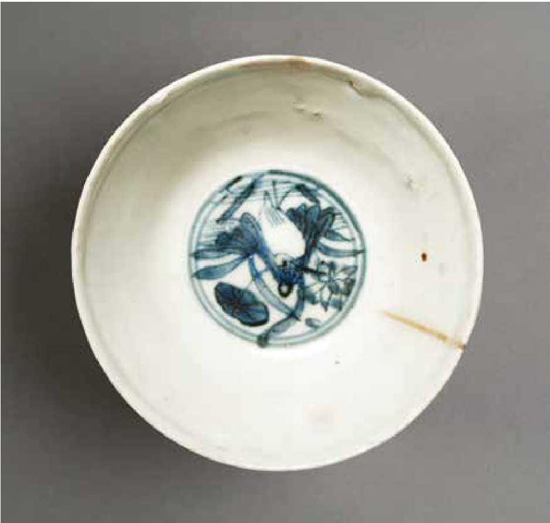
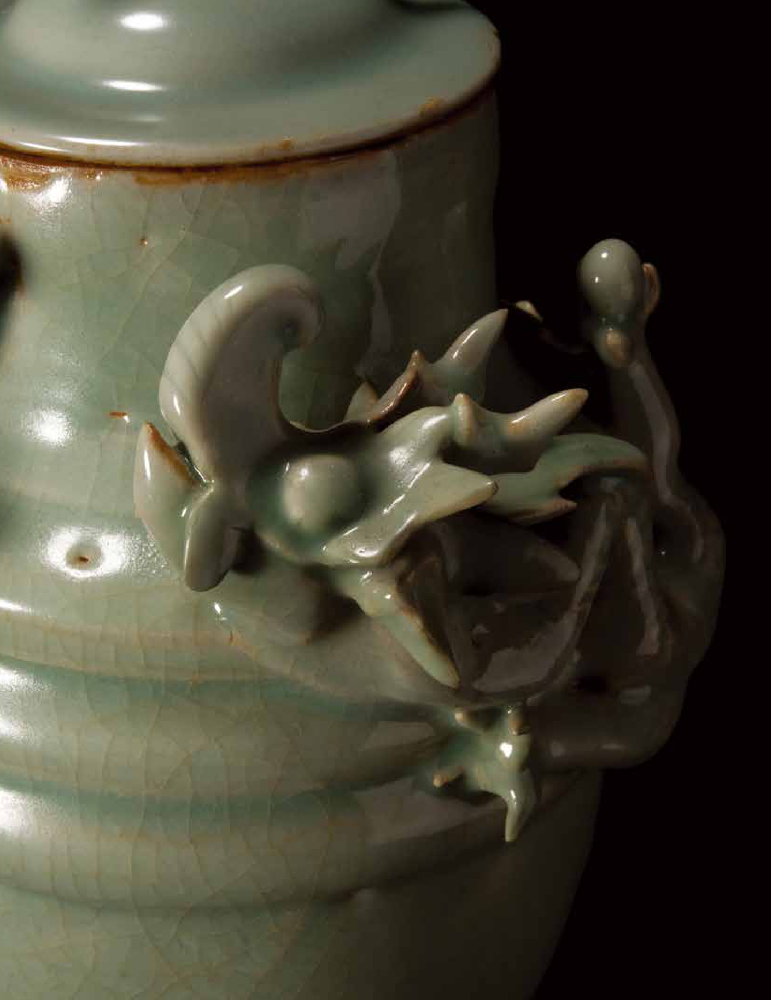

Objectifying China Mainndg  Tanhdei rQ Sitnygl isDtiycn Ianstfly uCenercaesm iAcsb road  

  

  

瓷移物化   
陶染域外的明清陶瓷   
Objectifying China   
Ming and Qing Dynasty Ceramics and   
Their Stylistic Influences Abroad  

  

Contents目錄  

# Objectifying China 瓷移物化  

Ming and Qing Dynasty Ceramics and Their Stylistic Influences Abroad 陶染域外的明清陶瓷  

# Curators 策展人  

Ben Chiesa 紀奕邦Florian Knothe 羅諾德  

Research Assistant and Translator 研究助理及譯者Kikki Lam 林嘉琪  

Publisher 出版人Christopher Mattison 馬德松  

Designer 設計師Stephy Tsui 徐曉雯  

# Edition 版次  

December 2017 二零一七年十二月 $\copyright$ University Museum and Art Gallery, The University of Hong Kong, 2017  

# ISBN 國際標準書號  

978-988-19025-1-1  

All rights reserved. No part of this publication may be reproduced or transmitted in any form or by any means, electronic or mechanical, including photocopying, recording, or any information storage or retrieval system, without permission in writing from the publisher or from the artist of the exhibition. 版權所有。未經香港大學美術博物館及參展藝術家書面許可，任何人士不得翻印或 發放本圖錄之任何內容或資料。  

UNIVERSITY MUSEUM AND ART GALLERY,  
THE UNIVERSITY OF HONG KONG  
90 Bonham Road, Hong Kong  
香港大學美術博物館  
香港般咸道九十號  

<html><body><table><tr><td></td><td>Note to the reader 備</td></tr><tr><td>10</td><td>Foreword 前言</td></tr><tr><td>12</td><td>Chinese porcelain in Europe and Asia 歐洲舆亚洲的中國瓷器</td></tr><tr><td>20</td><td>Blue-and-white 青花瓷</td></tr><tr><td>60</td><td>Blanc de Chine 中國白</td></tr><tr><td>72</td><td>Enamelled porcelain 釉上彩瓷</td></tr><tr><td>102</td><td>Qingbai and celadon</td></tr><tr><td></td><td>青白瓷與青瓷</td></tr><tr><td>120</td><td>Bibliography and selected reading list</td></tr></table></body></html>  

  

# Note to the reader  

Objects illustrated in this volume are from the collection of the University Museum and Art Gallery (UMAG) unless otherwise noted. Dimensions exclude mounting; height precedes width precedes depth.  

Chinese names are given in the traditional order, surnames first, with the exception of scholars who have adopted the Western order of surname last. Chinese transliterations for personal names, places and titles of works follow the Pinyin system of romanisation, except for words adopted into English and commonly used place names such as Macau (Pinyin: Aomen). Foreign terms are italicised unless commonly used in English.  

# Dates  

Beginning in the Ming dynasty, Chinese emperors were usually referred to by their reign era names rather than their given names. Accordingly, the form ‘the Qianlong emperor’ is followed rather than ‘Emperor Qianlong’ because ‘Qianlong’ is the reign era.  

# 備註  

除另作註明外，載於本書的器物均屬於香港大學美術博物館之藏品。器物的尺寸則先列其高度，後為闊度或深度，並不包含鑲嵌物尺寸。  

所有中文姓名皆按傳統書寫順序，先姓後名；個別採用西式姓名書寫順序的學者名稱除外。人名、地名及作品名稱的中文音譯，以拉丁字母的漢語拼音為準；已具英文譯名和慣用地名的字詞，如澳門─Macau ( 漢語拼音為 Aomen) 等除外。外來詞若非英文常用詞彙，則以斜體標示。  

The principle dynastic periods and reign eras for the objects illustrated in this catalogue, none earlier than the Tang dynasty, are listed as follows:  

# 年代  

自明代起，一般會以年號而非名字，來稱呼中國的皇帝。舉例說，「乾隆」為乾隆皇帝的年號，故他被稱為「乾隆皇帝」，而不是「皇帝乾隆」。  

以下為載於本圖錄的器物所屬的朝代與年號，全部為唐代或以後：  

Tang dynasty 618–907   
Five Dynasties and Ten Kingdoms 907–979   
Liao dynasty 916–1125   
Song dynasty 960–1279   
- Northern Song 960–1127   
- Southern Song 1127–1279   
唐代 618-907   
五代十國 907-979   
遼代 916-1125   
宋代 960-1279   
- 北宋 960-1127   
- 南宋 1127-1279  

Yuan dynasty 1271–1368 元代 1271-1368  

Ming dynasty 1368–1644  
- Hongwu 1368–1398  
- Yongle 1403–1424  
- Xuande 1426–1435  
- Chenghua 1465–1487  
- Hongzhi 1488–1505  
- Zhengde 1506–1521  
- Jiajing 1522–1566  
- Wanli 1573–1620  
- Tianqi 1621–1627  
- Chongzhen 1628–1644  
明代 1368-1644  
- 洪武 1368-1398  
- 永樂 1403-1424  
- 宣德 1426-1435  
- 成化 1465-1487  
- 弘治 1488-1505  
- 正德 1506-1521  
- 嘉靖 1522-1566  
- 萬曆 1573-1620  
- 天啟 1621-1627  
- 崇禎 1628-1644  

# Qing dynasty 1644–1912  

- Shunzhi 1644–1661  
- Kangxi 1662–1722  
- Yongzheng 1723–1735  
- Qianlong 1736–1795  
- Jiaqing 1796–1820  
- Daoguang 1821–1850  
- Xianfeng 1851–1861  
清代 1644-1912  
- 順治 1644-1661  
- 康熙 1662-1722  
- 雍正 1723-1735  
- 乾隆 1736-1795  
- 嘉慶 1796-1820  
- 道光 1821-1850  
- 咸豐 1851-1861  

Republican period 1912–1949 中華民國 1912-1949  

# Porcelain terminology  

The Chinese term ‘ci’ (translated as porcelain in English) refers to all ceramics that are fired at high temperatures, including porcelain and stoneware. In the West, the term porcelain refers specifically to white ceramics made with a special type of clay called kaolin and fired to a temperature of about $1300^{\circ}\mathrm{C}$ , which results in a translucent, glassy material that makes a ringing sound when struck. Stoneware is used to refer to related ceramics that are similarly hard and dense, but which are made with grey or brown clay, may or may not be white-bodied, do not transmit light, and are fired to a slightly lower temperature of 1000 to $1250^{\circ}\mathrm{C}$ . Ceramics fired below this temperature range are called earthenwares. The terms ‘protoporcelain’ or ‘porcellaneous’ are sometimes used to describe early ceramics made with some of the same ingredients and physical characteristics of porcelain.  

# Marks  

Many different marks can be found on Chinese porcelain. The most prevalent in this catalogue are imperial marks that occur on pieces for the court and related institutions from the Ming dynasty onwards. They usually consist of six characters (sometimes four) in two rows that are read from right to left and from top to bottom, or in seal script within a square. The first two characters indicate the dynasty (for instance Da Ming, ‘the great Ming dynasty’). The next two give the reign name (nian hao) of the ruling emperor, for instance Jiajing, or Wanli. The last two characters mean ‘made during the period of ’ (nian zhi). This tradition was continued during the Qing dynasty. Imperial Ming and Qing marks also occur on non–imperial wares and even on export porcelain.  

Other character marks and seal marks may have many different meanings: a wish for good luck, a date, a quality comparison, an owner or factory, or an indication for use in a specific setting.  

Individual potter's marks are rare on Jingdezhen porcelain, but they occur much more frequently on porcelain from Dehua. Marks are usually found on the bottom of a piece, sometimes on the edge or shoulder, or in the centre.  

# 瓷器術語  

中文詞彙的「瓷」( 英文譯成 porcelain) 是指所有以高溫燒製的陶瓷器，包括瓷器和炻器。英文詞彙的 porcelain 則專指一種加入了高嶺土、以攝氏一千三百度高溫燒成的半透明、明淨如鏡的白色瓷器，當它被敲打時會發出清脆的響聲。炻器是指一種以灰色或褐色土為材料，以攝氏一千度至一千二百五十度較低溫燒製，其硬度和密度與瓷器相約、但器身不一定是白色的陶瓷。以低於攝氏一千二百五十度燒成的器物則稱為土器。「原始瓷器」或「類瓷器」偶爾會用來表示造型及製成材料與瓷器相近的早期陶瓷器。  

# 款識  

中國瓷器上可見許多不同的款識。本書所錄的款識普遍為朝代款──書於專為明代或以後的宮廷及相關機構而設的瓷器上。朝代款以六字 ( 偶 爾 四 字 ) 兩 排 的 樣 式 排 列， 順 序 為 右至左、上而下，或為方框印款。首二字標示朝代 ( 如大明，即明代)，之後二字為統治者的年號，如嘉靖或萬曆，最後二字則指於某年製造。清代仍沿用此法。明清兩代的朝代款也會出現於非御用瓷器，甚至外銷瓷上。  

其他款識和印款可能具不同意義：吉祥語、製作日期、質量比較、收藏家、瓷廠、或標示瓷器的特定用途。  

景德鎮瓷器鮮有陶工的個人款識，德化瓷器上則較為常見。款識多書於器物的底部，亦可見於其邊沿、肩部或中心位置。  

  
Important kiln sites in China中國的重要窯址  

# 前言  

The early modern era was marked by the extension of the Silk Road to Italy and by the beginning of the importation into Europe of Eastern goods in the fourteenth century. Porcelain from China—the first country in the world to produce highfired, glazed ceramics—was one of the most important elements of this trade, which in the sixteenth century had expanded to include vast quantities of tea, silk, lacquer, spices and opium.  

This catalogue and its accompanying exhibition tell the story of this trade, exploring how ceramics from different regions, particularly China and Europe, spread styles, forms and manufacturing technologies across the globe, and in the process dramatically altered the course of European and Asian art.  

While we place particular importance on early Ming dynasty blue-and-white porcelain pieces that reached the Ducal court of the Medicis in Florence, and early export goods in the Low Countries, our chronological display begins much earlier, with a rare Tang dynasty blue-and-white water pot and a Yuan dynasty bottle—both from time periods that predate betterknown Ming production. These ceramics highlight the artistic quality and beauty of Chinese wares, as well as their influence, appreciation and imitation abroad.  

在十四世紀，當絲綢之路延伸至意大利、而東方的商品初傳至歐洲之際，標誌著近世的開展。中國是全球首個研製出以高溫燒造上釉陶瓷的國家，其瓷器是十六世紀大規模貿易中，包括茶葉、絲綢、漆器、香料和鴉片等，最重要的商品之一。  

本圖錄及相關展覽訴說陶瓷貿易的故事：探索來自不同地域，尤其是中國和歐洲的陶瓷，如何在商貿過程中，於全球各地傳播陶瓷的風格、形式及生產技術，並戲劇性地改變了歐洲與亞洲藝術的發展路向。  

  

圖錄與展覽按時序來展示藏品，不但著重遠銷至佛羅倫斯的名門望族──麥地奇家族的明初青花瓷、及流傳至低地諸國的早期外銷瓷，更遠溯至在著名的明代青花瓷出現前的陶瓷，如稀有的唐代青花水丞和元代瓶子。它們刻劃出中國陶瓷的藝術特質與美麗，及其為域外地區所帶來的影響、並喚起的讚嘆與模仿。  

This international theme is further explored by presenting Ming and Qing dynasty objects that were made for local consumption in China, as well as for export alongside local responses to these wares in Europe, East Asia and Southeast Asia. In so doing, we move beyond the better-known influences of export to the West by including regional varieties of, for example, celadon ware in Korea and Thailand.  

We would like to thank our exhibition partners, the Asian Civilisations Museum and the Hong Kong Maritime Museum for their generous loans, and for their assistance in organising related public programming and publications. As with all UMAG exhibitions, our mission is to engage with audiences through the discussion of materials and techniques, as well as historic and cross-cultural exchanges. We express our gratitude to Robert Black College, The University of Hong Kong, for support of the exhibition on their 50th anniversary.  

透過呈現明清兩代的本地用瓷、並外銷至歐洲、東亞、東南亞的陶瓷及其於當地觸發的工藝迴響，我們對這國際化主題的研究不僅停留於較為人熟識、中國外銷瓷對西方的影響，更進深探討它對其他地域的陶染，如泰國和韓國的青瓷。  

Florian Knothe Director, University Museum and Art Gallery, The University of Hong Kong  

本館衷心感謝亞洲文明博物館、及香港海事博物館慷慨惠借館藏，並大力協助籌劃相關的公眾與出版項目。如本館所有展覽一樣，是次展覽秉承香港大學美術博物館的宗旨──致力透過對物質、工藝、歷史和跨文化交流主題的討論來連繫觀眾，使其積極投入於其中。我們亦對迎來金禧誌慶的香港大學柏立基學院所給予的支持，表達由衷的謝意。  

# 羅諾德  

香港大學美術博物館總監  

# Chinese porcelain in Europe and Asia  

The word porcelain originated with the Venetian traveller Marco Polo (1254–1324) when he saw white-bodied ceramics being made in China for the court of Kublai Khan. He called them porcelanna, Italian for a white seashell, and this soon became the standard term in Europe. But China had been producing porcelain of the highest quality for markets across the globe long before the arrival of Europeans. From the sixth to twentieth centuries, Chinese kilns produced everything from magnificent display pieces for the imperial court to vast quantities of bowls, plates and dishes intended for everyday use and for export to Southeast Asia, Japan, Korea and the Islamic world. The appeal of these works lay not just in their technical achievement, but also in their association with Chinese art and culture, long viewed as a source of learning, tradition and vast wealth.  

The first Chinese porcelains arrived in Europe in the fourteenth century, when small numbers were presented as rare gifts to the ruling houses of Europe via intermediaries in the Middle East (fig. 1). Delicate, nearly transparent and resistant to extreme heat and moisture, they were technologically superior to the thick, low-fired European ceramics made before the eighteenth century, and were regarded as objects of great rarity and luxury. Their construction was so poorly understood that European collectors often had them mounted in gilt silver or gold in a manner similar to naturalia (‘natural wonders’) like ostrich eggs and large shells, which emphasised their preciousness and transformed them into entirely different objects. They were often displayed in cabinets of curiosities: collections of extraordinary objects which, like today's museums, attempted to categorise and tell stories about the wonders of the natural world (fig. 2).  

By the early sixteenth century—after Portugal established trade routes to the Far East and began commercial trade with Asia via Portuguese-controlled ports in Macau, Malacca and Dejima—porcelain became an important component of the wider trade in silk, spices, tea, ivory, metalwork and lacquer between East and West. Major production centres like Jingdezhen in Jiangxi province responded to demand in Europe by producing large amounts of porcelain specifically for export, transported and used as a form of ballast in large merchant ships. New arrivals like the Dutch and British built  

# 歐洲與亞洲的中國瓷器  

瓷器的英文 porcelain 一字源於意大利語 porcelanna( 即「白色貝殼」)，為威尼斯旅人馬可．波羅(1254–1324) 對在忽必烈的宮廷所遇見的中國製素白瓷器的稱謂，其後它更成為歐洲的標準用語。但早在歐洲人來華前，中國已為全球市場生產最優質的瓷器。從六世紀至二十世紀，中國各地的窯產量豐富，從華麗的宮廷陳設瓷，到碗、碟等日用瓷，出口至東南亞、日本、韓國及伊斯蘭世界的外銷瓷，應有盡有。瓷器引人入勝之處，不僅是其精湛的工藝，更是它與一直被視為學問、傳統及財寶的巨大來源中國藝術與文化的聯繫。  

直至十四世紀，少量的中國瓷器才首次經中東商旅踏足歐洲，作為獻給歐洲統治者的珍稀禮物 ( 圖 1)。精緻、近乎透明、極為耐熱及耐潮的中國瓷器，在工藝技術上較十八世紀以前、以低溫燒製且厚重的歐洲陶瓷更為優越，故它被視為極罕有的奢侈品。由於歐洲收藏家未能領悟製瓷之法，故他們偶爾會為瓷器鑲嵌金銀裝飾，就像對待駝鳥蛋及大型貝殼等「自然界的奇珍異物」一樣，以突顯其稀有性，並將之轉化成截然不同的器物。這種擺滿奇珍異品的「珍奇屋」展示方式，就如今天的博物館一樣，  

  

Fonthill Vase. China, ca. 1300–1330. Porcelain, height 28.3 cm.National Museum of Ireland, Dublin  
「豐山瓶」。中國，約一三零零年至一三三零年 $^\circ$ 瓷，高28.3 厘米。都柏林，愛爾蘭國家博物館  

  
Chamber of Art and Curiosities. Frans Francken the Younger, 1636. Oil on panel, 86.5 $\times$ 120 cm. Kunsthistorisches Museum, Vienna《藝術品珍奇屋》。小法蘭斯．弗蘭肯，一六三六年。板面油畫，86.5 ${\bf X}$ 120 厘米。維也納，藝術史博物館  

嘗試透過分類藏品來訴說大自然奇妙的故事( 圖 2)。  

up competing trade networks in the seventeenth century, which stimulated the production of special shapes and patterns for certain countries, as well as commissions from wealthy families who wanted personalised features on their dishes. The fashion for collecting these objects spread so quickly as to appear almost contagious, and was described by some enthusiasts as la maladie die porcelaine— ‘porcelain-sickness’. Among the wealthiest collectors this led to the creation of ‘porcelain rooms’, where masses of porcelain wares were displayed together and arranged on mantelpieces, cabinets and 十六世紀初，隨著葡萄牙建立來往遠東的貿易 航線，並開始經受控的港口，包括澳門、馬六 甲及出島與亞洲進行商貿後，瓷器成為東西大 規模貿易，包括絲綢、香料、茶葉、象牙、金 屬器及漆器的關鍵商品。為配合歐洲市場的需 求，主要製瓷中心如江西景德鎮遂大量生產外 銷瓷。於運輸過程中，瓷器亦用作大型商船的  

  

Jug with Portuguese arms. Jingdezhen, China, ca. 1520–1540. Porcelain with underglaze blue, height 18.7 cm. The Metropolitan Museum of Art, New York   
葡萄牙徽章紋壺。中國景德鎮，約一五二零年至一五四零年。青花瓷，高 18.7 厘米。 紐約，大都會藝術博物館  

1. Architect and designer Daniel Marot (1661–1752) is often linked to this late Baroque style. His designs for several rooms of Kensington Palace demonstrate the typical high-density approach to porcelain display of the late Baroque period (ca. 1660–1725).  

1. 人們經常將建築師及設計師丹尼爾．馬洛 (1661-1752) 與晚期巴洛克風格相提並論。肯辛頓宮內由他設計的幾間房間，盡顯巴洛克晚期 (1660-1725)風格、以高度密集的方式來陳列瓷器的典型設計。  

fitted wall-mounts—part of the late Baroque interior which combined the lavish use of colour with wood panelled or lacquered walls.  

The appearance of these objects changed in step with tastes in Europe. At times consumers favoured designs that depicted an exotic East, while at others Western patterns with prominent armorial crests or landscapes and figures taken from prints were preferred. European designs were transmitted via a wellestablished trading network which carried models to China, where they were copied onto special services (fig. 3). This often had strange results, such as a Dutch charger with the arms of Amsterdam inscribed ‘AMSTEL DAM’ or a porcelain ewer with the seal of Portugal painted upside down (fig. 4). Europeans also affected artistic change by bringing new technologies and techniques to China, such as the famille-rose (‘rose family’ in French) palette, which was employed widely on both domestic and export porcelain. Guiseppe Castiglione (1688–1766), a Jesuit painter patronised by the Kangxi, Yongzheng and Qianlong emperors, famously introduced Western painting techniques such as single-point perspective to Chinese artists, which found expression across a variety of mediums.  

Like all successful inventions, Chinese ceramics inspiredcompetition, at first in Asia and later in Europe. In the lateTang period, traders from the Middle East brought Chineseporcelains to western Asia, where potters in Iraq copied them壓艙物。到了十七世紀，荷蘭及英國等地相繼建立具競爭性的貿易網絡，進一步刺激了為個別國家訂造特定器型及花紋、及專為富裕家庭而設的個人化碟子的生產。收藏瓷器的風尚席捲歐洲，此風氣被某些極為熱衷者稱為「瓷器狂 熱 」(as la maladie die porcelaine)。 當 中 最 富裕的收藏家更因此成立「瓷器陳列室」，於壁爐、櫥櫃、牆壁上展示大量的瓷器，配襯髹以色澤奢華的木板或漆器而造的牆壁，作為晚期巴洛克風格室內設計的一部分。  

  
Plate. Jingdezhen, China, 1739–1743. Porcelain with overglaze enamels, diameter $22.9~\mathrm{cm}$ . The Metropolitan Museum of Art, New York 碟 $^\circ$ 中國景德鎮，一七三九年至一七四三年。釉上彩瓷，直徑 22.9 厘米。紐約，大都會藝術博物館  

這批器物的造型隨歐洲市場的喜好而改變。部分顧客偏愛描繪遠東此神秘異國的圖案，其他則推崇西式花紋，如耀眼的徽章或取自版畫的山水景與人物。透過穩固的貿易網絡，歐洲的圖案樣品傳往中國，陶匠再複製於獨特的餐具上 ( 圖 3)。此種「以訛傳訛」的溝通方式往往造成怪異的作品，如將荷蘭餐盤上的阿姆斯特 丹 (Amsterdam) 徽 章 錯 誤 寫 成「AMSTELDAM」、或將執壺的葡萄牙印章上下倒轉繪畫( 圖 4)。但歐洲人也為中國帶來新科技及技術，促成藝術變革，如廣泛用於本地及外銷瓷器的粉彩 ( 法文為 famille-rose，即「粉紅家族」)。受康熙、雍正和乾隆三帝器重的耶穌會士畫家郎世寧 (1688-1766)，即以向中國畫家介紹西方繪畫技巧而聞名，如用於各種媒介上的平行透視法。  

中國的製瓷技術，如所有成功的發明般激發競爭，先於亞洲，後在歐洲。唐代末年，中東商旅將中國瓷器帶至西亞，讓伊拉克的陶工巧妙地模仿。由於缺乏天然的高嶺土 ( 一種矽酸鹽含量高，令瓷器質地堅硬的礦物 )，陶工遂以呈白色的化妝土 ( 一種於以水和陶土調和而成的泥漿 ) 來模仿素白瓷的美麗，並繪上由氧化鈷提煉而成的藍彩為裝飾 ( 圖 5)。在越南，陶工以於陳朝 (1225-1400) 末年傳入的中國青花瓷為藍本，塑造出胎骨較厚重、呈淡灰白色的獨特青花瓷 ( 圖 6)。 這些青花瓷出產自境內主要窯址，如鄰近河內的朱鐸 (Chu Dou) 和巴茶 (Bát Tràng)。由於當時中國的瓷器生產因社會動盪和朝代更替而中斷，越南瓷業遂把握商機，於十五世紀時更成為了亞洲境內，包括馬  

  
Blue-and-white dish. China, Gongxian kilns, around 830s. Stoneware, diameter 23 cm. Asian Civilisations Museum, Singapore 青花碟。中國鞏縣窯，約八三零年代。炻器，直徑 23 厘米。新加坡，亞洲文明博物館  

  
Covered box. Sawankhalok, Thailand, 15th or 16th century. Earthenware with cream white glazeand iron-brown underglaze, diameter 16 cm. University Museum and Art Gallery, Hong Kong蓋盒。泰國宋加洛，十五世紀或十六世紀。乳白釉及釉下鐵褐釉陶器，直徑 16 厘米。香港，香港大學美術博物館  

2. Referred to as the ‘Ming gap’ (ca. 1370– 1570) by scholars like Roxanna Brown, these interruptions occurred between 1325 and 1380. The second severe shortage of blue-and-white porcelain saw China’s market share of ceramic production decrease to $50\%$ from 1368 to 1424–1430. This decreased to $5\%$ from 1424–1430 to 1487, before rebounding during the reign of the Hongzhi emperor, and then declining once again until the formal rescinding of the haijin (‘sea ban’) in 1567.  

3. The Dutch, exempt from restrictions on trade placed on other European nations by the Japanese authorities, also exposed the Arita potters to Chinese underglaze blue porcelain, which was popular in Europe, so that they could use it as an example in their own work.  

4. Some scholars have suggested that English manufacturers may have produced hard-paste porcelain before Böttger, but his factory in Meissen was certainly the first to produce it in large quantities (Queiroz and Agathopoulos 2005).  

2. 學 者 們 如 伯 朗 (Roxanna Brown)所指的「明代對外貿易真空期」（約1370 年至 1570 年），是指在一三二五年至一三八零年間，瓷器貿易的停滯。第二波的青花瓷短缺期，使中國陶瓷生產的市場佔有率，在一三六八年至一四二四、或一四三零年間，下跌至百分之五十。隨後在弘治一朝的業務復興前，即一四二四年、或一四三零年至一四八七年間，其佔有率更再跌至百分之五。弘治年間以後又再度衰落，直到一五六七年，明廷撤銷「海禁」政策後，才有所回升。  

3. 荷蘭人是日本統治者禁止歐洲國家在境內進行貿易的唯一例外。故他們為有田窯的陶工帶來在歐洲極受歡迎的中國青花瓷，使其能以此為製陶的參考樣本。  

4. 近年有研究指出，其他英國工業家或埃弗里德．切恩豪斯，可能較伯特格爾更早研製出瓷器。但德國的邁森工廠的確是歐洲首間大量生產硬質瓷的 瓷 廠 (Queiroz and Agathopoulos2005)。  

with great ingenuity. Lacking access to naturally occurring kaolin clay—a mineral rich in silicates that gives porcelain much of its strength—they emulated the beauty of pure white porcelain using white slip (a liquefied suspension of clay particles in water), often embellished with painted decoration in blue pigments derived from cobalt oxide (fig. 5). Following the introduction of Chinese examples towards the end of the Tran dynasty (1225–1400), Vietnamese potters developed their own unique ceramics, which were more heavily potted than Chinese wares and slightly off-white in colour (fig. 6). Produced at major kiln sites like Chu Dou and Bát Tràng near Hanoi, these wares benefited from the first of several interruptions to porcelain production in China, brought about by social unrest and dynastic change, and by the fifteenth century formed part of a lively intra-Asian trade in ceramics with Malaysia, Thailand, Indonesia and the Philippines.  

On China’s borders, nearly five centuries of Goryeo dynasty (918–1392) rule in Korea saw blue-green celadons inspired by wares from China become the dominant type of ceramics produced on the peninsula. And Korean potters, many of whom arrived during two invasions of Korea led by Toyotomi Hideyoshi in the 1590s, took an active role in the development of porcelain production in Japan. The early porcelain wares they produced, called Imari after a port near kilns in Arita, had a coarse, grainy texture with fluid, free-form designs in various shades of blue. They were influenced by both Korean and Chinese monochrome porcelain and less formal blue-andwhite wares from southern Chinese kilns—the latter export wares that were made to conform to the aesthetic of the Japanese tea ceremony. Later Imari wares were consciously designed to cater to Western tastes and became much more colourful and regimented, at times achieving more access in Europe than their Chinese counterparts.  

來西亞、泰國、印尼及菲律賓，蓬勃的陶瓷貿易之要員。  

# Porcelain manufactories in Europe  

在中國的邊境，高麗皇朝 (918-1392) 統治韓國接近五個世紀，並見證受中國青瓷啟發而成的藍綠色青瓷，成為了朝鮮半島的主流陶瓷。正是韓國陶匠─ 一群因豐臣秀吉於一五九零年代兩次入侵朝鮮而被擄至日本的工匠，對日本瓷器生產作出重大貢獻。日本早期製作的瓷器稱為「伊萬里瓷」，得名於有田町窯址附近的港口。受到韓國及中國的單色釉瓷、及中國南部窯址設計靈活的青花瓷 ( 長於燒造配合日本茶道美學的瓷器 ) 影響，伊萬里瓷器紋理細密、具顆粒質感，圖案率真自然，藍色色調流暢而變化豐富。後來為迎合歐洲市場的品味，伊萬里瓷器變得更色彩繽紛、井然有序，甚至一度較其競爭對手─ ─中國瓷器更受歐洲市場歡迎。  

Portuguese traders were successful in returning home with samples of kaolin, which they discovered in China to be essential in the production of porcelain wares, but Europeans remained ignorant of the techniques and processes involved in the production of porcelain until 1708, when the first European hard-paste porcelain (made from a compound of the feldspathic rock petuntse and kaolin clay fired at around $1400^{\circ}\mathrm{C}\mathrm{)}$ was made in Meissen, Germany by Johann Friedrich Böttger. With support from the porcelain-obsessed  

# 歐洲瓷廠  

雖然葡萄牙商人成功將於中國發現的製瓷關鍵材料高嶺土樣本帶回家鄉，但歐洲人對瓷器的製作技術與過程仍一無所知。直到一七零八年，約翰．弗里德里希．伯特格爾才於德國邁森工廠研製出首件歐洲硬質瓷 ( 混合含長石質的白墩子及高嶺土，再以約攝氏一千四百度燒製而成 )。 於一七一零年，伯特格爾得到薩克森選侯奧古斯特二世 ( 瓷器狂熱愛好者，於一七三三年逝世時坐擁三萬五千七百九十八件瓷器，屬歐洲最大的收藏 ) 的資助，在德勒斯登外的邁森成立工廠，並迅速投入生產大量半透明的奶白色硬質瓷。一七二零年代，邁森工廠研製出一系列新的釉彩，畫師亦擅長繪畫栩栩如生、想像中的遠東人文風景。在這項巨大的成功與前邁森工廠的畫師協助下，克勞斯．都帕契爾隨即在一七一九年於維也立成立第二間生產硬質瓷的工廠。其他普遍會聘用具相關的專業技藝、曾在邁森或維也納工廠工作的匠人之德國瓷廠，亦於一七四零至五零年代期間相繼落成。  

邁森工廠解開製瓷之謎後，歐洲各地的主要瓷器廠亦緊隨成立。在早自十六世紀末，已有麥  

Augustus II the Strong of Saxony (who on his death in 1733 owned 35,798 pieces of porcelain; the largest collection in Europe), Böttger established a factory at Meissen, just outside Dresden, in 1710, and was soon producing large amounts of hard-paste porcelain. In the 1720s, the Meissen factory developed a new and extensive range of enamel colours, and the factory’s painters excelled in fantastic depictions of life in an imagined Far East. These successes were soon followed by the founding of a second factory in Vienna by Claudius du Paquier, assisted by the former kiln master from Meissen, which began making hard-paste porcelain by about 1719. A number of other factories opened in Germany in the 1740s and ’50s, often with workers from Meissen or Vienna who provided the necessary technical expertise.  

The discoveries in Meissen were followed by the establishment of major factories elsewhere in Europe. In Italy, where softpaste porcelain (an imitation, low-fired porcelain that lacked the ingredients found in hard-paste porcelain) had been made at the Medici workshops since the late sixteenth century, Francesco Vezzi established a porcelain factory in Venice that began producing hard-paste porcelain in significant numbers in 1720. Experiments by the Marchese Carlo Ginori led to the development of a hard-paste porcelain factory in Doccia, near Florence in 1737, which produced works inspired by delicate white wares from Dehua (fig. 7). Both men were assisted by workers from the Du Paquier factory, and Doccia porcelain from the 1740s sometimes features painted decoration that reflects the influence of Du Paquier porcelain—demonstrating the atmosphere of technological and stylistic exchange that characterised the European ceramic industry of the eighteenth century.  

Kaolin was not discovered in France until the second half of the eighteenth century, and all French porcelain produced before 1770 was soft- rather than hard-paste. Both types were first made in factories which had previously produced the most common ceramic product of the time—faience, a type of tin-glazed earthenware—like those in Rouen and SaintCloud. Perhaps the most successful of these was at Sèvres in the western part of Paris, which had moved from its former premises in Vincennes in 1756. With the financial backing of King Louis XV (r. 1715–1774), the Sèvres factory soon came to dominate not only the French ceramic industry, but also the entirety of European ceramics for the second half  

地奇工作坊燒造軟質瓷 ( 一種以低溫燒製、且缺乏製成硬質瓷原材料的仿瓷器 ) 的意大利，法蘭西斯科．韋爾於一七二零年在威尼斯建立工廠，大量生產硬質瓷。馬切斯．卡羅．基諾里的實驗使位於佛羅倫斯附近的多西亞瓷廠於一七三七年得以成立，並以生產靈感源於精緻的德化白瓷之硬質瓷 ( 圖 7)。韋爾和基諾里均得到都帕契爾工廠的工人協助，故一七四零年代出產的多西亞瓷器的彩繪裝飾，偶爾折射出都帕契爾瓷器的特色──展現出十八世紀歐洲陶瓷工業之間的工藝和風格交流之氛圍。  

直到十八世紀下半葉，法國才發現高嶺土，故一七七零年前燒造的法國瓷器，都是軟質瓷而非硬質瓷。燒造兩種瓷器的瓷廠，昔日都是以生產當時最普遍的彩陶 一種塗上錫釉的陶器為主，就如盧昂和聖克盧的作坊一樣。其中最成功的，可能是巴黎西部的塞爾夫工廠。該廠於一七五六年從萬塞訥的舊址搬遷至此。在法國國王路易十五 ( 執政年份為 1715 年至 1774年 ) 的經濟支持下，塞爾夫工廠不但迅速獨霸法國的陶瓷工業，更主導十八世紀下半葉的歐洲陶瓷工業發展。塞爾夫工廠持續發展創新與進行改革實驗，又追尋各種創作靈感，如日本漆器 ( 圖 8)。故此，塞爾夫工廠在一七五零年代中葉，就產量與創新層面，已取代邁森工廠成為十八世紀歐洲陶瓷生產的先鋒。  

  
Sweetmeat dish. Doccia, Italy, ca. 1780. Tin-glazed hard-paste porcelain, length $8.9\mathrm{cm}$ . The Victoria and Albert Museum, London  

糖果糕點碟。意大利多西亞，約一七八零年。錫釉硬質瓷，長 8.9 厘米 $^\circ$ 倫敦，維多利亞及艾伯特博物館  

of the eighteenth century. Innovative and experimental new forms were always in development, and the factory looked to different sources of inspiration, such as Japanese lacquer (fig. 8). By the mid-1750s, it had overtaken the Meissen factory in terms of production and innovation. It remained at the forefront of European porcelain production for the rest of the century.  

Across the channel, English manufacturers struggled to discover the secrets of making porcelain without access to the necessary ingredients, and between the 1740s and 1760s were only able to develop formulae that created a range of soft-paste porcelains unsuitable for tableware. This changed after the discovery of kaolin clay in Cornwall in 1746 by an English chemist named William Cookworthy, who soon found even better-quality clay in St Stephen’s, near St Austell. After two decades of experimentation, Cookworthy patented his recipe for making porcelain and established the Plymouth China factory in 1768—the first in England to manufacture hard-paste porcelain. By the turn of the century, England had a flourishing porcelain industry, with factories in Derby, Worcester, Staffordshire, Liverpool and elsewhere. Primarily commercial ventures that operated without noble or royal financial support, they were run by entrepreneurs and artisans, and much of their output was aimed at a growing middle class.  

The European factories were so successful that eventually the demand for Chinese porcelain began to diminish, and towards the end of the eighteenth century the trade fell into serious decline. But centuries of genuine artistic exchange stimulated by the trade in porcelain had left an indelible mark on the arts of Europe. Chinese ceramics remain a potent source of design ideas for artists today, working in fields as diverse as architecture, interior design, theatre and painting.  

Ben Chiesa   
Assistant Curator, University Museum and Art Gallery,   
The University of Hong Kong  

  

Plate. Sèvres factory, France, 1791. Hard-paste porcelain, diameter$24.3~\mathrm{cm}$ . The Metropolitan Museum of Art, New York碟。法國塞爾夫工廠，一七九一年。硬質瓷，直徑 24.3厘米。紐約，大都會藝術博物館  

由於缺乏製瓷的關鍵材料，即使彼岸的英國製造商致力研究製瓷秘方，在一七四零年代至一七六零年代間，仍只能研製出一系列不適合用作餐具的軟質瓷的配方。當一名英國化學家威廉．考克沃西於一七四六年，在康瓦爾郡發現高嶺土 ( 他隨即於聖奧斯特爾附近的聖司提反發現質量更好的瓷土 ) 後，英國瓷業即發生巨變。經過二十年的製瓷配方實驗後，考克沃西申請專利並於一七六八年成立英國首間製造真正瓷器的工廠──普利茅斯瓷廠。十八世紀末、十九世紀初，英國瓷器工業發展蓬勃，工廠遍佈德比、烏斯特、史丹佛郡及利物浦等地。這些瓷廠並無得到王公貴族的支持，而是由企業家及藝術家領導的商營企業，其產品亦以不斷增長的中產階級為銷售對象。  

歐洲瓷廠的業務非常成功，使歐洲對中國瓷器的需求逐漸減少。十八世紀末，對華貿易更經歷嚴重衰退。但歷經數個世紀、由瓷器貿易所激發真摰的藝術交流，對歐洲藝術烙下不能磨滅的影響。中國陶瓷更成為了建築、室內設計、戲劇及繪畫等多元界別的藝術家源源不絕的靈感來源。  

紀奕邦  

香港大學美術博物館助理館長  

  

# Blue-and-white  

Perhaps the first truly global commodity, blue-and-white porcelain reached a wider audience than any other type of Chinese ceramic. Sent to markets in Southeast Asia, Japan, Korea, India, the Middle East and even Africa, it inspired potters in major ceramic centres to produce elegant ceramics of their own design; from the rich turquoise fritwares of fifteenth-century Iznik, to elaborately panelled Japanese kraak wares from seventeenth century Arita. Blue-and-white porcelain was also the first to be collected in Europe in large numbers, sparking a craze for things Chinese in the sixteenth century that would last well into the nineteenth, as new generations of artists and collectors rediscovered and renewed the art form.  

The earliest surviving Chinese blue-and-white ceramics were made in the Tang period, when kilns in northern China dominated the production of both high-fired white stonewares and porcelains. A shared creation of China and the Islamic Middle East, they were decorated with cobalt blue imported from northeast Persia or the Arabian Peninsula, using decorative techniques invented by potters in Basra, Iraq to embellish tin-glazed earthenwares. These earthenwares were themselves developed in imitation of Chinese white wares, demonstrating the remarkable hybridity of early ceramic industries in Asia.  

Tang blue-and-white ceramics represented a brief period of experimentation that was not repeated until the fourteenth century, when strong familial, cultural and economic ties to the Islamic world and the stabilisation of overland trade routes under the Mongol-led Yuan dynasty opened new markets and made access to imported cobalt easier. Yuan imperial patronage turned the kilns of Jingdezhen in Jiangxi province into the largest porcelain production centre in China.  

Combined with a cultural policy that promoted artistic exchange between different ethnic groups, this patronage created an atmosphere of experimentation that allowed new forms and styles to develop, including highly finished works intended for the court and less formal wares for the export market, transported along the silk road and from major ports like Canton and Quanzhou.  

# 青花瓷  

青花瓷，或許是世上首件真正全球化的商品，較其他種類的中國陶瓷陶染更廣泛的受眾。青花瓷遠銷至東南亞、日本、韓國、印度、中東，甚至非洲，啟發當地主要的陶瓷中心燒造出富有特色的高雅陶瓷，如十五世紀的伊茲尼克濃厚綠松色陶器、及十七世紀日本式「克拉克瓷」的精緻、伊萬里開光瓷器。作為首項被歐洲人大量收藏的器物，青花瓷觸發一場從十六世紀延伸至十九世紀的中國物狂熱，並獲得世世代代的藝術家及收藏家不斷重新發掘、和賦予新的藝術形式。  

目前存世最早的青花瓷產自唐代，當時以高溫燒製的白炻器及瓷器生產由中國北部的窯場主導。青花瓷揉合中國與伊斯蘭中東文化而成：它以從波斯東北或阿拉伯半島進口的鈷藍為裝飾，其工藝則源自由伊拉克巴斯拉陶工所發明、用來裝飾錫釉陶器的技術。而該陶器實際上是受中國白瓷啟發而成，由此可見亞洲早期陶瓷工業顯著的交融。  

唐代的青花瓷代表著一個短暫的陶瓷實驗時期。直到十四年紀由蒙古族統領的元代，青花瓷生產才再次繁盛。基於與伊斯蘭世界牢固的血統、文化和經濟聯繫、並穩定的陸路商貿路線，元代得以開創新市場，並更易獲得進口的鈷藍。同時，元代宮廷出資贊助江西景德鎮的窯場，使其成為中國最大的製瓷中心。  

配合實行推廣各族群之間的藝術交流的文化政策，元代宮廷更創造出一個鼓勵發展新的瓷器形式和風格之實驗性氛圍，如精雕細琢的宮廷瓷，設計靈活自由、經過絲綢之路和主要港口，如廣州及泉州運輸的外銷瓷等。  

元代青花瓷之成功，為明清兩代繁榮的外銷瓷工業──當時御窯及民窯生產了超過數百萬件陶瓷，奠定基礎。即使是專為特定市場而設的瓷器，也會流入其他地方：葡萄牙人曾購藏專  

The success of Yuan blue-and-whites laid the foundations for the dominance of the export industry in the Ming and Qing dynasties, when millions of ceramics were produced in the imperial kilns and private commercial enterprises. Tailored with specific designs for certain markets, they often found their way elsewhere. The Portuguese purchased blue-andwhite porcelain made for the Malay Peninsula in Malacca, and when the Dutch established a foothold in the Indonesian Archipelago in the first decades of the seventeenth century, they gained access to the important transhipment hub of Batavia ( Jakarta), from which over twelve million Chinese ceramics were shipped to Holland between 1607 and 1684. Not all of these were designed with European consumers in mind, and Dutch still-life oil paintings reveal that porcelains in shapes seemingly made for non-European customers were sold and used in Europe.  

Blue-and-white porcelain remained the most popular export form until the end of the seventeenth century, when growing European interest in wares decorated with coats of arms encouraged the use of polychrome enamels that allowed for more detailed, accurate depictions of heraldry. The Jingdezhen kilns, still the most important in China, responded to this demand and the trade in colourful porcelain supplanted blueand-white to become the defining aspect of Chinese export porcelain in the eighteenth century.  

為馬六甲的馬來半島而製的青花瓷；十七世紀初的荷蘭人在印尼群島建立據點，並取得於巴達維雅 ( 雅加達 ) 的貨船轉運中心營商的機會，於是超過一千二百萬件的中國陶瓷在一六零七年至一六八四年間運至荷蘭─ ─其中部分陶瓷並非專為歐洲客人而設。荷蘭靜物油畫所繪畫的中國瓷器，即為證明。  

到了十七世紀末，雖然歐洲人日漸喜愛繪有精細徽章的紋章瓷，但青花瓷仍是最受歡迎的外銷瓷品種。十八世紀時，由中國最重要的窯場集中地─ ─景德鎮為迎合需求而生產的彩瓷，卻取代了青花瓷，成為外銷瓷的標誌。  

# Water pot  

Gongyi, China (Tang dynasty), probably 9th century   
Stoneware, height 7.5 cm   
HKU.C.1953.0028  

A rare example of early blue-and-white pottery from the Tang dynasty, this water pot is sparsely decorated with horizontal blue dashes and dots over a crackled transparent glaze, reminiscent of the freeform brown and green designs on Changsha wares from Hunan.  The shape of the pot resembles Tang period tripod vessels used by scholars to clean brushes and add water to ink.  

Chinese blue-and-white ceramics from the Tang period were virtually unknown until shards recovered from the coastal city of Yangzhou in Jiangsu province in 1975 confirmed their existence. Most of these early blue-and-white wares were likely made at kilns in Gongxian (now Gongyi county) in Henan province, together with a number of dishes recovered in 1998 from the wreck of a ninth-century Arab dhow which sank near Belitung Island in Indonesia. The oldest Arab ship discovered in Asian waters, it carried 60,000 pieces of Chinese ceramics loaded at Yangzhou and intended for markets in Southeast Asia and the Middle East.  

# 水丞  

中國鞏義，唐代，約九世紀  
炻器，高 7.5 厘米  
HKU.C.1953.0028  

唐代早期青花陶器的罕有例子。水丞施紋片透明釉，釉下以零星的藍點與藍色橫紋為裝飾，讓人聯想到湖南長沙窯褐綠色陶瓷自由奔放的設計風格。水丞的造型，與唐代文人常用的三足筆洗和水丞相似。  

一九七五年，當唐代青花陶瓷碎片在江蘇省揚州市的沿岸城市被發掘出來後，才得以確認唐代已燒造青花陶瓷的事實。大部分估計產自河南省的鞏縣 ( 今為鞏義市 ) 的早期青花陶器和一些小碟，都是在一九九八年從一艘沉沒於印尼勿里洞島附近海域、屬於九世紀阿拉伯帆船「黑石」號打撈出來。這艘於亞洲水域發現到最古老的阿拉伯商船，承載六萬件中國陶瓷，包括如此水丞的器物。該船從揚州出發，以東南亞及中東地區為目的地。  

  

# Bottle (yuhuchun)  

China (Yuan dynasty), 14th century Porcelain with underglaze blue, height 25.5 cm HKU.C.1978.0632  

Bottles of this shape take their name from Song dynasty literary references to decanters for rice wine (yuhuchun), although they may also have been used as water containers. Highly prized by the upper echelons of Chinese society, they were popular exports to Southeast Asia, Korea, Japan, India and the Middle East, and have been recovered from excavations as far afield as Kenya. They were made in a variety of forms to suit different tastes: from monochrome, blue-and-white and overglaze painted examples, to elaborately gilded works in precious silver.  

The earliest surviving porcelain yuhuchun are monochrome wares that date to the Song dynasty. These early yuhuchun seem to have been particularly well received in Japan, where they were favoured by tea masters. They were also among the first Chinese porcelains to arrive in the West in the fourteenth and fifteenth centuries, presented as rare gifts to the ruling houses of Europe via intermediaries in the Middle East. Yuhuchun decorated with cobalt blue were not produced until the Yuan dynasty, when the reopening of overland trade routes between China and Central Asia allowed Chinese potters to import high-quality cobalt more easily.  

Made on a larger scale than earlier examples, blue-and-white yuhuchun were sometimes made in faceted shapes, reflecting different approaches in the Yuan dynasty to the properties of clay as an expressive medium. While Song yuhuchun were mostly thrown on the potter’s wheel and allowed to grow naturally into shapes with minimal guidance from the potter’s hands, Yuan examples make greater use of the plastic quality of the clay in modelling and moulding. They were often decorated with imagery inspired by designs found on objects from the Islamic world, such as the patterns resembling Islamic calligraphy on this bottle.  

# 瓶 （玉壺春瓶）  

中國，元代，十四世紀青花瓷，高 25.5 厘米HKU.C.1978.0632  

這一類的瓶稱為玉壺春，得名於宋代以瓶 ( 玉壺 ) 來盛米酒 ( 春 )，偶爾亦會作水瓶。極受中國上流社會推崇的玉壺春瓶，亦是廣受東南亞、韓國、日本、印度及中東市場歡迎的外銷瓷，甚至遠至肯亞也發掘到此瓶。玉壺春瓶的款式多變，如單色釉、青花、釉上彩，及以貴重精緻的銀器鑲嵌裝飾，以迎合不同的品味愛好。  

現存最早的玉壺春瓶屬宋代的單色釉器。早期的玉壺春瓶似乎特別為日本，尤其是茶道大師所喜愛。6 它們也是十四至十五世紀，首批經中東商旅踏足西方的中國瓷器，作為獻給歐洲統治者的珍稀禮物。7 以鈷藍為裝飾的玉壺春瓶，直到元代才出現，當時中國與中亞的陸上商貿大道重啟，使中國陶工較易引進高質素的鈷藍。  

青花玉壺春瓶的生產規模較早期的單色釉器更大，且形態豐富多變，展現出元代陶匠擅於透過拿捏陶土元素，作為塑造各種器形的媒介。有別於宋代陶匠將陶土置於陶輪，以最低干預讓其自然成形的方法，元代的工匠充分利用陶土的可塑性以塑形。玉壺春瓶常以伊斯蘭世界器物上的圖案，如此瓶上與伊斯蘭書法相似的花紋作裝飾。  

5. See a bronze bottle with incised chrysanthemum sprays in place of the panelled designs on this example, recovered from the Sinan shipwreck of 1323 (Metropolitan Museum of Art, New York).  

6. For the latter, see a Song yuhuchun in the Far Eastern Ceramics Museum, Japan, illustrated in Hobson et al. 1931, pp. 136–137.  

7. A yuhuchun named the Fonthill Vase for its previous owner William Beckford of Fonthill Abbey (who acquired it on one of his trips to Paris in 1793, 1803 or 1814) is one of the earliest recorded Chinese porcelain vessels to have been exported to Europe. Clearly viewed as an object of great value, it was once mounted as a ewer in silver-gilt for Ladislas the Great of Hungary (r. 1342–1382), who gave it to Charles III of Durazzo in 1381 on his ascent to the throne of Naples, and is depicted as such in a watercolour drawing by the French antiquarian Roger de Gaignieres, ca. 1713, now in the Bibliotheque Nationale, Paris. The vase itself has been in the National Museum of Ireland, Dublin since the 1860s.  

5. 可參考一件從新安沉船 (1323) 打撈出來的刻花轉枝菊花紋青銅瓶。其裝飾與這件玉壺春瓶上的開光圖案相 似 (Metropolitan Museum of Art,New York) 。  

6. 參見日本遠東陶瓷博物館所藏的一件 玉 壺 春 瓶 (Hobson et al. 1931, pp.136–137.) 。  

7. 一件以其前擁有者、「豐山」莊園的威廉．碧福 ( 他在一七九三、一八零三或一八一四年的巴黎旅途中購得此件 ) 而命名 的「豐山瓶」玉壺春瓶，是存世有記錄最早外銷至歐洲的中國瓷器之一。這件玉壺春瓶被視為至寶，洛約什一世大王 ( 執政年份為1342 年 至 1382 年 ) 曾 嵌 上 銀 飾， 視為一件執壺，並於一三八一年贈予卡洛三世，慶祝他成為那不勒斯國王。從現存於法國國家圖書館、由法國古物收藏家羅格．格蘭爾約於一七一三年繪畫的水彩畫中，亦可見此瓶。該瓶自一八六零年後，收藏於位於都柏林的愛爾蘭國家博物館。  

  

# Bowl  

Jingdezhen, China (Ming dynasty), Yongle period, 1403–1424 Porcelain with underglaze blue, diameter 20.5 cm HKU.C.2003.1484  

A period of cultural restoration and expansion, the Ming period swept away much that was associated with the defeated Yuan dynasty, but blue-and-white porcelain survived and prospered. Bowls with floral patterns in the form of peonies or lotus flowers were among the most popular, and were made in vast numbers for the imperial court and for export to the Middle East, where they were preserved in royal Safavid, Mughal and Ottoman collections. Marked examples were strictly reserved for the use of the imperial household and as tributary gifts.  

Painted using different shades of blue to suggest volume, the decoration on this bowl depicts peonies with budding tendrils, with a border of stylised lotus scrolls on the interior. The naturalistic depiction of the floral motifs, open design and the rich colour of the cobalt (which is fired to a dark deepblue in some parts and pale blue in others), are typical features of Yongle era porcelain.  

# 碗  

中國景德鎮，明永樂 (1403-1424)  
青花瓷，直徑 20.5 厘米  
HKU.C.2003.1484  

雖然明代將大部分與元代相關的文化洗去，但青花瓷於這個文化得以復興與擴張的朝代，仍能蓬勃發展。景德鎮各處的窯均積極燒造當時最受歡迎的花卉紋碗，如牡丹或蓮花紋，以迎合明宮廷與薩非皇朝、蒙兀兒皇朝及鄂圖曼帝國的宮廷等中東市場的需求。而當中最精緻的瓷器，是專屬皇室人員或作為朝貢禮物。  

這碗繪以不同色調的鈷藍來強化色澤效果，並飾有牡丹紋及生氣勃勃的蔓藤，碗內邊飾為一周風格化的卷蓮紋。自然的花卉紋、簡約的設計與濃厚的鈷藍色 ( 部分燒成深藍黑色，其他則為淡藍色 ) 都是永樂瓷器的典型特色。  

  

# Tankard  

Jingdezhen, China (Ming dynasty), early 15th century Porcelain with underglaze blue, height 13.3 cm HKU.C.1957.0193  

The unusual shape of this tankard derives from containers introduced to China by traders from the Islamic world during the Yuan dynasty. The same form, but lacking a handle, is known in twelfth-, thirteenth- and fourteenthcentury Islamic metalwork, while examples with handles appear in Persian jade from about 1420. Chinese porcelain versions of these forms were made in the Yuan dynasty at the imperial kiln complex in Jingdezhen.  

Successful both domestically and as export items sent to the Middle East, they continued to be produced into the reigns of the Yongle and Xuande emperors. Clearly treasured possessions in successive dynasties, a similar tankard displayed on a  wooden stand is illustrated in the gu wan tu (‘pictures of ancient playthings’) handscroll in the Victoria and Albert Museum; a form of pictorial inventory of the palace collections made in 1729 for the Yongzheng emperor.  

Europeans admired the exotic profiles of Chinese porcelains inspired by objects from the Middle East. After arriving in Europe, often via the Netherlands, tankards were sometimes mounted with silver-gilt covers and stands. Later on, seventeenth-century versions of these tankards from Arita were even made with pre-formed holes in the handles to facilitate the addition of mounts.  

# 把杯  

中國景德鎮，明代，十五世紀初  
青花瓷，高 13.3 厘米  
HKU.C.1957.0193  

把杯獨特的造型源自元代商旅從伊斯蘭世界傳入中國的容器。十二世紀至十四世紀流行的伊斯蘭金屬器，與此把杯造型相似但缺把手；配把手的，可見於一四二零年左右的波斯玉器。  

始產於元代的江西景德鎮御窯，這款把杯深受本地與中東市場喜愛，故於永樂及宣德年間仍繼續燒造，更被往後各朝視為瑰寶。今維多利亞及艾伯特博物館，收藏一幅一七二九年雍正皇帝宮廷收藏圖綠 《古玩圖》手軸，即繪有類似以木架承托的把杯。  

歐洲人對於揉合了中東風情的中國瓷器推崇至極。經荷蘭傳入歐洲後，這類瓷器通常再被鑲嵌上鍍銀的蓋及托。十七世紀的伊萬里瓷把杯的手柄上更預先設有小孔，讓鑲嵌過程更加方便。  

  

# Plate  

Jingdezhen, China (Ming dynasty), Zhengde period, 1506–1521 Porcelain with underglaze blue, diameter 25.6 cm HKU.C.1957.0194  

The distinctive floral spray and pomegranate designs on this plate were probably developed during the Xuande period. Later revived with small refinements during the reigns of successive emperors, they were also occasionally imitated on blue-and-white wares from the Qing dynasty. The branches holding pomegranates have ragged ends, following an artistic convention intended to suggest that they were broken off from a tree. Highly prized by members of the court, similar plates were sometimes sent abroad as diplomatic gifts. Comparable examples are illustrated in the gu wan tu (‘pictures of ancient playthings’) handscroll of the British Museum, an alternate version of the handscroll from the Victoria and Albert Museum depicting the previous tankard.  

# 碟  

中國景德鎮，明正德 (1506-1521)  
青花瓷，直徑 25.6 厘米  
HKU.C.1957.0194  

碟上獨特的折枝花卉與石榴花紋或首創於宣德年間，並於隨後各朝加以潤飾後再度流行，甚至偶爾出現於清代青花瓷裝飾上。石榴花的枝子尾部參差不齊，是一種顯示它剛被摘下來的傳統藝術表現手法。明宮廷視相類瓷碟為至寶，間或用作外交禮物。大英博物館所藏的《古玩圖》手軸上，繪有相似的瓷碟，該圖亦是維多利亞及艾伯特博物館所藏，屬《古玩圖》的另一版本。  

  

# Bowl  

Jingdezhen, China (Ming dynasty), early or mid-15th century Porcelain with underglaze blue, diameter $20.8~\mathrm{cm}$ HKU.C.2003.1485  

The base of this bowl is painted with the reign marks of the Xuande emperor, but in its shape and design it is closely related to a group of Chenghua period blue-and-white porcelain bowls formerly in the collection of the Tsui Museum of Art. The Tsui bowls are similarly marked Xuande, but were unearthed from Chenghua period strata at imperial kiln sites in Jingdezhen. They represent the earliest known examples of reign marks from a previous era being inscribed on pieces of imperial porcelain—a practice that later became widespread as a mark of respect and to acknowledge the borrowing of designs. Lions playing with beribboned balls on the exterior carry auspicious associations of physical and spiritual power and wishes for high rank.  

# 碗  

中國景德鎮，明代，十五世紀初或中葉  
青花瓷，直徑 20.8 厘米  
HKU.C.2003.1485  

雖然碗底書宣德皇帝的年號，但碗的器型和設計與徐氏藝術館昔日所藏的成化青花碗非常相似。8 徐氏藝術館所藏的成化青花碗，雖同樣書宣德年款，卻是出土自景德鎮御窯的成化地層，兩者都屬已知最早在御瓷上書有前朝年款的例子之一。此舉於往後各朝廣泛沿用，成為一個對前朝、並借用其設計的尊重與誌謝。外壁的獅子戲繡球紋則寓意力量、靈力及步步高陞。  

  

8. The Tsui Museum of Art housed the collection of Hong Kong businessman T.T. Tsui, who began collecting in the 1970s. Tsui donated a significant portion of his collection to UMAG and the Hong Kong Heritage Museum, as well as to numerous institutions in Australia, the United Kingdom and the United States.  

8. 徐氏藝術館的館藏由於一九七零年代開始收藏藝術品的香港商人徐展堂捐贈。徐氏亦捐贈了大批私人收藏予香港大學美術博物館、香港文化博物館，及澳洲、英國和美國的各大機構。  

# Bowl  

Jingdezhen, China (Ming dynasty), late 15th or early 16th century Porcelain with underglaze blue, diameter 14.8 cm HKU.C.1978.0659  

This thickly potted bowl is decorated with a honeycomb pattern and stylised lotus panels in pale blue. Inside, a large central medallion with a double vajra (a Buddhist motif that takes the form of a club with a ribbed spherical head) is framed by a string of pearls on the sides.  The compact, hard porcelain body is more grey than white, with a blue-tinged glaze that contains numerous bubbles.  

Bowls of this type were mass-produced at Jingdezhen in the late fifteenth and early sixteenth century, a period marked by a sudden outflow of Chinese blueand-white ceramics to Southeast Asia. Several factors contributed to this flurry of activity, including a thriving commercial industry which had developed in response to reduced imperial porcelain production between 1435 and 1465, and the ensuing environment of economic and political stability during the reigns of the Chenghua and Hongzhi emperors.  

Similar bowls intended for Southeast Asia from this period have been found in shipwrecks off the coast of Indonesia and the Philippines, such as a nearly identical example recovered from a Chinese junk that sunk off the Lena Shoal ca. 1490–1500, now in the Ambassador and Mrs Charles Muller collection. They were also sent to Persia, where the honeycomb pattern was prominently used on fritware dishes made in Tabriz and other important cultural centres.  

# 碗  

中國景德鎮，明代，十五世紀末或十六世紀初  
青花瓷，直徑 14.8 厘米  
HKU.C.1978.0659  

碗胎骨厚重，飾有淡藍色的蜂巢紋與風格化的蓮瓣紋。 $0\boxed{\times}$ 壁中心繪一個雙十字杵紋 ( 一種在棍棒上附球狀頭的佛教紋飾 )，外圍飾上一串珍珠。瓷質細密剛硬，呈灰白色，施帶釉泡的微藍色釉。  

在十五世紀末至十六世紀初，景德鎮大量生產此類型的碗，標誌著一個青花瓷出口至東南亞的急速增長時期。這一陣狂熱基於幾個因素，如在一四三五年至一四六五年間，因御窯產量減少而促成的蓬勃商業發展、成化與弘治年間持久穩定的政經局面等。  

沉沒於印尼及菲律賓海域的沉船，曾打撈出年代與器型相近的東南亞外銷碗。一隻與此碗幾乎完全相同的碗，曾從菲律賓琳娜淺灘打撈起的中國帆船 ( 約 1490-1500) 上發現，現屬「查理斯．穆勒夫人收藏」的藏品。波斯人則喜為這些舶來品飾上蜂巢紋，就像產於大不利茲和其他文化重地的伊茲尼克陶器一樣。9  

9. See a dish with a central rabbit design, ca. 1500 in the Victoria and Albert Museum, acc. no. 559-1905, illustrated in Crowe 2002.  

9. 參見維多利亞及艾伯特博物館藏的一隻兔紋碗，約屬一五零零年代的 作 品， 藏 品 編 號 559-1905 (Crowe2002)。  

  

# Bowl  

Zhangzhou, China (Ming dynasty), late 16th or early 17th century Porcelain with underglaze blue, diameter 11.3 cm HKU.C.1978.0660  

Crudely potted and decorated on the interior with an egret surrounded by flowers, this bowl was probably made in Zhangzhou, an important porcelain production centre and port in the south of Fujian province, or smaller nearby coastal kilns. Characterised by thick porcelain filled with impurities decorated with simple designs, scholars originally called wares of this type ‘Swatow’, after an old Dutch transliteration of Shantou, a port in northern Guangdong province that was mistakenly believed to have been the port from which they were shipped. Excavations in the 1990s revealed several major kiln sites in Zhangzhou that produced these wares in the late sixteenth and midseventeenth centuries; they are generally now referred to as Zhangzhou wares.  

Valued as much as highly-finished Jingdezhen porcelain in parts of Southeast Asia, Zhangzhou wares were primarily made for export to the Philippines, Malaysia and Indonesia. They were also desired by European traders for the high prices they commanded in the intra-Asian trade. They were made in a variety of shapes, though surviving examples from shipwrecks like the Witte Leeuw, a Dutch ship that sank in 1613 near St. Helena, suggest that large dishes, bowls, covered boxes, jars and small plates were the most popular forms.  

# 碗  

中國漳州，明代，十六世紀末或十七世紀初  
青花瓷，直徑 11.3 厘米  
HKU.C.1978.0660  

碗胎質厚重粗糙且攙雜著污點，內壁飾有簡樸、被花卉環繞的白鷺紋，應為福建省南部重要的製瓷中心及港口─ 漳州、或鄰近沿岸的小窯場的產品。此類瓷器起初被學者稱為「汕頭器」(Swatow)，因為當時的荷蘭人誤以為廣東省北部港口汕頭是其瓷器貨運點，而 Swatow 是古荷蘭文「汕頭」的譯音，故稱之為「汕頭器」 ，今則普遍稱作「漳州器」。一九九零年代於漳州進行的考古發掘，亦發掘出多個建於十六世紀末與十七世紀中葉的相關窯場。  

東南亞人民視漳州器如優質的景德鎮瓷般珍貴，故這類瓷器是專為菲律賓、馬來西亞及印尼等海外市場而設。在亞洲各地經營貿易的歐洲商人同樣渴求漳州器，並以高價購藏。漳州器造型豐富，從於一六一三年在聖海倫娜附近沉沒的荷蘭船「白獅」號打撈出瓷器則可見，大型碟碗、蓋盒、罐和小碟是最受歡迎的種類。  

10. The term ‘Swatow’ was apparently introduced by antique dealers and collectors, but it is not clear when the use of the term started. Robert Hobson (1872–1941), former keeper of the Asian Department of the British Museum and author of one of the earliest and most important works on these objects, The Wares of  the Ming Dynasty (Hobson 1923), did not use the term ‘Swatow’, nor did officials of the Dutch East India Company, who instead referred to them as grof (‘coarse’) wares.  

10.「 汕 頭 」(Swatow) 一 字 明 顯 源自 古 物 買 家 與 收 藏 家， 但 暫 未 能確 定 其 具 體 的 起 用 日 期。 大 英 博物館亞洲館前館長羅伯特．霍布森(1872-1941) 所 著 的《 明 代 陶 瓷 》(Hobson 1923)，是有關這些瓷器最早且最重要的文獻之一，當中他並沒使用「汕頭」(Swatow) 一字。荷蘭東印度公司的官員則以「粗糙器」來形容這類瓷器。  

  

# Incense burner  

Jingdezhen, China (Ming dynasty), 16th or 17th century Porcelain with underglaze blue, diameter 17.3 cm HKU.C.1954.0122  

This blue-and-white incense burner is modelled after monochrome porcelain examples from the Song and Yuan dynasties. It is decorated with a scene in cobalt blue underglaze depicting a man with a shaved pate standing among pavilions and banana plant leaves. Wearing a water-proof cape, he may be a hunter or outdoorsman. The absence of reign marks and the lively, imprecise painting style are typical of non-imperial blue-and-white porcelain made in private kilns during the so-called ‘transitional period’ between the collapse of the Ming dynasty and the stabilisation of Qing rule.  

Its roughly potted body is covered in small flaws in the form of glaze bubbles, pinholes, frits and grit on the surface—the result of poor glazing that failed to bond properly with the clay. Porcelains like this were particularly popular in Japan, where their imperfections were appreciated by practitioners of the tea ceremony, which celebrated an aesthetic of austerity, spontaneity and apparent artlessness known as wabi. By the early seventeenth-century substantial quantities of Chinese ceramics made with obvious surface flaws (described positively as mushikui, ‘worm-eaten’ in Japanese) began to be made specifically for this market. These wares, termed ko-sometsuke (‘old blue-and-white’) by nineteenth-century Japanese connoisseurs, were produced in forms that included tea bowls, tea pots, water containers, vases, food trays and incense burners.  

Though ko-sometsuke do not appear to have been exported to the West (none have been recovered from the remains of seventeenth-century vessels carrying goods to Europe), they had a profound impact on the form and styles of later Japanese ceramics made in Arita. Arita wares competed with Chinese kilns in the seventeenth century for a share of the European market and inspired the development of innovative decorative designs that combined both Japanese and Chinese designs at various European ceramic factories, such as Worcester and Derby.  

# 香爐  

中國景德鎮， 明代，十六世紀或十七世紀  
青花瓷，直徑 17.3 厘米  
HKU.C.1954.0122  

此器據宋元時期的單色釉香爐塑造，並以釉下鈷藍為裝飾。外壁繪有一位站於樓閣與芭蕉葉之間的剃髮男子。身披斗篷的他或許是一名獵人或戶外旅人。香爐不書年款，且以生動活潑、隨意的手法繪畫圖案，是明末清初、由民窯所製的「過渡期」非御器青花瓷之典型做法。11  

香爐胎質粗糙，表面滿佈小瑕疵如釉泡、小孔、粗糙釉料小粒等，乃因在燒造過程中，釉與陶土未能緊密貼合所致。但這款不完美的瓷器於日本非常流行，受到在十六世紀追求「侘寂美學」，即簡樸、自然、拙劣之美的茶道愛好者所推崇。為迎合此需求，十七世紀初的中國積極生產表面具明顯瑕疵，卻被日本人譽之為「蟲咬」( 酷似經蟲咬過的缺陷美 ) 的陶瓷。這類青花瓷種類繁多，包括茶碗、茶壺、水壺、瓶、食物托盤及香爐等。十九世紀的日本鑑賞家更稱之為「古染付」( 即「古青花」)。  

雖然「古染付」似乎未曾外銷至西方 ( 至今仍未從十七世紀、往歐洲的貨船殘骸中發現其蹤影 )，但它對於日後日本有田燒的器型及風格影響深遠。十七世紀的有田燒不僅能與中國的窯匹敵、競逐歐洲市場，更啟發歐洲各地陶瓷廠，如烏斯特瓷廠和德比瓷廠，研製出揉合中日陶瓷花紋的創新裝飾設計。  

  

11. 中國製瓷業的「過渡期」一般指在從明萬曆皇帝於一六二零年逝世後，到一六八三年，臧應選出掌景德鎮御窯、並重新加以嚴格規管前的一段時期。  

11. The transitional period in Chinese ceramic production is generally assumed to have started with the death of the Ming Wanli emperor in 1620, lasting until the appointment of Zang Yingxuan as director of the imperial factories of Jingdezhen in 1683, which represented a return to strict imperial control.  

# Jardinière  

Jingdezhen, China (Ming dynasty), Jiajing period, 1522–1566 Porcelain with underglaze blue, diameter 72.3 cm HKU.C.1996.1093  

This immense ceramic is a jardinière, made as a decorative display or water container for the gardens of a Chinese villa. The main pattern depicts awkward-looking twin lions with sharp claws playing with ornamental balls. A prominent inscription at the centre reads: Da Ming Jiajing Nian Zhi— ‘Manufactured in the Reign of Jiajing of the Great Ming Dynasty’.  

Because of their weight, large objects like this were particularly difficult to manufacture, often warping during the firing process. By some accounts, they required up to nine days to fire, with frequent misfires.  The almost purple colour of the decoration is the result of mixing imported cobalt blue with local cobalt from Ruizhou, called shiziqing. A signature colour of Jiajing porcelains, it was generally only used on jardinières reserved for the imperial court, noble families or high-ranking officials.  

Auspicious patterns like the twin lions sporting ornamental balls were popular during the reign of the Jiajing emperor, a result of his interest in Daoism, alchemy and Xiangrui (‘auspicious signs’). The rest of the designs on the jardinière are similarly loaded with symbolism: the cloud motifs are variations of the ruyi (‘wish-granting wand’) design. The grouping of these images represents a common device in Chinese art: the use of homophones to create visual puns. For example, the words for ‘lion’ and ‘things’ are both pronounced shi in Chinese. The combination of twin lions and cloud patterns therefore refers to the blessing of shishi ruyi (‘wishes for all things will be granted’).  

Europeans who acquired Chinese porcelain likely had little understanding of this complex visual language, but enjoyed the pleasing colour, exotic subject matter, minute detail and technical achievement of such objects. The unusual creatures and unfamiliar landscapes also undoubtedly contributed to a European vision of the East that found expression in fantastical art movements such as Chinoiserie and Japonisme.  

# 大花盆  

中國景德鎮，明嘉靖 (1522-1566)  
青花瓷，直徑 72.3 厘米  
HKU.C.1996.1093  

這個碩大的花盆是中式庭園內的陳設裝飾或儲水器皿，主圖案為獅子滾繡球紋，雙獅張牙舞爪但表情呆笨，中心位置書「大明嘉靖年製」款。  

由於花盆體積龐大，一般需時九天燒造，且在燒製過程中容易變形。如此高難度的工序使燒造的成功率非常低。濃豔泛紫的青花是以進口的回青及瑞州本地石子青混合而成，是嘉靖青花的標誌性色澤，通常專屬宮廷貴族或高官所用。  

嘉靖皇帝崇信道教、煉丹及祥瑞，故當時流行使用吉祥圖案，如雙獅滾繡球紋。花盆上其餘的裝飾亦具象徵意義：雲紋為如意紋的一種變型。中國藝術喜透過組合圖案、和運用字詞的諧音來組成吉祥語句；如「獅」與「事」發音相近，故雙獅紋與雲紋的結合即寓意「事事如意」。  

雖然當時的歐洲人應對中國進口瓷器上複雜的視覺寓意茫無頭緒，但他們仍然深愛這些色澤亮麗、雕工精細的奇珍異器。歐洲人對東方的想像，如「中國風」及「日本主義」等精彩的藝術運動，無庸置疑地乃源於瓷器上陌生的異獸和風景。  

  

# Pair of wine cups  

Jingdezhen, China (Ming dynasty), Jiajing period, 1522–1566 Porcelain with underglaze blue, height 10.5 cm HKU.C.1957.0196  

With large flaring mouths, vessels of this shape resemble inverted bells and are commonly referred to as ‘chime-type cups’. Popular throughout the Ming and Qing dynasties, this pair was made during the reign of the Jiajing emperor. In keeping with the emperor's interest in auspicious symbolism, the three goats and suns surrounded by prunus, pine and bamboo trees are another example of the use of homophones in the Chinese language to create visual puns. The goats and suns (both pronounced yang) form a rebus that refers to a passage from the I Ching (‘The Book of Changes’): “the first month of the year is the Trigram of Tai, after which three suns rise”. The passage denotes the passing of seasons as winter (associated with the cosmic force of yin) ends and spring (associated with yang) arrives, and carries an auspicious message of renewal.  

# 酒杯一對  

中國景德鎮，明嘉靖 (1522-1566)  
青花瓷，高 10.5 厘米  
HKU.C.1957.0196  

酒杯杯口呈喇叭形，形狀肖似上下倒轉的鈴，故常被稱為「鈴形杯」，為明清兩代流行的款式。由於嘉靖皇帝尊崇道教，故在其統治年間所製的瓷器亦廣泛使用與道教相關的吉祥象徵。作為另一個以字詞的諧音來營造語帶雙關的瓷器，此對酒杯繪有以梅、竹、松環繞的三隻羊及三個太陽的青花圖案。「羊」和「陽」同音，意指《易經》：「正月為泰卦，三陽生於下」──代表冬去春來，陰消陽長，寓意歲首吉祥、萬象更新。  

  

# Jar (guan)  

China (Ming dynasty), Jiajing period, 1545, or 19th century Porcelain with underglaze blue, 31 x 30 cm HKU.C.1992.0967  

Large jars of this shape, called guan, were used for the storage of wine. Oversized examples with extremely fine painting also had an additional ornamental function, and were occasionally used to decorate imperial palace grounds. They were popular export items to the Middle East and Southeast Asia in the fourteenth century, with comparable jars preserved in the Ardabil Shrine, Iran, and Wat Mahathat, a temple in Lamphun, Thailand.  

An inscription at the centre locates the production of this jar to Jingdezhen in the 24th year of the reign of the Jiajing emperor (1545)—although similar jars were imitated well into the nineteenth century. Blue-and-white guan jars evolved significantly over the course of the Yuan and Ming dynasties. The neck of this guan is significantly wider than most fourteenth-century examples, which also had lower shoulders, sometimes with small handles attached. The banded floral decoration is typical of the mid-Ming period, although vessels painted with peacocks—a symbol of beauty, power and the Ming court—are more unusual.  

# 罐  

中國，明嘉靖，一五四五年，或十九世紀  
青花瓷， $>31\mathrm{~x~}30$ 厘米  
HKU.C.1992.0967  

此為大酒罐。體積特大、飾有精巧花紋的罐通常為御園裝飾物，也是深受十四世紀的中東與東南亞地區歡迎的外銷瓷；類似器皿可見於伊朗的阿爾達比勒神廟、和泰國南奔的瑪哈泰寺。  

中心位置書「大明嘉靖乙巳年江西景德鎮造」款，表明它製於嘉靖二十四年，即一五四五年──不過直到十九世紀，當地仍有燒造相類的罐。青花罐的器型在元明兩代經歷顯著的變化。與十四世紀的大多數同類的低肩、間或配有短手柄的器物相比，此罐之頸部明顯較寬。雖然轉枝花卉紋是明中葉瓷器的典型花紋，但象徵美麗、力量與明宮廷的孔雀紋卻是較特別的。  

# Kraak plate  

Jingdezhen, China (Ming dynasty), Chongzhen period, 1628–1644 Porcelain with underglaze blue, diameter 23 cm Hong Kong Maritime Museum, HKMM2014.0010.0001  

The border of decorative panels on this plate is a distinctive feature of thinlypotted porcelains called kraak ware that came to dominate the export trade in the seventeenth century. Mass produced from the late Wanli period for export within Asia as well as to Europe, kraak likely takes its name from the Dutch term for Portuguese merchant ships called caracca, which first brought these wares to the West. Early interest in kraak in the Netherlands was stimulated by the Dutch capture of two Portuguese carracks in 1602 and 1604, whose cargoes were filled with thousands of pieces of kraak ware that were later auctioned off. They were widely depicted in early seventeenth-century Dutch paintings, such as still lifes by Floris van Dijck (1575–1621) and Osias Beert (ca. 1580–1623).  

Standard shapes for kraak included bowls, cups and dishes, as well as more specifically Western forms like butter dishes, mustard pots, saltcellars and wine pots. Deep, un-rimmed bowls and dishes were probably based on earlier Chinese porcelain shapes, while Western forms required the use of pewter, wood or silver models, which Dutch East India Company agents in China ordered regularly. Kraak wares could be of low or extremely fine quality, the latter usually the result of orders made by private traders for special clients. Large plates or chargers were among the most expensive items in European inventories, while smaller examples like this plate from the Hatcher cargo (a Chinese junk that sank near Batavia in 1643) were more affordable.  

# 「克拉克瓷」碟  

中國景德鎮，明崇禎 (1628-1644)青花瓷，直徑 23 厘米香港海事博物館，HKMM2014.0010.0001在萬曆末年，中國大量生產「克拉克瓷」。「克拉克瓷」胎質纖巧，是十七世紀外銷至亞洲與歐洲的主流瓷器，此碟上別緻的開光邊飾則為其特色。「克拉克瓷」一名可能源自荷蘭文「克拉克」(caracca) ──首次承載這款瓷器往西方的葡萄牙商船的名字。12 當荷蘭於一六零二年及一六零四年擄獲兩艘載滿上千件「克拉克瓷」的葡萄牙商船、並拍賣該批瓷器後，荷蘭人開始對「克拉克瓷」產生濃厚的興趣。它亦成為十七世紀初荷蘭繪畫的常見題材，如佛洛斯．凡迪克 (1575-1621) 及奧薩斯．比爾特 ( 約1580-1623) 所繪的靜物畫。  

碗碟、杯、及較為西式的牛油碟、芥末罐、鹽瓶、和酒埕等，都是「克拉克瓷」的典型種類。深腹、無邊飾的「克拉克瓷」碗碟應以早期中國瓷器為基礎，具白鑞、木或銀模鑲嵌的碟則較為西式。駐中國的荷蘭東印度公司中介，也會恆常地訂造相關的「克拉克瓷」。「克拉克瓷」的質量參差，部分質量較差，但經私人商旅購藏、專為特別顧客所訂製的瓷器，卻又極為精緻。大碟及盤是歐洲收藏中最昂貴的種類。體積較小如這隻從「哈察」號 ( 在一六四三年，一艘沉沒於巴達維亞鄰近海域的中國帆船 )打撈出來的碟，屬較易購藏的類別。  

  

12. While caracca is generally accepted as the root of kraak, other origins have also been proposed, such as the Dutch verb kraken, which means ‘to break’.  

12.「 克 拉 克 瓷 」 一 般 被 認 為 源 自caracca，但亦有其他說法，如荷蘭詞語 kraken，即「打破」的意思。  

# Klapmuts bowl  

# 「荷蘭帽形」碗  

Jingdezhen, China (Ming dynasty), early 17th century Porcelain with underglaze blue, diameter 15 cm HKU.C.1966.0301  

The central scene on this bowl features an eagle standing on a rock surrounded by trees. Imagery like this is common in Chinese art, much of it drawn from the bird-and-flower painting genre that developed in the Song dynasty, and which found later expression on ceramics and other materials. Associated with boldness, strength and heroism, the eagle shown on a rock may represent a hero standing alone, a subject known on a number of earlier sixteenth-century export wares made at the Zhangzhou kilns in Fujian for export to Southeast Asia.  

中國景德鎮，明代，十七世紀初  
青花瓷，直徑 15 厘米  
HKU.C.1966.0301  

碗心繪有一隻在林木間，屹立於岩石上的蒼鷹 $^\circ$ 此圖案應取自宋代的花鳥圖，是中國繪畫、陶瓷和其他器物上常見的花紋。象徵堅韌、力量與英勇的蒼鷹矗立於岩石上，或暗寓一位孤軍作戰的英雄。這題材常見於十六世紀初外銷至東南亞的福建漳州器。  

The central image is surrounded by a reserve panel pattern typical of kraak porcelain. Alternating panels contain lozenge-shaped frames with a variety of auspicious symbols, such as a double gourd (representative of good fortune), leaf (felicity), peach (immortality) and pomegranate (fertility). Above the lozenges are triangular fields showing animal faces. Unlike typical panelled borders found on kraak, each element is unique and none are repeated.  

蒼鷹圖案繪在「克拉克瓷」常有的開光設計內，交替的菱形開光包含各樣的吉祥圖案，如葫蘆 ( 幸運 )、葉子( 福氣 )、桃 ( 長生不老 ) 和石榴 ( 子孫昌盛 )。在菱形開光上的三角形邊框內，則飾有動物紋。有別於典型的「克拉克瓷」上大致相同的邊飾，這碗的裝飾是獨特而不重複的。  

Deep bowls with flattened rims were a characteristic export shape. Designed as soup bowls, the wide rim was intended to accommodate large metal spoons that were not used in China. Many examples were made for the Dutch market, often called klapmuts—the Dutch word for fashionable seventeenth-century hats of the same shape. Klapmuts bowls appear extensively in Dutch East India Company shipping records, as well as in paintings, the earliest dating to 1601.  

此器深腹，敞口，是外銷瓷的特色。寬闊的碗口據湯碗的造型而設計，方便配合使用西方的金屬大湯匙。這類瓷碗專為荷蘭市場而設，荷蘭語稱為 klapmuts，即一款與這款瓷碗形狀相似、流行於十七世紀的荷蘭帽子。荷蘭東印度公司的船務紀錄及荷蘭繪畫中也常有相關的記錄，最早的可追溯至一六零一年。  

  

# Kraak-style plate  

Delft, the Netherlands, ca. 1670s Tin-glazed earthenware, diameter 32.9 cm Asian Civilisations Museum, 2007-55844 Gift of Mr and Mrs Toshio Egawa  

# 「克拉克瓷」風格碟  

This plate was made in the major Dutch porcelain production centre of Delft. It combines the panelled borders of kraak porcelain with loosely painted motifs in the transitional style. The border is divided into segments of floral decoration alternating with robed figures seated in rocky landscapes. They surround a central image of two figures in a garden filled with rockwork, foliage and cloud scrolls. Based on Chinese prototypes, the Dutch painter has simplified the design so much that the figures appear almost cartoon-like.  

Although Europeans failed to produce hard-paste porcelain until the eighteenth century, there were numerous attempts to make earthenware imitations from an early stage. The practice of coating buff-coloured pottery with clear lead glaze mixed with tin oxide to create a white surface was most likely introduced to Europe from the Islamic world via Moorish Spain. It was practiced at numerous centres, where it came to be known by different names—Delft in Holland, delftware in England, faience in France and Germany and maiolica in Italy. Dutch examples painted with decoration imitating blue-and-white Chinese porcelains were first produced in Haarlem in North Holland, where potters from Flanders settled after the fall of Antwerp in 1585.  

荷蘭台夫特，約一六七零年代錫釉陶器，直徑 32.9 厘米亞洲文明博物館，2007-55844Toshio Egawa 伉儷贈  

產自荷蘭台夫特製瓷中心，碟上的設計揉合「克拉克瓷」的開光與筆觸隨意、屬過渡期風格的花紋。邊飾交替的開光內，分別繪有花卉紋和穿著長袍、端坐於山水風景之間的人物。中心圖案則描繪兩位遊於以假山、葉紋與卷雲紋為裝飾的庭園的人物。由於荷蘭畫師將中式圖案的原型過分簡化，致使人物充滿卡通意味。  

在十八世紀成功研製出硬質瓷之前，歐洲人早已積極利用陶器來模仿瓷器，如在淺黃色的陶器上，施混合了清澈的鉛釉與氧化錫而成的白色裝飾。此技術應是經摩爾人由伊斯蘭世界傳入歐洲，並在當地廣泛沿用及發展成不同的名稱──荷蘭為「台夫特藍陶」、英國為「台夫特陶器」、法國與德國為「彩陶」，意大利則為「馬略卡陶器」。荷蘭人首次於荷蘭北部的哈倫成功燒製仿中國青花瓷裝飾的陶瓷，乃由一群在一五八五年，安特衛普衰落後，來自佛萊明大區的陶工負責。  

  

# Plate  

Delft, the Netherlands, ca. 1670s Tin-glazed earthenware, diameter 22.6 cm Asian Civilisations Museum, 2007-55819 Gift of Mr and Mrs Toshio Egawa  

The worn edges along the rim of this plate reveals its earthenware body, demonstrating that Delft ceramics were only able to mimic Chinese porcelain on the outer surface and could not recreate the translucency and hardness of true porcelain. The reddish-brown earthenware was glazed with tin oxide, which resulted in a white outer layer after firing. Delft designers were better able to match the appearance of Chinese export ceramics in their surface decoration. They boast a wide variety of designs including floral motifs, animals, landscapes, family crests and religious subjects. This plate is decorated with a stag amidst flowering plants, a well-known design on seventeenth century kraak ware.  

# 碟  

荷蘭台夫特，約一六七零年代錫釉陶器，直徑 22.6 厘米亞洲文明博物館，2007-55819Toshio Egawa 伉儷贈  

碟上已磨損的口沿露出陶胎，顯示台夫特藍陶只能透過在褐紅色的陶器施氧化錫，使燒成的陶器表面呈白色來模仿中國瓷器，而未能塑造出真正的半透明硬質瓷。台夫特的設計師卻擅於模仿中國外銷瓷的裝飾，並以繪出豐富多樣的圖案設計為傲，如花卉、動物、山水風景、紋章和宗教題材。碟的圖案為十七世紀「克拉克瓷」的著名設計遊於花叢的鹿兒。  

45  

  

# Plate with a coat of arms  

Genoa, Italy, ca. 1710s Tin-glazed earthenware, diameter 25.6 cm Asian Civilisations Museum, 2007-55829 Gift of Mr and Mrs Toshio Egawa  

The deer, birds and foliage on this maiolica plate are painted in a spontaneous style reminiscent of kraak ware, tempered slightly by the formal arrangement of motifs. The design in each quarter of the outer band is repeated and separated by floral bouquets, except for an area that was intentionally left blank so that it could be personalised to suit individual buyers. That space was painted with a coat of arms in red, orange and green enamels— probably the arms of a member of the Knights of Malta. The design sources for personalised details like this were specially commissioned drawings incorporating the arms and insignia of the client.  

The quest to duplicate Chinese porcelain was an obsession shared by many connoisseurs and entrepreneurs in Europe. Early successes in Florence commissioned by Grand Duke Francesco I de’ Medici (r. 1574–1587) led to the production of a type of soft-paste porcelain made from white clay and ground glass around 1575. Italian potters also attempted to imitate Chinese porcelain by applying painted decoration to traditional low-fired earthenwares with a white tin glaze called maiolica. Italian maiolica production flourished from the fifteenth to seventeenth centuries and laid the foundations for other tin-glazed pottery traditions in Europe.  

# 徽章紋碟  

意大利熱那亞，約一七一零年代錫釉陶器，直徑 25.6 厘米亞洲文明博物館，2007-55829Toshio Egawa 伉儷贈  

此馬略卡碟飾有質樸自然的鹿、飛鳥和葉紋，雖與圖案井然有序地排列的「克拉克瓷」相似，風格卻較為自由。重覆的邊飾圖案以花束相隔，其中刻意留下一個空白位置，供買家繪上個人化圖案。此徽章紋可能代表馬爾他騎士團，其紅色、橘色和綠色三種色彩乃施於藍彩之上。這款具個人特色的設計靈感來自客人特別訂製的徽章圖案。  

在歐洲的鑑賞家及企業家之間，掀起一陣收藏仿中國製陶瓷的熱潮。這種仿製瓷器技術源自得到托斯卡納大公爵法蘭西斯科．麥地奇 ( 執政年份為 1574 年至 1587 年 ) 贊助、於佛羅倫斯進行的早期實驗，並於一五七五年成功燒造出一種由白陶土及玻璃粉末製成的軟質瓷。意大利陶工亦在傳統低溫燒成的陶器上，繪上稱為馬略卡的白錫釉，來仿製中國瓷。此裝飾手法，於十五世紀至十七世紀蓬勃發展，為歐洲其他錫釉陶器傳統奠定基礎。  

# Mounted bowl  

Jingdezhen, China, Kangxi period, 1662–1722; mounts added in the Netherlands, late 17th century Porcelain with underglaze blue and ormolu mounts, 15.2 x 21.5 cm Asian Civilisations Museum, 2014-00433  

Exotic and highly valued, early porcelain in Europe was perceived in the same way as natural curiosities like ostrich eggs, serpentine and coconuts, and like those materials was sometimes ornamented with expensive mounts chosen to enhance its value. Because of their rarity and cost, these early mounted porcelains were confined to royalty and a few aristocratic families, where they were used as attractive sideboards or displayed in kunstkammer (‘cabinets of curiosities’ in German).  

After the Dutch and British East India companies entered the trade in Chinese ceramics in the seventeenth century, and porcelain became available to a growing middle-class, the practice of mounting these objects with precious metals continued as a means of demonstrating wealth and luxury. Their presence in numerous Dutch and Flemish still life paintings of the early seventeenth century attests to their popularity.  

Mounted porcelain took various forms, from small blue-and-white bowls and ewers to large celadon vases and pots. This bowl was made for export at Jingdezhen, with the mounts added later, probably in the Netherlands. The exterior features an openwork honeycomb and flower-head pattern, revealing a body decorated with underglaze blue floral sprays beneath. Double-walled objects with a pierced outer wall like this bowl are called linglong (‘devil’s work’) in China due to the time and effort it takes to produce them.  

# 金屬鑲嵌碗  

中國景德鎮，清康熙 (1662-1722)；荷蘭，金屬鑲嵌，十七世紀末鍍金青花瓷， $,~15.2~\mathrm{~x~}~21.5$ 厘米亞洲文明博物館，2014-00433  

歐洲人起初視瓷器為奇珍異器，與鴕鳥蛋、蛇紋石和椰子等自然獵奇物一樣，並以昂貴的物料鑲嵌於瓷器上，使其更加名貴。正因早期鑲嵌瓷器的貴重與罕有，它們多專屬於皇室和少數貴族家庭，作為耀眼的餐櫥、或「珍奇屋」(德語為 kunstkammer) 內的擺設。  

十七世紀，隨著荷蘭與英國東印度公司擴大對華陶瓷貿易，使歐洲崛起的中產階級更易購藏中國瓷器，這種為瓷器鑲嵌上珍貴金屬的做法，遂成為一種炫耀財富的手段。其受歡迎程度，可見於十七紀世初，大量出自荷蘭和佛蘭德畫家之手的靜物畫中。  

不論是小巧的青花碗和壺，或青瓷大花瓶和大罐，不同類型的瓷器都能加以鑲嵌裝飾。此碗為外銷瓷，產於中國景德鎮，再於荷蘭添加鑲嵌裝飾。碗外壁以鏤刻的蜂巢及花冠圖案為裝飾，透出碗上的青花折枝花紋。由於製作需時、巧奪天工，故這款附有鏤空外壁的雙層瓷器稱為玲瓏瓷。  

  

# Plate with qilin  

Jingdezhen, China (Qing dynasty), Shunzhi period, 1644–1661 Porcelain with underglaze blue, diameter 37 cm HKU.C.1981.0799  

The central figure of the plate is an auspicious mythical beast known as a qilin Depictions of qilin were relatively rare before the seventeenth century, but became more popular during the reign of the Shunzhi emperor. They were usually depicted with the head of a dragon, the body of a deer (but scaled), the hooves of a goat and the tail of a Buddhist ‘lion-dog’. The treatment of the banana plant to the right of the qilin is consistent with those found on other blue-and-white wares dated to the mid-seventeenth century, such as an almost identical plate from the Gerald Reitlinger collection of the Ashmolean Museum (acc. no. 1778.888), and a number of fragments in the Metropolitan Museum of Art that were recovered from the wreck of the Nuestra Señora de la Maravillas, a Spanish treasure galleon sunk in 1656.  

The glazed base is incised with the four-character mark of yutang jiaqi (‘fine vessel for the jade hall’). The Jade Hall, also known as Hanlin Academy, was an official bureau made up of scholars who attained the highest degrees essential for reaching office in dynastic China. Such marks appear to have been a symbol of status and were used only occasionally in the late Ming period. They became more fashionable in the Shunzhi era, before falling out of favour during the reign of the Kangxi emperor.  

# 麒麟紋碟  

中國景德鎮，清順治 (1644-1661)  
青花瓷，直徑 37 厘米  
HKU.C.1981.0799  

碟的主圖案為瑞獸麒麟。於順治年間非常流行的麒麟紋，是十七世紀以前的陶瓷上罕見的紋飾。麒麟的形像一般為龍首、鹿身 ( 有鱗 )、羊蹄、獅尾 ( 指佛教的「狛犬」)。麒麟右面的芭蕉葉，是十七世紀中葉青花瓷的常見花紋。牛津大學阿什莫林博物館的「傑拉德．萊特林格收藏」也藏有一隻造型幾乎相同的瓷碟 ( 藏品編號 1778.888)；由紐約大都會藝術博物館所藏、從一六五六年西班牙藏寶沉船「馬娜維拉」號打撈出的瓷器碎片，也可見相類的圖案。  

上釉的底部書「玉堂佳器」四字款。玉堂，即翰林院，由學識淵博、通過科舉考試的士人群體所組成的中央機構，亦是士人晉升為朝廷重臣的核心場所。作為地位象徵的玉堂款，在明末瓷器上偶有使用，於順治年間風靡一時，卻在康熙以後漸不流行。  

  

# Vase  

Jingdezhen, China (Qing dynasty), Kangxi period, 1662–1722 Porcelain with underglaze blue, height 46.3 cm HKU.C.1964.0289  

The decoration on this vase depicts figures (probably scholars with attendants) standing in a mountainous landscape with waterfalls, rivers and pine and prunus trees. Scenes which alluded to the lives of the literati became popular during the transitional period, as ceramic production for the court declined, and the literati-gentry, merchants and export market became their most important patrons. Potters had easy access to models, with scenes of the literati used widely on woodblock prints, painting manuals and various luxury goods. More than merely decorative, they presented a contemporary portrait of society and acted as a form of political commentary. There is an element of theatricality to the scenery here, with humble fishermen shown eking out a living on the water with the lofty retreats of the scholarly elite high above.  

The shape of the vase is modelled after archaic bronze wine vessels called gu first produced in the Shang (ca. 1600–1050 BCE) and Zhou (ca. 1046–256 BCE) dynasties. The round mid-section, distinct from the more angular mid-sections of the ancient gu, is a feature of late Shunzhi and early Kangxi vases. The basic forms of antiquarian objects like gu had been absorbed into the repertory of the Jingdezhen potters by the Kangxi period, and were used widely for a variety of purposes; however, the pairing of the shape with literati subject matter on this vase suggests that it was chosen deliberately to appeal to the scholarly class.  

# 瓶  

中國景德鎮，清康熙 (1662-1722)  
青花瓷，高 46.3 厘米  
HKU.C.1964.0289  

瓶身以青花繪畫了站於連綿的山水景色，如瀑布、河川、松樹與梅樹的人物 ( 或許為文人及侍從 )。由於當時御器的需求下降，景德鎮民窯轉而繪製與其最重要的贊助人，即士紳、商人與海外市場相關的圖案。故描繪文人雅致生活的圖案於過渡期間非常流行。景德鎮陶工亦能輕易取得繪有文人風貌的雕板印刷品、繪畫圖冊、各樣奢侈品，作為瓷器裝飾的樣本。這類瓶不僅為居室裝飾，更是一個對當代社會的描繪和政治評論。此瓶上的圖像極具戲劇性：謙卑的漁夫在水中艱苦地維持生計，高高在上的文士精英卻高傲地獨居一處。  

瓶的器型取自商代 ( 約公元前 1600 年至公元前 1050 年 )與周代 ( 約公元前 1046 年至公元前 256 年 ) 的青銅器觚。有別於古代觚的帶稜角的腰部，此瓶圓形的間隔部分是順治晚期及康熙早期所製的瓶之特徵。古董器物如觚的基本造型，在康熙年間受到景德鎮陶工廣泛使用，融入瓷器設計之中。此瓶將觚的器型與文人主題結合，是經仔細的考慮，以吸引文人階層。  

  

# Brush pot  

Jingdezhen, China (Qing dynasty), Kangxi period, 1662–1722 Porcelain with underglaze blue, 17 x 22 cm HKU.C.1964.0294  

Brush pots held brushes used by scribes for Chinese calligraphy. After use, they were rinsed and stored in the pot with their handle down so that the bundles of hair would keep their shape. They formed a significant proportion of the scholarly objects made at the imperial kilns during the Kangxi period, probably because of the emperor’s interest in calligraphy. The literati valued beauty inspired by nature, a preference vividly reflected in the objects they displayed in their studios, whether in the choice of shapes, materials or decorative themes.  

Literati objects like brush pots occasionally made their way into European collections via other markets. They were often repurposed, and it was not unusual to find brush pots in Europe being used as flowerpots. Some may have been acquired in Southeast Asia, where objects made for the literati were imported and collected by overseas Chinese merchants who turned to scholarly pursuits in their spare time.  

# 筆筒  

中國景德鎮，清康熙 (1662-1722)  
青花瓷， $17\mathrm{~x~}22$ 厘米  
HKU.C.1964.0294  

文人習書法時，喜用筆筒來清洗和存放毛筆，擱筆時筆芯向上，確保毫毛不變形。文玩瓷器是康熙年間御窯的主要產品之一，可能與皇帝對書法具濃厚興趣有關。文人對自然美的追求亦可見於所選用的文房用具之器型、物料和裝飾主題上。  

文玩瓷器亦經其他市場，如於閒暇時喜愛文人玩意、而積極收藏相類器物的東南亞海外華人商家，傳入歐洲。由於歐洲收藏家並不熟悉這些瓷器，它們往往被賦予新的用途，如中國的筆筒常被用作花盆。  

# Covered sugar bowl  

England, ca. 1780 Earthenware (pearlware), 9.9 x 11.7 cm Asian Civilisations Museum, 2007-55778 Gift of Mr and Mrs Toshio Egawa  

Fascinated by the landscapes they saw in Chinese paintings and ceramics, customers in the West wanted European porcelain decorated with similar designs. But few of the craftsmen who decorated these objects had ever been to China, and their imaginations resulted in landscapes, people and animals that audiences in China would have barely recognised, such as the pagodas and trees depicted with hatched and cross-hatched lines on this bowl. Combining Asian motifs with Western embellishments, the twisted handles with moulded leaf appliqués were inspired by contemporary rococo designs on ceramics and metalwares. The bowl is made of pearlware, a greyish earthenware with a blue-tinted glaze made in several English factories as a substitute for Chinese porcelain.  

# 有蓋糖罌  

英國，約一七八零年  
陶器 ( 珍珠陶瓷 )， $,~9.9~\mathrm{~x~}11.7$ 厘米  
亞洲文明博物館，2007-55778  
Toshio Egawa 伉儷贈  

對中國繪畫和陶瓷上的山水景色甚為驚嘆的西方顧客，希望歐洲製瓷器亦具備同樣的裝飾。但畢竟曾到訪中國的當地工匠寥寥可數，故繪畫師只是憑空想像、畫出甚至連中國人也難以辨認的東方山水景物、人物與動物紋。這糖罌上以線條和交叉線畫成的寶塔和樹木，即為一例。受到當時陶瓷與金屬器上的洛可可風格影響，糖罌以東西合璧的花紋為裝飾，雙耳則為扭紋狀，並配有貼塑葉紋。它屬於一種稱為「珍珠陶瓷」的藍釉灰色陶器。當時英國多間工廠都有投入生產「珍珠陶瓷」，作為中國瓷器的替代品。  

  

# Pair of plates  

England, mid-18th century   
Tin-glazed earthenware, diameter 21.6 cm (below), 29.8 cm (right)   
Asian Civilisations Museum, 2007-55836, 2007-55853   
Gift of Mr and Mrs Toshio Egawa  

Tin-glazed earthenware produced in England was also known as delftware, because the decoration was painted in the style of ceramics from Delft. The scenes on both plates are free interpretations rather than slavish copies of actual Chinese designs. The decorators have attempted to create figures that look Chinese by depicting them with Chinese-style robes and setting them in landscapes derived from Chinese porcelain. The pagoda and the Asian-style parasol were also meant to evoke the East.  

# 碟一對  

英國，十八世紀中葉  
錫釉陶器，直徑 21.6 厘米 (下)、29.8 厘米 (右)  
亞洲文明博物館，2007-55836 及 2007-55853  
Toshio Egawa 伉儷贈  

英國製的錫釉陶器被稱為台夫特陶器，因為其裝飾工藝是以荷蘭台夫特藍陶為藍本。碟上的景色是工匠對中國花紋設計的個人詮釋，而非刻板的模仿─ ─透過繪畫身穿中式長袍的人物、並以中國瓷器常見的山水風景、寶塔和亞洲式的陽傘等，來增添器物的東方韻味。  

55  

  

# Bowl with brown glaze  

Jingdezhen, China (Qing dynasty), Qianlong period, 1736–1795 Porcelain with underglaze blue and brown glaze, diameter 18.5 cm HKU.C.1987.0914  

Large quantities of bowls and dishes with underglaze blue decoration on the interior and deep brown glazes on the exterior were produced in Jingdezhen during the early eighteenth century, when the fashion for Chinese porcelain was at its highest in Europe. Made by adding high concentrations of ironoxide (usually in the form of iron filings) to the glaze during the firing process, porcelain wares of this type were referred to as ‘Batavian ware’, after the major Dutch port in Indonesia through which they were shipped.  

A visitor to the Qing court, the French Jesuit priest François Xavier d’Entrecolles described porcelains of this type as tse-kin (‘golden brown’) in letters sent to his superiors in 1712 and 1722. He observed that they were one of the main wares manufactured for the Qing court on a regular basis, and a recent invention—though the long history of brown glazes in China suggests that he was referring specifically to technical processes used in the early eighteenth century rather than brown-glazed porcelain in general.  

These wares were particularly popular in the Netherlands, although significant quantities recovered from the foundered Swedish East Indiaman Gotheborg (sunk 1745) demonstrate that they were also exported to Northern Europe in large quantities. They were shipped to America after it entered the China trade in 1784, and the decoration was later revived in the early nineteenth century, primarily on wares intended for export to Southeast Asia. This bowl was recovered from the Nanking cargo, the wreck of a Dutch East India Company ship which left Canton in December 1751 with more than 230,000 pieces of porcelain, textiles and tea for the European market.  

# 醬色釉碗  

中國景德鎮，清乾隆 (1736-1795)醬色釉青花瓷，直徑 18.5 厘米HKU.C.1987.0914  

十八世紀初是中國瓷器風靡歐洲的最高峰，當時景德鎮窯大量生產這款內壁飾青花，外壁施深醬色釉的碗碟。這類稱為「巴達維雅陶瓷」的瓷器，色澤源自燒造過程中，在釉中混入高濃度的氧化鐵 ( 通常為粉狀 )；並得名於荷蘭人在印尼將瓷器運銷至歐洲的港口。  

在乾隆年間，到訪清廷的法國耶穌會傳教士殷弘緒，曾於一七一二年及一七二二年寄回法國的書信中，以「金褐」來形容這種瓷器。殷弘緒亦表示醬色釉青花瓷屬宮廷恆常訂造的瓷器之一。雖然醬色釉的使用於中國瓷器裝飾歷史悠久，但他認為這種十八世紀初的釉，有別於以往常見的褐色釉瓷，屬新發明的品種。  

縱然從瑞典東印度公司「歌德堡」號商船 ( 於一七四五年沉沒 ) 上可見大量瓷器外銷至北歐，這款瓷器卻特別受荷蘭人歡迎，其後更在一七八四年，美國展開對華貿易後，外銷至當地。到了十九世紀初，這種裝飾再度流行，主要見於東南亞外銷瓷。而這隻碗，是從「南京」號一艘於一七五一年十二月從廣州出發，承載著超過二十三萬件外銷至歐洲市場的瓷器、織品及茶葉的荷蘭東印度公司商船上，打撈出來的。  

  

# Pair of ogee-form bowls  

Jingdezhen, China (Qing dynasty), Qianlong period, 1736–1795 Porcelain with underglaze blue and brown glaze, height 8.2 cm HKU.C.1964.0291  

The brown glazes used on Batavian wares were produced in a variety of shades, including a light brown referred to as café au lait (‘coffee with milk’ in French). This colour was achieved in much the same way as the deep-brown glaze used on the previous bowl, but with a lesser amount of iron-oxide added during the firing process. Café au lait porcelain was commonly over-decorated with coloured enamels on arrival in Europe. In Germany, wheel-engraving, in which craftsmen removed sections of the glaze to expose the white porcelain beneath in controlled patterns, was another technique used to enliven these objects.  

# 流線形碗一對  

中國景德鎮，清乾隆 (1736-1795)醬色釉青花瓷，高 8.2 厘米HKU.C.1964.0291  

這種用於巴達維雅陶瓷上的醬色釉色澤豐富，包括稱為「咖啡牛奶」( 法文為 café au lait) 的淺褐色。這種顏色的製作方法與上述深褐色的碗相近，但燒製過程所含的氧化鐵量較少。傳入歐洲後，醬色釉瓷一般會以不同色釉作華麗的裝飾。其中一種裝飾技術是德國工匠會在陶器上劃花，除去部分釉以露出白瓷。  

# Flower-shaped bowl  

China (Qing dynasty), Qianlong period, 1776 Porcelain with underglaze blue, 5.5 x 27 cm HKU.C.1991.0939  

Delicately decorated with a landscape scene showing willows, blossoming peonies and pavilions, the most striking feature of this chrysanthemumshaped bowl is the epitaph incised in black ink on the exterior. Alongside a reign mark attributing its production to the forty-first year of the Qianlong emperor’s reign, a carved inscription on the foot identifies its subject as cong wuyi Ruren— the wife of an imperial official. The rest of the text provides her name, Zou, and nickname (Jugu, ‘lady of chrysanthemum’) from which the dish presumably takes its shape. This is followed by a detailed account of her family background. Ruren was the title granted for the mothers and wives of imperial officials of the seventh rank and higher during the Ming and Qing dynasties.  

Traditional epitaphs were often carved on stones or ceramics. They described the experiences, merits and accomplishments of the deceased and were mostly reserved for imperial officials and their family members. The eulogy on this bowl associates Zou with many of the feminine virtues in dynastic China, such as the Confucian triad of obedience as a daughter, wife and mother. Both ‘willow’ and ‘stay’ are pronounced liu in Chinese, and the presence of the willow at the centre of the bowl was likely an expression of yearning for Zou from her family.  

# 花形碗  

中國，清乾隆，一七七六年青花瓷， $>~5.5~\mathrm{~X~}~27$ 厘米HKU.C.1991.0939  

碗為菊瓣形，繪有精緻的山水景色，如楊柳、盛放的牡丹及亭台樓閣。其中最引人注目的，是外壁以墨書寫及鐫刻的墓誌銘。據銘文記載，此碗製於乾隆四十一年，中心底款為「從五一孺人」 一位已歿的孺人，即朝廷命官的妻子 ( 孺人是明清時期，七品或以上官員的母親或妻子的封號 )。孺人姓鄒，乳名菊姑 ( 或因此此碟為菊瓣形 )，銘文詳述其出身與家譜。  

傳統墓誌銘多刻於石頭或陶瓷上，內容詳述死者的生平與功德，絕大多數專為朝廷命官及其親屬而設。此頌詞讚揚鄒氏擁有古代中國所強調的女性德行，如儒家「三從」美德，是一位孝女、賢妻和良母。碗心繪柳樹，「柳」與「留」為諧音，很可能象徵子孫對鄒氏的懷念之情。  

  

  

The extremely fine, evenly toned porcelains in this section were made in the kilns of Dehua in Fujian province, southern China. Fujian, a tea-growing region, attracted the attention of European merchants in the sixteenth and seventeenth centuries, and many of these objects were brought back to Europe, where this type of white Dehua porcelain became known as blanc de Chine (French for ‘white of China’). They were also exported to Japan in large quantities.  

Dehua specialised in whitewares, the most highly prized were those with an ivory-coloured glaze. References in seventeenthcentury literary sources note that the translucent appearance of Dehua whitewares was the result of ‘truly fine’ porcelain stone that was dug by driving a shaft into the side of a nearby hill, from where the material was then pulled out with a rope. The earliest pieces of Dehua porcelain were made of this locally mined porcelain stone, with little or no clay, and were thinly potted. Unlike Jingdezhen, the Dehua kilns had no access to water transportation and until the arrival of foreign merchants most of its products were sold locally.  

The most common types of Dehua products were incense burners and Buddhist figures moulded and finished by hand. In China, these were usually placed on household altars and the latter were worshipped as devotional images. They were also brought to Europe as exotic curiosity items during the seventeenth century, where they were placed on tables and cabinets in the residences of aristocrats and wealthy people, or exhibited in ‘porcelain rooms’.  

By the eighteenth century, Europeans were familiar with Chinese polychrome ceramics. Dehua wares simply may have been seen as too plain by comparison, and many were gilded or enamelled in Europe to make them more attractive to customers. The Dehua kilns also produced objects tailored for the European market, including figures of Dutch men and women and Christian figures. These wares were closely copied at European porcelain factories, such as Meissen, Chantilly and Bow.  

# 中國白  

極為精緻、色澤均勻的白瓷產自中國南部福建省德化窯。作為產茶地區，福建於十六及十七世紀早已受到歐洲商人的青睞，所製的瓷器亦被大量運返歐洲。德化白瓷馳名中外，被譽為「中國白」( 法語為 blanc de Chine)。  

德化窯擅長燒製一種備受推崇的象牙白釉瓷。據十七世紀的文獻記載，半透光的德化白瓷是以「極優質」的瓷石製造。工匠會先將在窯場附近山坡覓得的瓷石鏟起，再用繩索拉出。最早的德化瓷就是利用這種本地開採的瓷石製造，並混合少量陶土 ( 甚至不用陶土 )，故白瓷胎質纖巧。有別於景德鎮，德化窯並無水路交通，故在海外商旅踏足此地前，德化窯的產品多為本地銷售。  

德化窯最常見的產品包括香爐和以人手塑造的佛像。不僅作為本地家居祭壇的器具和人民膜拜的對象，這些器物於十七世紀更外銷至歐洲，被當地人視為奇珍異物，成為貴族和富裕家庭的桌子和櫥櫃裝飾品、或「陶瓷室」陳列品。  

當歐洲人在十八世紀接觸到更多中國彩瓷後，相比之下，德化白瓷顯得過分淡雅。故此，白瓷傳入歐洲後，多添加金屬鑲飾或琺瑯彩裝飾，以吸引客人購買。德化窯亦會為歐洲市場度身訂造瓷器，如荷蘭男女塑像、基督教聖像。當時歐洲的瓷廠，特別是邁森、尚蒂伊和博屋等都爭相模仿製造白瓷。  

# Guanyin figure  

Dehua, China (Qing dynasty), Kangxi period, 1662–1722 Porcelain with ivory glaze, height 23.5 cm HKU.C.1953.0014  

Likely made for domestic use and worshipped on a small household altar, this figure represents the Chinese Guanyin, a bodhisattva (‘enlightened being’), sitting on a rock in the ‘royal ease’ position. Her body is dressed in loosely fitting robes that fall open at the chest, revealing a lotus-shaped pendant and leaving only her right foot uncovered. The head, slightly lowered, bears a jewelled crown placed on neatly arranged hair in a high chignon, all covered by a cowl. Moulded in different sections, the exterior is fully covered by a white glaze with a slightly blueish hue, leaving only the base rim and the interior uncovered.  

Guanyin, the bodhisattva of compassion, is one of the most popular Buddhist figures in China. She originated in India as the male bodhisattva Avalokitesvara, who was transformed after the introduction of Buddhism into China (through a process that is not well understood) into a female bodhisattva associated with the virtues of compassion and mercy. Guanyin was also worshipped as the patron of fishermen, and by women as a fertility goddess and ‘bringer of sons’.  

Early images of a cowled female bodhisattva, dating from the Song dynasty, have been found at the ancient Buddhist cave shrines of Maijishan (cave 165), Gansu province and Dazu (cave 136) in Chongqing. From the seventeenth century onwards, the porcelain kilns at Dehua were celebrated for their production of Buddhist models, amongst which Guanyin figures were prominent. They appear to have been the most popular figural subjects during the reign of the Wanli emperor through to the end of the Qing dynasty.  

# 觀音像  

中國德化，清康熙 (1662-1722)象牙白釉瓷，高 23.5 厘米HKU.C.1953.0014  

這尊觀音像估計用於本地小型家居祭壇。身穿袒胸寬鬆長袍、佩戴蓮瓣形瓔珞的觀音菩薩 ( 菩薩意即「覺悟眾生」)自在坐於石上，露出右足。觀音菩薩微微低頭，其高聳的髮髻和寶冠均以頭巾包裹。整尊塑像由不同部分組成，除底部邊沿及內壁，通體施淡藍色調的白釉。  

象徵慈悲為懷的觀音菩薩是境內最受歡迎的佛像之一。源自印度的男性菩薩聖觀音，觀音菩薩傳入中國後，經本土化 ( 其過程仍待探討 ) 而轉變成代表慈悲與憐憫的女性形像。漁民和欲得後嗣者都會崇拜觀音菩薩，後者視其為「送子觀音」。  

早期頭披白紗的女性觀音菩薩形像可追溯至宋朝，如甘肅省麥積山石窟 (165 窟 ) 及重慶大足石刻 (136 窟 )。自十七世紀，德化窯所製的佛像就聞名於世，觀音像則是當中最突出的，甚至可能是明萬曆至晚清年間最受歡迎的人物塑像。  

  

# Virgin and Child  

# 聖母與聖子  

Dehua, China (Qing dynasty), Kangxi period, 1662–1722   
Porcelain with ivory glaze, height 39 cm   
Asian Civilisations Museum, 2011-02085   
Gift of Agnes Tan Kim Lwi in memory of Tun Tan Cheng Lock  

Made for Christians in Asia and the West, this Virgin and Child sculpture was inspired by figures of Guanyin. When depicted with a child, Guanyin was known as the ‘bringer of sons’, so it was natural for potters in Dehua to adapt their models for the Christian market. The figures can be clearly identified based on the curly hair of the child, the non-Chinese headdress of the woman and the orb with a cross in the hands of the infant—the globus cruciger (‘crossbearing orb’ in Latin) of Christian iconography.  

Thirty-nine porcelain figures called Sancta Marias (‘blessed Marys’), probably Virgin and Child figures such as this, are recorded in the sale list for the cargo of the Nassau (along with 170 related ‘women with children’ figures), an English ship which returned from Xiamen in 1699. Demonstrating their appeal among the noble houses of Europe, dated inventories show that figures of a woman and child, probably representing Guanyin, were also in the Dresden porcelain collection of Augustus II the Strong, King of Poland and Elector of Saxony (1670–1733), as well as in the smaller collection of William III, King of England (r. 1689–1702) and Queen Mary II (r. 1689–1694) at Kensington House, London.  

中國德化，清康熙 (1662-1722)  
象牙白釉瓷，高 39 厘米  
亞洲文明博物館，2011-02085  
Agnes Tan Kim Lwi 贈以紀念 Tun Tan Cheng Lock  

專為亞洲與西方的基督徒而設，這尊聖母與聖子像的形像受到中國觀音影響。由於「送子觀音」是觀音與小孩的組合形像，故德化窯的陶工輕易就能塑造出具基督教含義的聖母與聖子像。聖子的鬈髮、手持的王權寶球 ( 拉丁文為 globus cruciger，即「附有十字的圓球」)、並聖母所佩戴的非中式頭飾，充滿基督教圖像色彩。  

一艘於一六九九年從廈門返回英國的「拿素」號貨船的銷售清單，即記有承載三十九座、可能如這座聖母與聖子像的聖母瑪利亞像 ( 並有一百七十座相關的「婦人與孩子」像 )。與觀音像相關的「婦人與孩子」像令歐洲貴族著迷，並加以收藏；如波蘭國王薩克森選侯奧古斯特二世(1670-1733) 的德勒斯登瓷器收藏、英格蘭國王威廉三世( 執政年份為 1689 年至 1702 年 ) 與女王瑪麗二世 ( 執政年份為 1689 年至 1694 年 ) 的倫敦肯辛頓宮，均有收藏此類瓷器。  

# Figural pair  

# 人物塑像一對  

Dehua, China (Qing dynasty), 18th century Porcelain with ivory glaze and enamel, height 11 cm Asian Civilisations Museum, 2010-00362  

This figural group shows a lady in layered robes with her right arm raised, seemingly in protestation, with a male figure encircling her in his arms. Traces of cold painted enamels (applied after the pottery had been both glazed and fired) reveal how red and black were used to embellish the lips, robes, hair and shoes of the figures. This was probably the work of a European enameller attempting to mimic the vivid colours of polychrome porcelains, which were increasingly popular in Europe in the eighteenth century. Figures such as this constituted an important part of the output at the Dehua kilns, and many made for export were based on scenes inspired by popular Dutch genre paintings.  

中國德化，清代，十八世紀琺瑯彩象牙白釉瓷，高 11 厘米亞洲文明博物館，2010-00362一位身穿多層長袍、高舉右手的女士，看似正在抗拒摟著其纖腰的男士。從塑像上的冷琺瑯痕跡 ( 冷琺瑯是施於經燒製的上釉瓷器上 )，可見工匠以紅彩與黑彩勾勒出人物的雙唇、衣飾、鬢髮及鞋履。這作品應出自歐洲琺瑯彩工匠之手，以模仿漸流行於十八世紀的歐洲、色彩鮮明的中國釉上彩瓷。這類人物塑像是中國德化窯的重要產品，其中外銷瓷的圖案便以當時流行的荷蘭風俗畫為靈感而繪畫。  

  

# Tea bowl and saucer  

# 茶碗與醬料碟  

Meissen, Germany, ca. 1735   
Hard-paste porcelain, diameter 7.1 cm (tea bowl), 12 cm (saucer)   
Asian Civilisations Museum, 2007-55790, 2007-55789   
Gift of Mr and Mrs Toshio Egawa   
德國邁森，約一七三五年   
硬質瓷，直徑 7.1 厘米 ( 茶碗 ) $\cdot\phantom{-}12$ 厘米 ( 醬料碟 )   
亞洲文明博物館，2007-55790 及 2007-55789   
Toshio Egawa 伉儷贈  

Made in Meissen, the centre of porcelain production near Dresden, this tea bowl and saucer demonstrates the popularity of Dehua porcelain in Europe during the first half of the eighteenth century. Like Chinese porcelain, Meissen ware is hard-paste porcelain, which more closely duplicates the glassy surface of blanc de Chine than earlier European soft-paste porcelain.  

茶碗與醬料碟產自毗鄰德勒斯登的邁森製瓷中心，反映十八世紀上半葉德化瓷風靡歐洲的情況。與中國瓷一樣，邁森瓷器是硬質瓷，較歐洲的軟質瓷更像晶瑩通透的「中國白」。  

The moulded prunus branches on the tea bowl were a popular Dehua motif widely emulated on Western porcelain. Motifs were sometimes altered as they were taken up in the West; the vegetation on the saucer more closely resembles grape vines.  

茶碗上的印花梅花紋，是德化瓷流行使用的圖案，備受歐洲瓷器積極模仿。當花紋傳入西方後偶爾會有所改變，如醬料碟上的植物圖案更像葡萄蔓藤。  

# Pair of cups  

# 杯一對  

Dehua, China (Qing dynasty), Kangxi period, 1662–1722 Porcelain with clear glaze, diameter 7.8 cm HKU.C.1978.0636  

中國德化，清康熙 (1662-1722)上釉瓷，直徑 7.8 厘米HKU.C.1978.0636  

  

  

# Brush washer  

Dehua, China (Qing dynasty), Kangxi period, 1662–1722 Porcelain with clear glaze, 3.2 x 11.2 cm HKU.C.1964.0275  

Together with figurines and serving vessels, the kilns at Dehua produced a variety of small porcelain objects for the scholar's desk. Both decorative and functional, they expressed the sophistication and connoisseurship of their owners and were sometimes used in the composition of literary works and paintings. Their shapes, often inspired by the natural world, provided philosophical and moral inspiration to scholars through their symbolic content. The shape of this brush washer, for example, imitates lotus leaves, which are traditional symbols of purity in Chinese culture because they rise out of the mud to bloom.  

Leaf-shaped brush washers from Dehua appear to have inspired the production of small cups for sherbet and hot beverages in Europe. The first examples were made at Meissen in 1711 in red grès, but later hard-paste white porcelain wares with tin-glazes were produced across Europe. They were a speciality of the manufactory at Doccia, Italy, where notable examples were made from 1766 until the end of the eighteenth century.  

# 筆洗  

中國德化，清康熙 (1662-1722)上釉瓷， $,~3.2\mathrm{~x~}11.2\$ 厘米HKU.C.1964.0275  

除了人物塑像和餐具，德化窯亦大量生產各式各樣精巧的文玩瓷。文玩瓷既可作為陳設裝飾，又具實際功用，更能反映擁有者的品味與鑑賞能力，偶爾也成為文學作品及繪畫的題材。文玩瓷的器型多取材於為文人帶來哲學與道德啟發的大自然。此筆洗的蓮瓣形狀，就是源自中國文化中象徵純潔、出汙泥而不染的蓮花。  

歐洲製盛雪酪與熱飲的小杯，很可能受到德化瓷的葉形筆洗啟發。首隻相關的小杯屬邁森瓷廠於一七一一年生產的紅炻瓷，後來則是歐洲各地所產的錫釉硬質白瓷。意大利的多西亞陶瓷廠擅長製造這款瓷器，並於一七六六年至十八世紀末期間大量生產。  

  

# Kendi  

Dehua, China (Ming dynasty), 14th century Porcelain with ivory white glaze, 21 x 19.8 cm HKU.C.1978.0635  

The Malay term kendi derives from the Sanskrit word for ritual pouring vessels used in India called kundika, which were originally made of bronze and other metals. They typically have a bulbous body, a neck which is used for holding the vessel and a spout. This example is incised with a scrolling floral pattern that was popular from the Tang dynasty onwards. Used in Southeast Asia from at least as early as the ninth century, they found less utility in China, and were instead made in porcelain from about the fourteenth century for markets in Malaysia, Indonesia, Thailand, Vietnam and the Philippines, shipped from the ports of Quanzhou and Fuzhou.  

# 軍持  

By the sixteenth century, they were carried farther afield to the Middle East, where Persian copies were made and sometimes adapted for use as waterpipes for smoking tobacco. They were also brought to Europe via Portuguese and Dutch traders in the seventeenth century, where they were used as curiosities and decorative items rather than as functional vessels. Substantial quantities were recovered from the Witte Leeuw (1613) and the Hatcher Cargo (1643)—the remains of vessels carrying goods intended for Dutch-controlled Batavia, from where they would have been transported to other ships sailing for Europe.  

中國德化，明代，十四世紀象牙白釉瓷，21 x 19.8 厘米HKU.C.1978.0635  

軍持 kendi 為馬來語，源自梵文 kundika，即一種印度的儀式用水壺。軍持通常為鼓腹，配有壺嘴和方便持器的短頸。其器型可能源於當地的青銅或金屬器。這件軍持上則刻有唐代起流行的卷草花卉紋。東南亞人使用軍持的習慣至少可追溯至九世紀，在中國本地卻不太普及。故德化窯及其他窯所製的軍持，是專為馬來西亞、印尼、泰國、越南和菲律賓的市場而設，經泉州及福州港口外銷當地。  

到了十六世紀，軍持遠傳至中東，發展成波斯式軍持或演變成煙管。在十七世紀，它亦經葡萄牙與荷蘭商人抵達歐洲，被當地人視為奇異的裝飾品，而非實用容器。從兩艘計劃前往由荷蘭人控制的巴達維亞，卻在途中沉沒的「白獅」號沉船 (1613) 和「哈察」號 (1643) 中國商船上，即打撈出大量可能會轉售予其他開往歐洲的商船的軍持。  

  

  

# Enamelled porcelain  

The decoration of ceramics with colourful patterns in China started with sancai or ‘three-colour’ wares from the Tang period. During the late Ming and Qing dynasties, when the trade in porcelain between China and the West reached new heights, porcelains decorated in red, green and yellow with outlines of blackish cobalt or underglaze blue called wucai (‘five-colour’) became the most widely produced polychrome wares. Depending on the prominence of certain colours, they came to be known in Europe by names such as famille verte (‘green family’) and famille rose (‘rose family’), after terms used by the French Jesuit and ceramic collector Albert Jacquemart in 1873.  

Colours were added to porcelain by applying enamels (powdered glass mixed with pigments) to unglazed clay that had been through one firing or to glazed ceramics, sometimes with underglaze decoration in blue applied beforehand. The enamels were then fused to the surface through a second firing at a relatively low temperature of about $900^{\circ}\mathrm{C}$ . Major advancements in the production of polychrome porcelain were achieved in the early eighteenth century, driven by the support of the Kangxi emperor—a patron of the arts who encouraged experimentation at the imperial kilns in Jingdezhen—and by the arrival of European Jesuits at court, who brought with them knowledge of Western chemistry. These innovations included the use of a greater percentage of kaolin in the firing process, the subtle use of shading in new colours like pink and white, and changes to the composition and firing of glazes that led to the invention of complex hues like ‘peachbloom’ and ‘oxblood red’.  

Enamelled porcelain proved hugely successful in Europe, and large amounts were purchased by the Dutch and British East India companies in the seventeenth century. This trade was briefly interrupted when the Qing dynasty cut off porcelain exports from 1644 to 1684, at which point traders turned to the Arita kilns in Japan. The brightly coloured objects they purchased from there were popular enough that Chinese makers were forced to imitate Japanese styles when Chinese exports resumed. European manufactories later produced their own synthesised versions, incorporating stylistic features  

# 釉上彩瓷  

色彩斑爛的中國陶瓷裝飾工藝可追溯至唐三彩。由明末至清代，中國與西方的瓷器貿易發展蓬勃，以黑鈷藍彩或釉下藍勾勒線條，再以紅、綠、黃彩點綴圖案的五彩瓷成為最為廣泛生產的釉上彩瓷。據瓷器所顯的色調，及法國耶穌會士與陶瓷收藏家艾博特．亞克馬特於一八七三年的記載，歐洲人稱之為「綠色家族」(famille verte) 和「粉紅家族」(famille rose)。  

將彩 ( 以顏料與玻璃粉混合而成 ) 施於經一次燒造但未上釉的瓷土、或上釉陶瓷上，再經約攝氏九百度的低溫二次燒成的，是為釉上彩。瓷器偶爾會先施釉下青花為底飾，再施釉上彩。釉上彩瓷工藝的進步主要成於十八世紀初，由鼓勵景德鎮御窯進行實驗的藝術贊助人康熙皇帝、及推廣西方化學知識的駐清廷歐洲耶穌會士所推動。當中的創新技術包括，在瓷器燒製過程中使用較高濃度的高嶺土、巧妙運用顏色的明暗變化，如粉紅色與白色、及透過改變釉色元素與燒成溫度，來創造出嶄新而複雜的色澤如「豇豆紅」、「郎窯紅」。  

從十七世紀荷蘭和英國東印度公司購藏大量的釉上彩瓷可見，這類瓷器在歐洲取得巨大的成功。當清廷於一六四四年至一六八四年停止外銷瓷貿易，歐洲的商人遂轉向日本的伊萬里瓷。光彩奪目的伊萬里瓷極受歐洲人歡迎，甚至當中國重啟外銷瓷貿易時，中國陶匠製瓷時亦需加以模仿。歐洲陶瓷工廠其後更創造出揉合中日兩國外銷瓷特色的獨特瓷器。而為了應對來自中日兩國強勁的競爭對手，歐洲瓷廠專為不同階層的人士研製瓷器，既有為追求時尚者而設的精緻裝飾瓷，亦生產受大眾喜愛的質樸日用瓷。  

由於製作釉上彩瓷的工序較青花瓷 ( 只需一次 燒成 ) 的更為繁複，故其價格一般較為昂貴， 並更適合作為充滿個人風格的專門訂製瓷器， found on export ceramics from both countries. Facing strong competition from China and Japan, they developed a wide range of goods aimed at different classes, from fine ornamental pieces for the fashion-conscious, to simply decorated items for daily use.  

Enamelled porcelain tended to be more expensive than blueand-white porcelain, which could be produced in a single firing, and also tended to be more expensive. It was seen as particularly suitable for special commissions with personalised decoration, such as coats of arms, and could replicate designs better than blue-and-white porcelain. It was an interest in these armorial porcelains that drove much of the demand for enamelled porcelains in Europe in the eighteenth and nineteenth centuries.  

Many different types of enamelled porcelain were also produced for export to parts of Asia in the eighteenth and nineteenth centuries, where colourful and boldly patterned ceramics like Zhangzhou ware had been traded since the late Ming dynasty. Some were decorated with unique palettes and motifs not found on ceramics for other markets, such as the vividly contrasting colours and Hindu-Buddhist iconography of ‘Bencharong’ (derived from the Sanskrit word for ‘fivecolour’)  for the Siamese court, or the auspicious symbolism and bright pinks, greens and yellows of ‘nyonya ware’ made for Peranakan Chinese communities in the Straits Settlements.  

如紋章瓷。釉上彩瓷亦較青花瓷更易重覆繪製圖案。正因歐洲人對紋章瓷產生濃厚的興趣，使十八世紀和十九世紀的歐洲對釉上彩瓷的需求急劇增加。  

在十八世紀和十九世紀，不同類型的釉上彩瓷外銷至亞洲各地，如自明末早已成為重要貿易商品、裝飾豐富亮麗的漳州器。部分外銷瓷的色澤和圖案都非常獨特，並只售予特定的市場，如專屬暹羅宮廷、色澤對比強烈鮮明的「碧查龍」(Bencharong 源自梵文「五種顏色」之意，即五彩 ) 印度教與佛教塑像，和專為海峽殖民地的土生華人群體而製、充滿吉祥意味的亮麗粉紅、綠和黃色的「娘惹器」。  

  

# Bowl with wucai enamels  

Jingdezhen, China (Ming dynasty), Wanli period, 1573–1620 Porcelain with underglaze blue and overglaze enamels, diameter 15.5 cm HKU.C.1964.0274  

# 五彩碗  

中國景德鎮，明萬曆 (1573-1620)青花釉上彩瓷，直徑 15.5 厘米HKU.C.1964.0274  

# Pair of plates with wucai enamels  

Jingdezhen, China (Ming dynasty), Wanli period, 1573–1620 Porcelain with underglaze blue and overglaze enamels, diameter 11 cm HKU.C.1959.0278  

These ceramics are decorated in the wucai ('five-colour') palette, with outlines in underglaze blue and surface enamels in red, yellow and green. First developed during the reign of the Jiajing emperor, the production of wucai porcelain flourished in the Wanli period. These emperors commissioned a variety of porcelain objects decorated in this style, made in both the imperial kilns and private commercial enterprises. These plates, decorated on the interior with an imperial five-clawed dragon and marked on the base with the reign marks of the Wanli emperor, may be one such example.  

Despite the name, wucai porcelain could be decorated with fewer or more than five colours. Ming dynasty enamelling techniques allowed for some variety in tone, but gradations in colour and shading were limited. Innovations in the Kangxi period, such as the addition of opaque white (derived from lead arsenate) and transparent ruby enamel (from colloidal gold), led to the development of new variations of wucai, such as famille rose, which were highly prized in Europe.  

# 五彩碟一對  

中國景德鎮，明萬曆 (1573-1620)青花釉上彩瓷，直徑 11 厘米HKU.C.1959.0278  

這些五彩碗碟以釉下藍勾勒線條、釉上紅、黃、綠彩為裝飾。五彩技術始於明嘉靖年間，成熟於萬曆時期 $^\circ$ 這些君主都委託御窯與民窯生產各式各樣的五彩瓷，這件內壁繪御用的五爪金龍、底款書萬曆年款的碗，應為一例。  

雖名為「五彩」，但五彩瓷實際上可擁有少於或多於五種顏色。明代彩繪技術豐富了瓷器的色澤變化，但顏色的色階和明暗變化仍有所限。康熙年間，在五彩基礎上研製出來、透過添加玻璃白 ( 源自含鉛化合物 )、和從膠態金提取的半透明紅寶石粉而成的粉彩，更成為深受歐洲市場歡迎的新技術。  

  

# Pair of ko-akae plates  

China (Ming dynasty), Tianqi period, 1621–1627 Porcelain with overglaze enamels, width 18.5 cm HKU.C.1978.0627  

Painted in a wucai palette of red, green, brown and yellow overglaze enamels, the scenes on these plates show a Buddhist monk seated on the ground surrounded by tea utensils. The figure may be Kanaka Bharadvaja, a luohan (‘perfected being’, rakan in Japanese), who in Buddhist art is commonly depicted with a book and a fly whisk. Called ko-akae (‘old red wares’) in Japan, they are the colourful equivalents of ko-sometsuke dishes made in China in the seventeenth century for use in meals accompanying the Japanese tea ceremony.  

The plates feature characteristic surface flaws that tea practitioners found appealing, such as glaze bubbles and worn edges. But the protective brown enamel on the rims and greater regularity and delicacy of shape when compared to many ko-sometsuke speak to the complex aesthetic of the tea ceremony—which was defined as much by individual practitioners as the sensibility of austerity, spontaneity and apparent artlessness promoted by influential masters like Sen no Rikyu (1522-1591). Though marked on the base with the marks of the Daoguang emperor, such wares were produced during a relatively brief period between the reigns of the Tianqi and Kangxi emperors. These reign marks were probably added later to increase the prestige of the objects or as a mark of respect.  

Other names for ko-akae include Tenkei akae, based on their prolific production during the reign of the Tianqi emperor (called Tenkei in Japanese), and Nankin akae, due to the Japanese belief that they were decorated in Nanjing. They were rarely exported to Europe, where more highly finished and thinly bodied polychrome ceramics were preferred.  

# 古赤繪碟一對  

中國，明天啟 (1621-1627)釉上彩瓷，闊 18.5 厘米HKU.C.1978.0627  

五彩碟上以紅、綠、褐及黃釉上彩繪畫一位安座著的佛教僧侶。他身旁擺放著茶具。這名僧侶應是在佛教藝術中常手執拂塵或書本的「迦諾迦跋厘惰闍」，即羅漢 ( 日語為 rakan「覺者」) 。13 產自十七世紀的中國，日本人稱這類瓷器為「古赤繪」，應用於日本茶道的料理，並視之為「古染付」( 即「古青花」) 的彩色版本。  

「古赤繪」的標誌性瑕疵，如釉泡、足部剝釉等，深受十七世紀的日本茶道愛好者歡迎。但這一對造型工整優雅、口沿更有具保護作用的褐彩的碟，較「古染付」更能體現由許多日本茶道大師，如日本茶聖千利休 (1522-1591)所提倡一種追求簡樸、自然、拙劣的茶道複雜美學。雖然碟底書道光皇帝年款，但這款器物普遍製於天啟至康熙年間。或許是為了增加瓷器的價值或表示尊重，才添加該年款。  

由於產自明天啟年間，故「古赤繪」又名「天啟赤繪」。日本人曾認為這款瓷器產於南京，故又稱之為「南京赤繪」。由於歐洲人偏愛精緻而纖細的釉上彩瓷，故「古赤繪」甚少外銷至歐洲。  

  

13. In Chinese art, luohans are often represented both collectively or as individuals, but in Japanese art they are more commonly represented singly.  

13. 中國藝術的羅漢形像可以獨立或群體的形式出現，日本的則多為獨自一人。  

# Bowl  

China (Qing dynasty), late 17th or early 18th century Porcelain with overglaze enamels, 8.6 x 19 cm HKU.C.1972.0432  

The introduction of a brilliant translucent green enamel to the existing wucai palette of yellow, red, green, aubergine and underglaze blue was an important innovation in the development of polychrome porcelain. Wares decorated in several shades of green were particularly prized at the imperial court in Beijing. Their smooth, clear glazes and sophisticated decoration also found wide appeal in the courts of Europe in the seventeenth century. This bowl is decorated with a well-known design from that period, showing horses, flowers and auspicious emblems against a green background of swirling waves. The crests of the waves and some of the horses have been intentionally left without enamel, revealing the white body of the porcelain below.  

Porcelain with predominantly green and yellow designs came to be known as famille verte in the West in the late nineteenth century. Auction records and inventories of the time are littered with references to vases, figures and animals decorated in these colours, and the collector and academic Robert Hobson attested to their popularity in his early catalogues of Chinese ceramics in the British Museum.  Major antiquarians of this era, including George Salting, Ernest Grandidier and Anthony de Rothschild, are known to have amassed significant quantities for their private collections.  

# 碗  

中國，清代，十七世紀末或十八世紀初  
釉上彩瓷， $,~8.6\mathrm{~x~}$ 19 厘米  
HKU.C.1972.0432  

精美透明的綠釉彩之創造是彩瓷發展的重要里程碑，為既有的五彩色調，即黃、紅、綠、茄皮紫和釉下藍錦上添花。具有不同色階、釉順滑澄澈、裝飾細膩的綠釉瓷器，既極受清代宮廷喜愛，亦受十七世紀的歐洲宮廷青睞。碗以當時極為流行的圖案裝飾，在繪有波濤洶湧的綠地海浪紋上，呈現出駿馬、花卉、吉祥圖案。繪師刻意不為浪頭與部分駿馬填色，以顯出底下的白瓷。  

十九世紀末的歐洲人稱這種以綠色與黃色為主的瓷器為famille verte，意即「綠色家族」。以這種釉彩為裝飾的花瓶、人物和動物塑像，亦常見於當時歐洲的拍賣行與收藏紀錄。收藏家與學者羅拔．霍布森早年為大英博物館所藏中國陶瓷而寫的圖錄，證明這款瓷器曾風靡歐洲。許多古物收藏家如喬治．薩廷、歐內斯．格蘭迪迪耶和安東尼．羅謝爾特等，都是以收藏大量這類瓷器聞名。  

  

# Vase  

Jingdezhen, China (Qing dynasty) Kangxi period, 1662–1722 Porcelain with overglaze enamels, height 45 cm HKU.C.1955.0172  

# 瓶  

中國景德鎮，清康熙 (1662-1722)  
釉上彩瓷，高 45 厘米  
HKU.C.1955.0172  

# Brush pot  

# 瓶  

The pictorial decoration on these objects resembles literati-style landscape paintings. Incredibly detailed, the designs demonstrate the sophisticated porcelain enamelling techniques developed during the reign of the Kangxi emperor. A great supporter of the arts, Kangxi initiated major efforts to rebuild the kilns at Jingdezhen, which had been destroyed in 1674 by Ming rebels. The emperor encouraged potters at the newly-rebuilt kilns to push technological limits, resulting in large, finely potted ceramics with complex polychrome designs.  

中國景德鎮，清康熙 (1662-1722)  
釉上彩瓷，高 48.2 厘米  
HKU.C.1972.0437  

Jingdezhen, China (Qing dynasty) Kangxi period, 1662–1722 Porcelain with overglaze enamels, height 48.2 cm HKU.C.1972.0437  

三件瓷器上所繪的圖案極為細緻，與文人山水畫相似，更突顯出康熙年間釉上彩繪技術的精湛。作為重要的藝術贊助人，康熙皇帝下旨重修於一六七四年受明遺民叛亂而破壞的景德鎮窯場，並鼓勵新窯場的陶匠積極改良技術，結果玉成大量工藝複雜、裝飾精緻的釉上彩瓷。  

中國景德鎮，清康熙 (1662-1722)青花釉上彩瓷，高 16.9 厘米HKU.C.1972.0431  

這類器物的主題普遍取材自雕板印刷戲劇、和小說插圖的歷史人物。文人主題亦是非常流行，如筆筒上所繪的文人雅集，或第二件瓶上開光內的文玩與博古圖案。  

Common subjects for such objects include historical characters modelled after illustrations in woodblock-print plays and novels. Literati themes were also popular, such as the scene of scholars enjoying leisurely activities depicted on the brush pot, or the scholarly objects and antiques depicted in panels on the second vase.  

  

# Vase  

Jingdezhen, China (Qing dynasty) Kangxi period, 1662–1722 Porcelain with underglaze blue and overglaze enamels, height 16.9 cm HKU.C.1972.0431  

# 筆筒  

# Plate  

Delft, the Netherlands, ca. 1710 Tin-glazed earthenware, diameter 35.7 cm Asian Civilisations Museum, 2007-55840 Gift of Mr and Mrs Toshio Egawa  

This Dutch plate is entirely of European origin but decorated in a predominantly Chinese style. The overall decoration imitates Chinese famille verte porcelain, with stylised scroll and flower motifs mostly in green. The floral and scroll borders are arranged in a manner that seems inspired by kraak porcelain. The central figure is of European invention and represents a personification of abundance holding a richly filled cornucopia.  

Delft potters excelled at painting Western ceramic forms with Asian motifs. These luxury goods were produced in increasing numbers and competed with imported Chinese porcelains. Delftware inspired by Chinese originals persisted from about 1630 to the mid-eighteenth century, and since about 1640, Delft potters began using personal monograms and distinctive factory marks as trademarks to distinguish their work, like a blue $^{\mathrm{~\small~K~}}$ with a dot on the underside of this plate.  

Large flat plates like this one are also called ‘chargers’. They were often used as decorative accessories in well-appointed interiors. The lack of wear on this example suggests that it served an ornamental function. It may have been placed on top of a buffet or cabinet, by itself or with additional pieces of European and Asian ceramics, or brass, pewter or silver vessels.  

# 碟  

荷蘭台夫特，約一七一零年錫釉陶器，直徑 35.7 厘米亞洲文明博物館，2007-55840Toshio Egawa 伉儷贈  

這隻荷蘭製碟的裝飾極富中國瓷器特色，其整體設計，包括風格化的綠色纏枝花卉紋，都在模仿中國的硬彩或「綠色家族」瓷 (famille verte)。花卉與纏枝紋的邊飾設計，應源自「克拉克瓷」。碟心繪有一位手持承載豐富收穫的羊角的人，是歐洲圖案「豐饒角」的擬人化表現。  

台夫特陶匠以在西方陶瓷上繪畫亞洲花紋見稱。當時這些奢侈品的產量不斷攀升，甚至可與中國進口的瓷器匹敵。啟發自中國瓷器的台夫特藍陶，在一六三零年至十八世紀中葉持續興旺。自一六四零年，台夫特的陶工開始為陶瓷添上個人花押字和獨特的瓷廠徽號。碟底部附圓點的藍色K 字，正是該瓷廠的商標。  

這種體積較大的平碟也稱為「盤」，通常作為傢俱齊全的居室裝飾品。此碟保存得極為完好，表示它應是置於碗櫥或櫥櫃的陳設用瓷。它既可單獨擺放，亦可與其他歐洲及亞洲陶瓷、或以黃銅、錫鑞或銀所製的容器一同陳列。  

  

China, probably decorated in the Netherlands, 18th century   
Porcelain, diameter 7.5 cm   
Asian Civilisations Museum, 2007-55816   
Gift of Mr and Mrs Toshio Egawa  

# Tea bowl  

This porcelain tea bowl was exported from China without decoration. The river scenes and flowers were added in Europe, probably by enamellers in the Netherlands, a practice which started there and in Germany in the eighteenth century. The painting of designs onto porcelain blanks was undertaken to enhance the appeal or to disguise imperfections of the plain wares, much like on eighteenth-century porcelain from Dehua. The exterior is decorated with four cartouches. Two contain freely painted flowers, while the other two frame river scenes.  

# 茶碗  

中國，荷蘭裝飾，十八世紀瓷器，直徑 7.5 厘米  
亞洲文明博物館，2007-55816Toshio Egawa 伉儷贈  

這隻中國製茶碗本來光亮明淨，無裝飾。其上的河川風光和花卉紋是在歐洲加工繪製，應出自荷蘭繪師之手。始於十八世紀，荷蘭及德國的匠人習慣在潔白的瓷器上繪圖，為瓷器增添美感或掩蓋瑕疵，如為十八世紀的德化瓷加工一樣。茶碗外壁有四個旋渦花紋，其中兩個為寫意奔放的花卉紋，其餘的則為河川景色。  

# Plate  

Worcester, England, 1770s Soft-paste porcelain, diameter 22.2 cm Asian Civilisations Museum, 2007-55811 Gift of Mr and Mrs Toshio Egawa  

This pattern with a phoenix and a qilin, surrounded by kraak-style panels of flora and fauna, is based on an early eighteenth-century Chinese design, though the creature takes on an even more fantastical appearance in the hands of the Worcester enamellers. The Chinese famille verte originals from the Kangxi reign feature brighter colours.  

This design first appeared on Worcester porcelain around 1770, and was only used to decorate dessert services. The design is called the Bishop Sumner pattern, possibly after one of two bishops named Sumner in the late eighteenth and nineteenth century, who may have owned a Worcester service with this pattern.  

The Worcester porcelain factory distinguished itself from other manufactories in England through the use of large proportions of soaprock in its ceramics, which made them tougher than most other types of English porcelain and better able to withstand sudden changes in temperature.  

# 碟  

英國，烏斯特，一七七零年代軟質瓷，直徑 22.2 厘米亞洲文明博物館，2007-55811Toshio Egawa 伉儷贈  

具「克拉克瓷」風格的動植物開光內，繪有一隻鳳凰和一隻麒麟。圖案以十八世紀初的中國瓷器為基礎，但生物的形像在烏斯特繪師的筆下更維妙維肖。此碟的色澤較康熙五彩的原型更為暗淡。  

這圖案約於一七七零年，首次出現在烏斯特瓷器上，且只用於點綴甜點餐具。由於一位稱為薩納的主教，在十八世紀末至十九世紀時或曾擁有一套附有此花紋的烏斯特餐具，故這圖案稱為「薩納主教花紋」。  

由於烏斯特瓷廠製瓷時會加入大量的皂石，故其產品較其他英國瓷廠的更為堅硬，也更易適應溫度的急劇變化。  

  

# Two bowls  

# 醬料碟兩隻  

Worcester, England, 1770s Soft-paste porcelain, diameter 11.8 and 14.7 cm Asian Civilisations Museum, 2007-55773, 2007-55802 Gift of Mr and Mrs Toshio Egawa  

Featuring mythical beasts alternating with tables bearing vases of flowers, the design on these bowls derives from a Kangxi famille verte pattern dating from the early eighteenth century. One of the most popular Chinese-inspired porcelain patterns produced in England, it was mainly used to decorate tea and dessert wares. Worcester was the first factory to produce wares with this pattern, beginning around 1768. It was subsequently made by many other English factories in the late eighteenth and early nineteenth century. The name of this pattern, ‘Dragon in Compartments’, originated in the 1780s at the Chamberlain factory, where it was also simply called ‘pattern number 75’. Collectors and dealers sometimes refer to the pattern as ‘Bengal Tiger’ or ‘Kylin’ (a variant spelling of qilin).  

英國，烏斯特，一七七零年代  
軟質瓷，直徑 11.8 及 14.7 厘米  
亞洲文明博物館，2007-55773 及 2007-55802  
Toshio Egawa 伉儷贈  

碟上神秘的野獸與擺滿花瓶的桌子圖案交替排列，此設計源於十八世紀初的康熙五彩。這種靈感來自中國瓷器的英國陶瓷，是本地最受歡迎的品種之一，主要用於點綴茶具和甜點餐具。烏斯特瓷廠約於一七六八年首創配有此花紋的陶瓷，隨後多間英國瓷廠於十八世紀末和十九世紀初都加以模仿。這圖案稱為「龍藏居室」，源自一七八零年代的章伯靈工廠，當時工廠員工只稱其為「編號七十五」。收藏家及藝術品經銷商偶爾會稱之為「孟加拉虎」或「Kylin」( 麒麟的英文譯音 qilin 的另一種寫法 )。  

# Milk jug  

# 牛奶罐  

Probably Copperas Hill, Liverpool, England, ca. 1780 Soft-paste porcelain, height 9.1 cm Asian Civilisations Museum, 2007-55782  

Chinese figures frequently appear on porcelain made in English factories in the 1700s. Some wares are close copies of Chinese originals, and may have been produced to replace broken or missing pieces in valuable sets imported from China. Other objects feature freely adapted patterns, such as the figures on this sparrow-beak milk jug from a coffee service. Boys with a lady holding a fan are painted on both objects. The simple figures are rendered almost as caricatures, with facial features and hair delineated with just a few brushstrokes. This manner of drawing is characteristic of the enamelled wares produced by John Pennington at the Copperas Hill works, an important porcelain factory in Liverpool.  

英國利物浦，很可能是克帕勒斯，約一七八零年  
軟質瓷，高 9.1 厘米  
亞洲文明博物館，2007-55782  

中國人物經常出現在一七零零年代英國製的瓷器上。部分瓷器的仿真度極高，或用來代替珍貴的中國進口瓷器套裝中，已損毀或遺失的瓷器。其他陶瓷品的設計自由隨意，如這件鳥喙形罐和咖啡杯上持扇女子與男孩。圖案畫風簡約得如漫畫，仿佛人物的面部輪廓和鬢髮，都只是以寥寥數筆勾勒。這種繪畫手法是位於利物浦克帕勒斯的重要瓷廠──約翰．帕寧頓工廠的彩瓷特色。  

  

# Vase and plate  

# 瓶和碟  

Jingdezhen, China (Qing dynasty) Kangxi period, 1662–1722   
Porcelain with powder blue glaze, gilding and overglaze enamels,   
height 43.3 cm, diameter 27 cm   
HKU.C.1954.0136, HKU.C.1976.0623  

中國景德鎮，清康熙 (1662-1722)灑藍釉描金釉上彩瓷，高 43.3 厘米，直徑 27 厘米HKU.C.1954.0136 及 HKU.C.1976.0623  

The speckled blue surface of these objects, called ‘powder blue’, was created by blowing cobalt blue through a bamboo tube onto unfired porcelain, a technique that was perfected in the Kangxi period. On wares like this, specially shaped resists were used to create blank areas, which were subsequently painted in overglaze enamels and then fired a second time. A third firing fixed gilded designs onto the surface of the blue ground.  

這兩件瓷器上斑駁的藍色色澤，稱為「灑藍」，是一種利用竹管、將釉下鈷藍吹在未經燒製的瓷器上的技術。該工藝於康熙時期達至巔峰。陶匠亦會使用形狀獨特的防染物料來製作空白的開光圖案，飾上釉上硬彩後，再進行第二次燒造。瓷器會再經第三次燒造來鞏固藍地上的描金裝飾。  

The complex three-stage decoration and firing of such objects made them luxurious and expensive export items. They were often decorated with figures and objects that European consumers found appealing, such as a slender Chinese lady depicted in several panels on the vase. In the Dutch language she was called Lange Lijs, which became ‘Long Eliza’ in English. One of the most popular designs on export wares from the Kangxi period, the design was widely imitated in European porcelain, particularly on plates and bowls from Worcester in the 1760s.  

由於灑藍釉描金釉上彩瓷的製作工藝複雜，需要進行三次裝飾和燒造，故這類瓷器是奢侈昂貴的外銷瓷，所繪的圖案亦令歐洲的客人著迷。瓶身開光內身形纖瘦的女士，是康熙外銷瓷最流行的圖案之一， 荷蘭語稱之為 LangeLijs，後來英語則演變成Long Eliza，即「修長的伊利莎」。歐洲多間瓷廠都爭相仿製此圖案，尤其多見於烏斯特瓷廠在一七六零年代所製的碗碟。  

  

# Brush pot  

# 筆筒  

China (Qing dynasty), Kangxi period, 1662–1722 Porcelain with powder blue glaze and gilding, height 15 cm HKU.C.1953.0050  

This brush pot is decorated with an image and inscription in gold on powder blue glaze. The text displays the poem A Visit to the Red Cliffs at Night by the Ming dynasty official Luo Hongxian, (1504–1564). A cartographer and scholar, Luo’s interest in topography and the Chinese landscape is well expressed in his poem, which was written in response to the Ode to the Red Cliffs by the Northern Song scholar Su Shi (1037–1101). Luo wrote that he visited the Red Cliffs five hundred years after Su Shi, and that the scenery was as beautiful as it was in the past. He described his attempts to retrace Su Shi’s footsteps, and the sight of fishermen who came to sell fish in a silent landscape with lonely cranes flying above a river. Painted scenes accompany the poem, showing the river and scholars in a boat.  

Powder blue porcelains with gilded decoration were exported to Europe, but the inscriptions, shape and painted scenes on this brush pot suggest that it was made for a Chinese audience—one interested in and familiar with the scholars named and the literati community they represented.  

中國，清康熙 (1662-1722)灑藍釉描金瓷，高 15 厘米HKU.C.1953.0050  

筆筒施灑藍釉地，其上以描金裝飾繪山水圖與詩文。該詩為明官羅洪先 (1504-1564) 所撰的《夜泊赤壁》。作為地理製圖學家和學者的羅洪先，其志趣於詩歌字裡行間表露無遺。《夜泊赤壁》乃呼應北宋文豪蘇軾 (1037-1101)的《赤壁賦》之作。五百年後，羅洪先重遊赤壁，驚嘆景色依舊明媚，表明己欲以蘇軾為榜樣，並感慨在孤寂的山間，只見賣魚的漁夫與在河上翱翔的鶴。器身繪文人泛舟河上的景致來呼應詩歌。  

雖然灑藍釉描金瓷經常外銷至歐洲和日本，但從筆筒的器型、圖畫與詩文可見，它是專為與上述文人學者及士大夫群體志趣相投的本地顧客而製。  

# Rouleau vase  

# 棒槌瓶  

China (Qing dynasty), Kangxi period, 1662–1722 Porcelain with powder blue glaze and gilding, height 44 cm HKU.C.1953.0012  

Like the brush pot, this vase is inscribed with an essay accompanied by a landscape showing a fisherman and a farmer outside the walls of a pavilion. The finely executed golden characters copy the famous preface to the Pavilion of  Prince Teng (‘Tengwang Ge Xu’) by the Tang dynasty scholar Wang Bo (650–676). An important example of Tang literature, the text was written as Wang Bo travelled to see his father in Jiaozhi County (in present-day northern Vietnam), when he encountered a grand banquet on route. During the banquet he completed his text, in which he laments his inability to benefit from his talent. He later drowned—at age 26—in the South China Sea before reaching his father.  

中國，清康熙 (1662-1722)灑藍釉描金瓷，高 44 厘米HKU.C.1953.0012  

正如上述的筆筒，這件棒槌瓶上有一篇以精緻華麗的描金裝飾書寫的《滕王閣序》，配以一幅描繪漁夫與農夫站在一座名為「滕王閣」的亭台樓閣附近的山水畫。《滕王閣序》為唐代文人王勃 (650-676) 所撰。在前往交趾( 即今日越南北部 ) 探望父親時，王勃偶遇慶滕王閣重修之宴席，並於席間書此文，感慨自己懷才不遇。最後他未得見父親便在南海意外溺斃，死時只得廿六歲。  

  

# Pair of mounted jars  

# 銅鎏金瓷罐一對  

Jingdezhen, China, Qianlong period, 1736–1795; mounts added in France, 18th or 19th century Porcelain with gilt-bronze mounts, 45 x 28 cm Asian Civilisations Museum, 2014-00709  

This pair of jars combines some of the best features of the decorative arts of eighteenth-century China and Europe. The powder blue porcelain vessels have an elegant, undulating profile. The elaborate gilded bronze mounts, which show dragons, were finely sculpted, cast and gilded in France, likely during the reign of Louis XV (1710–1774). Imported wares were often mounted with extravagant gilt-bronze settings, which adopted the stylistic vocabulary and fantastic forms of French rococo, while also making unfamiliar Chinese forms more useable in European interiors. Merchants called marchands-merciers, who specialised in marketing luxury objects, facilitated the addition of such mounts to porcelain, drawing on extensive networks of silversmiths, craftsmen and decorators.  

This pair of vessels demonstrates the high regard for fine Chinese porcelain at the European courts. In France, the earliest recorded Chinese (blue-and-white) ceramic object reached the court of Henry II (1519–1559) via Constantinople, a gift from Suleiman the Magnificent (1494–1566), Sultan of the Ottoman Empire. Further gifts presented by the Siamese ambassador Phra Narai (1633– 1688) to Louis XIV (1638–1715) in 1686, and objects imported by the French East India Company (since 1664) helped spread a fashion for such exotica. The intense blue of these Chinese jars may well have been an inspiration for the Sevres blue for which the French royal manufactory became so famous later in the eighteenth century.  

中國景德鎮，清乾隆 (1736-1795)；法國鑲飾銅鎏金，十八世紀或十九世紀鑲飾銅鎏金瓷，45 ${\bf X}$ 28 厘米亞洲文明博物館，2014-00709  

這一對罐子揉合了十八世紀中國與歐洲最優秀的裝飾藝術工藝。流線形的灑藍釉瓷罐造型優雅，其上精緻的龍形銅鎏金鑲嵌裝飾，雕工精細，屬法國國王路易十五(1710-1774) 時期的作品。當時進口的中國瓷器通常都會作進一步加工，按法國洛可可的風格特色與典雅的藝術造型，為瓷器鑲以華麗的銅鎏金飾，使陌生的舶來品更符合歐洲室內設計之用。當時瓷器鑲嵌金屬的加工工序，則由擅於營銷奢侈品、擁有廣闊人脈如熟悉銀器匠、工匠和裝飾工匠的商人 ( 法文為 marchands-merciers) 負責。  

此對罐子呈現出歐洲宮廷對精緻的中國瓷器之高度重視。傳入法國境內最早的中國陶瓷紀錄，是由鄂圖曼王朝的蘇丹蘇萊曼一世 (1494-1566) 所贈、經君士坦丁堡傳入法國亨利二世 (1519-1559) 宮廷的青花瓷。其後暹羅國王那萊王 (1633-1688) 於一六八六年遣使法國，將更多的青花瓷贈予路易十四 (1638-1715)。自一六六四年，當法國東印度公司經營中國瓷器貿易後，令此風尚席捲法國 $^\circ$ 這一對罐子上濃厚的藍色色澤，或曾經啟發在十八世紀聞名世界的法國塞爾夫皇家瓷器製造廠，所出產的塞爾夫藍釉瓷。  

  

# Pair of custard cups  

Jingdezhen, China (Qing dynasty), Qianlong period, ca. 1790s   
Porcelain with underglaze and overglaze enamels and gilding,   
height 9 and 8.7 cm   
Donated in memory of Miss Beryl Robina Wright   
HKU.C.1997.1288a-b  

Lavishly painted and gilded porcelain services of the late eighteenth and early nineteenth century, usually decorated with outdoor scenes of noble men and women, are sometimes called ‘palace ware’. The name was first used by collectors in New York, Boston and Philadelphia in the 1930s to refer to their ostentatious detail and subject matter. Late export porcelain of this type was typically made, glazed and fired at Jingdezhen but decorated in Canton, from where it was shipped to Europe and America.  

These custard cups are part of a larger dinner service of dishes, plates, saucers, platters, tureens, bowls and cups suitable for a grand interior. Each object is decorated with a central scene in the famille rose palette showing different men and women among pavilions and mountainous landscapes. The scenes are surrounded by several painted and gilded borders with geometric and floral patterns, interrupted by small panels showing birds, flowers and landscapes in iron-red or sepia.  

This design has been referred to as the ‘Rockefeller pattern’ since 1979, due to its association with the famous Rockefeller family of New York. John D. Rockefeller, Jr (1874–1960), son and heir of the dynasty's founder, owned a dessert service with the pattern. Prior to being acquired by the Rockefellers, the service was owned and probably commissioned by Charles Stirling, a wealthy Scottish landowner involved in the China trade. Another service of the same design is known to have been ordered by John Roberts (1739–1810), a Director of the British East India Company, likely around 1805. The gradual dissemination of these services through inheritance and sale accounts for the presence of many individual pieces in different collections today.  

The famille rose palette used to paint the central scenes was developed in China during the late Kangxi period by Jesuit priests working with craftsmen at the Yangxindian (‘Hall of Mental Cultivation’) within the Forbidden City. It is characterised by soft pinks and reds created by mixing ruby red (derived from colloidal gold) and opaque white enamel, which allowed for a great range of tones and shading. Its development in China was roughly contemporaneous with rose du barry enamels invented in France in the eighteenth century, named after the Comtesse du Barry, mistress to Louis XV (1710–1774) and a patron of the Sèvres porcelain factory.  

# 洛克斐勒家族餐盤套裝的蓋杯一對  

中國景德鎮，清乾隆，約一七九零年代  
青花釉上彩描金瓷，高 9、8.7 厘米  
贈以紀念露美奈女士  
HKU.C.1997.1288a-b  

在十八世紀末與十九世紀初，以奢華的彩繪描金裝飾的餐盤套裝，通常繪有貴族男女於戶外遊玩的場景。一九三零年代的紐約、波士頓和費城的收藏家，據其華麗的裝飾細節與主題而稱之為「宮廷器」。「宮廷器」這款外銷瓷多數在景德鎮燒造及上釉，再於廣東飾上彩繪裝飾及運銷至歐洲和美國。  

這對蓋杯來自一套適用於高貴豪華的居室之大型餐具套裝，其中包括碟、盤、醬料碟、大盤、湯盤、碗和杯。每件器具的中心圖案都是遊於連綿山水風光與亭台樓閣的男女。整個景致被數道以彩繪描金方式繪畫的幾何與花卉紋環繞，其中亦有小型的開光，開光內繪有鐵紅或深褐色的花鳥與山水風貌。  

自一九七九年起，由於這種設計與著名的紐約洛克斐勒家族相關，故被稱為「洛克斐勒花紋」。小約翰．洛克斐勒 (1874-1960)，即洛克斐勒家族集團創辦人的長子，擁有一套附有此花紋的甜點餐具套裝。在此之前，該套餐具由查理斯．史特靈，一位經營中國貿易的蘇格蘭富裕地主贊助訂製。另一套同類的餐具套裝，則由英國東印度公司的總監約翰．羅勃茲 (1739-1810) 約於一八零五年訂購。這些餐具套裝既被世代相傳，亦有被個別拍賣，故餐具現今散落於不同收藏之中。  

這一對杯的中心圖案，是以粉彩繪畫。此工藝始於康熙晚年，由在紫禁城養心殿工作的工匠及耶穌會士共同研製。粉彩的標誌性顏色淡粉紅色和紅色，是由以膠態金所提取的寶石紅與玻璃白混合而成，色階變化多端、明暗有致。粉彩技術成熟的時間，大約與十八世紀、法國研製的「杜巴利玫瑰紅」釉彩 ( 因路易十五 (1710-1774) 的情婦、塞爾夫皇家瓷器製造廠的贊助人杜巴利伯爵夫人而得名 )同期。  

  

# Bowl with doucai enamels  

Jingdezhen, China (Qing dynasty), Daoguang period, 1821–1850 Porcelain with underglaze blue and overglaze enamels, diameter 13.8 cm HKU.C.2009.1809  

Like wucai, doucai (‘fitted-colour’) porcelains are decorated with a combination of underglaze blue and overglaze enamels. However, while on wucai porcelain underglaze dark blue is applied in bold washes to complement strong overglaze colours, usually within outlines in red, brown or black, doucai porcelain features pale enamel washes with outlines in soft underglaze blue. Developed during the reign of the Xuande emperor, the technique was perfected in the Chenghua period. It has been used to great effect on this bowl to depict mandarin ducks in a lotus pond, framed by a band of stylised, possibly Sanskrit, characters on the rim.  

Since they were mistakenly thought to mate for life, pairs of mandarin ducks are an auspicious symbol for a happy marriage in China. When accompanied by lotuses, homophonous in Chinese with the word for harmony (he), they may also be interpreted as expressing the wish for many sons, and ceramics pairing the two motifs have their origins in the decorative arts of the Tang dynasty. Similar designs were used on Yuan dynasty blue-and-white dishes and enamelled ceramics from the Ming dynasty, as well as kraak wares made for export to Europe. They also appear to have been a popular adornment for Ming jardinières, used as aquaria and to grow water plants.  

# 鬥彩碗  

中國景德鎮，清道光 (1821-1850)青花釉上彩瓷，直徑 13.8 厘米HKU.C.2009.1809  

# Plate  

與五彩瓷一樣，鬥彩瓷是一種以釉下青花及釉上彩為裝飾的瓷器。不過，相比起五彩瓷是以濃厚的筆觸抹上濃豔的釉下青花，來配合鮮明的釉上彩，如以紅、深褐或黑彩勾勒線條圖案；鬥彩瓷則以一抹淡釉彩及淺釉下青花線條為特色。鬥彩工藝始於宣德年間，成熟於成化一朝。這碗以清新淡雅的鬥彩呈現出於蓮花池戲水的鴛鴦，口沿以一周可能是梵文的文字為邊飾。  

慣於結伴同行的鴛鴦，在中國文化屬寓意夫妻和睦的吉祥圖案。由於「荷」與「和」、「蓮」與「連」都是諧音，鴛鴦蓮花 ( 荷花 ) 的結合象徵和諧融洽、連生貴子。早自唐代，已有在瓷器上繪畫鴛鴦臥蓮紋的工藝傳統。元代青花碟、明代彩瓷，並外銷至歐洲的「克拉克瓷」都經常使用相類的圖案。14 鴛鴦蓮花紋亦是明代儲水用和栽種水生植物的大花盆上常見的裝飾。  

14. The earliest enamelled porcelains with ducks and lotus flowers alternating in a row on the exterior appear to date to the Jiajing period, such as an iron-red, green and yellow bowl from the British Museum illustrated in Harrison-Hall 2001, no. 9:101.  

14. 最早的以鴛鴦和蓮花交替呈現為裝飾的釉上彩瓷碗可追溯至明嘉靖年間，如大英博物館所藏的鐵紅、綠及黃彩的鴛鴦臥蓮紋碗 (Harrison-Hall2001, no. 9:101.)。  

China (Qing dynasty), Daoguang period, 1821–1850 Porcelain with blue underglaze and overglaze enamels, diameter 17.5 cm HKU.C.1978.0637  

# 碟  

This plate depicts a red five-clawed dragon writhing in mid-air above blue swirling waves. The colour combination was achieved by painting waves in cobalt oxide under a clear glaze and firing the clay at a high temperature. Red enamels were applied later and fused on in a subsequent, low-temperature firing. Dragons against breaking waves were popular designs from the Ming dynasty onward, and underglaze-blue and red examples can be found with reign marks of nearly all the Qing emperors.  

中國，清道光 (1821-1850)青花釉上彩瓷，直徑 17.5 厘米HKU.C.1978.0637  

碟的中心花紋是騰雲駕霧於翻騰海浪上的五爪飛龍。碟的色澤獨特，海浪紋是以清徹的釉下氧化鈷繪畫，並以高溫燒製；礬紅彩則是隨後添上，再經低溫燒造而成。海浪龍紋於明代開始流行，並幾乎於清代歷朝皇帝年間，都可見這款書朝代款的青花礬紅海浪龍紋瓷器。  

  

# Commemorative plate  

Spode, England, ca. 1822 Stone china with overglaze enamels, diameter 25.7 cm Hong Kong Maritime Museum, HKMM2013.0040.0001  

Made in Spode, England, this plate carries the arms of the Honourable East India Company, together with its motto ‘Auspicio Regis et Senatus Angliae’ (‘By right of the King and the Senate of England’). Established in 1600, the first English East India Company was named ‘The Governor and Company of Merchants of London trading into the East Indies’. Formed to pursue trade with maritime Southeast Asia, it eventually came to dominate half of the world’s trade. In 1698, its name was changed to the Honourable East India Company and in 1709 a new coat of arms, shown on this plate, was adopted.  

Armorial porcelains like this plate were a major component of the global trade in porcelain for centuries, beginning with blue-and-white dishes made in Jingdezhen for export to Portugal in the 1540s. Britain was a major consumer of armorial porcelain from China, accounting for over half of the total amount of armorial porcelain produced before the entry of America into the China trade in 1784. By the eighteenth century, British porcelain manufactories were also producing such wares. This plate may have been part of a larger service ordered from the Spode factory by the East India Company in 1822 or 1823, for use in the company’s factory in Canton. A banner on the reverse reads ‘The London’, after the ship which brought the ceramics to China in 1824. Its captain, John Barnet Sotherby, may have ordered several plates for his own use.  

The Spode factory developed ‘stone china’, a variety of tough earthenware, in 1813. It was one of many similar earthenwares made as substitutes for porcelain after the East India Company responded to the success of the European porcelain industry, and declining demand for Chinese export porcelain, by reducing large-scale imports in 1791.  

# Plate in fencai enamels  

Jingdezhen, China (Qing dynasty), Xianfeng period, 1851–1861 Porcelain with overglaze enamels, 17 x 2.8 cm HKU.C.1981.0856  

The design on this irregularly-shaped plate shows a landscape with two scholars enjoying nature and playing go. A young man, probably an attendant, crosses a bridge with picnic supplies. The plum trees and chrysanthemum blossoms in the foreground are painted in soft pink-reds that are a hallmark of the famille rose palette, called fencai (‘powdered colours’) in Chinese.  

Marked with the reign marks of the Xianfeng emperor, the plate represents a rare example of porcelain produced during a period of intense political chaos. Xianfeng’s reign saw rebels from the Taiping Heavenly Kingdom seize much of southern China in the 1850s, including Jingdezhen, which they burned to the ground in 1853. The kilns were not rebuilt until the rebels were defeated in 1864, by which time China was suffering increasing encroachment by European powers.  

# 紀念碟  

英國，斯波特，約一八二二年斯波特式硬質瓷，直徑 25.7 厘米香港海事博物館，HKMM2013.0040.0001這隻碟出產自英國斯波特，其上有尊貴東印度公司的徽章及公司格言「從屬於贊助者──英格蘭國王和國會」。首間英國東印度公司成立於一六零零年，初名為「倫敦商人在東印度貿易的公司」，原欲經營與東南亞的海上貿易，後來拓展業務至覆蓋當時全球貿易的一半。一六九八年，公司易名為尊貴東印度公司，並於一七零九年沿用此碟上的新徽號。  

紋章瓷如本碟是數百年來全球瓷器貿易之重要商品，它始於一五四零年代，景德鎮專為外銷至葡萄牙而製的青花瓷碟。在美國於一七八四年加入對華貿易前，英國是中國製紋章瓷的主要顧客，其購藏量佔整體的產量超過一半。到了十八世紀，英國瓷廠開始製造相關的瓷器。這隻碟很可能是東印度公司於一八二二或一八二三年，向斯波特瓷廠訂製的大套裝餐具的其中一隻碟，為該公司於廣州的瓷廠所用。其上的橫幅倒寫著「The London」( 倫敦 )，代表於一八二四年抵達廣州、承載這批瓷器的商船。或許就是船長約翰．巴納．索富比訂製了幾隻碟子為己用。  

斯波特瓷廠於一八一三年研製出一系列的硬質陶器，稱為「斯波特式陶瓷」。當歐洲瓷廠成功研製出瓷器後，東印度公司於一七九一年減少大規模入口中國瓷器，當地對中國外銷瓷的需求逐漸減低，這款歐洲製陶器遂成為中國瓷器的替代品之一。  

# 粉彩碟  

中國景德鎮，清咸豐 (1851-1861)釉上彩瓷， $\rangle~17~\mathrm{~x~}~2.8$ 厘米HKU.C.1981.0856  

這隻造型不規則的碟上，繪有兩位在山明水秀的景致之間砌磋圍棋的文人。一位可能是侍從的年輕男子正擔著食物，跨越橋樑。前景的梅樹和菊花，乃是以粉彩的標誌性顏色淡粉紅色來點綴。  

碟的底部有「大清咸豐年製」款。咸豐一朝經歷太平天國的叛亂，叛亂分子於一八五零年代佔領南方大部分地區，包括景德鎮，更於一八五三年燒毀景德鎮窯場。直到一八六四年，太平天國被平定後，窯場才得以重建。不過當時的中國仍受歐洲列強虎視眈眈，故政局動盪的背景使這件咸豐年製的瓷碟更顯珍貴。  

  

  

# Qingbai and celadon  

Centuries before the flowering of blue-and-white wares in the fourteenth century, large kiln sites in northern and southern China were producing glazed porcelain and stoneware in various shades of blue, green and white, which were adorned with elegant incised decoration. Some of the most famous of these include qingbai (‘green-white’), a translucent porcelain with a bluish-green glaze produced at kiln complexes in Jingdezhen and Jizhou, and celadon, a type of porcelain or stoneware with an olive-green glaze that takes its name from a character with a distinctive outfit in L’Astrée, a seventeenthcentury French comedy. Similar in colour to valuable jade, these ceramics were among the most highly regarded in China—particularly celadon from the Longquan kilns in Lishui, Zhejiang province, which supplied the Southern Song court after the collapse of the northern dynasty in 1127. Today, some scholars prefer the term ‘greenware’ for these ceramics to avoid using arbitrary Western nomenclature.  

Chinese qingbai and celadon wares were also exported to East Asia, Southeast Asia and the Islamic world—where the latter was thought to break or change colour if touched by poison. They were most eagerly collected in regions situated firmly within China’s sphere of cultural and political influence, such as Japan. Song dynasty celadon shipped from Ningbo in Zhejiang province to Japan. During the Kamakura period (1185–1333), celadon became the favoured form of utensils and interior decoration for the Japanese tea ceremony, and formed part of a fashion for karamono (‘Chinese things’), attested to by the thousands of shards recovered from historic sites and many intact examples preserved in major Japanese temples.  

In Korea, refined Chinese celadon pieces brought to the imperial court by official embassies in the Goryeo period (918–1392) were seen as the pinnacle of ceramic artistry. Local potters were soon making their own versions, combining stylistic elements drawn directly from Chinese wares as well as new designs articulated for Korean consumers. And in Mainland Southeast Asia, green-glazed ceramics reminiscent of celadon were among the first stonewares to be produced,  

# 青白瓷與青瓷  

在十四世紀青花瓷盛行前的數百年，中國北方與南方的大型窯場以製造藍、綠和白色等不同色調的刻花上釉瓷或炻器為主。其中最著名的，包括青白瓷和青瓷。前者是一種產於景德鎮和吉州窯的藍綠釉半透明瓷器，後者則為一種施橄欖綠色釉的的瓷器或炻器，其英文celadon，得名於十七世紀法國喜劇《牧羊女亞絲泰萊》中，一名身穿綠衣的人物「雪拉同」(Celadon)。15 色澤近乎翡翠的青白瓷和青瓷，在境內備受推崇，尤其是在一一二七年北宋滅亡後，為南宋宮廷供應陶瓷的浙江省麗水市龍泉窯的青瓷。部分當代學者為了更準確地命名這類陶瓷器，會以 greenware( 綠釉陶瓷 ) 來表示青白瓷和青瓷。  

中國青白瓷和青瓷亦是流行的外銷瓷品種，市場遍及東亞、東南亞及伊斯蘭世界。當時的伊斯蘭世界更認為若青瓷碰到毒藥，就會裂開或變色。在深受中國文化與政治勢力影響的地區如日本，青瓷受到熱烈追捧。在日本的謙倉時代 (1185-1333)，宋代青瓷從浙江省寧波運至日本，成為日本茶道者所喜愛的食具和室內陳設，同時掀起一陣「唐物」風潮 ─在歷史遺跡所發掘到的碎片、和日本各大寺廟中保存完好的青瓷，即為明證。  

在韓國的高麗皇朝 (918-1392)，經外交使節傳入高麗宮廷的精緻中國青瓷，被視為陶瓷工藝的巔峰之作。高麗的陶匠隨即加以模仿，製作出混合中式風格和高麗本地色彩的青瓷。在東南亞大陸，與青瓷相似的綠釉陶瓷是當地首款採用中國燒窯技術，以較高溫度燒製而成的炻器。在十三世紀至十四世紀，越南紅河三角洲沿岸設有許多燒造綠釉陶瓷的窯場。十五世紀的宋加洛窯是最著名的，其出產的陶瓷更成為泰國早期最重要的出口商品之一。  

using kiln technologies from China that allowed ceramics to be fired at much higher temperatures. They were made at a number of sites in Vietnam along the Red River Delta during the thirteenth and fourteenth centuries, and most famously at Sawankhalok in the fifteenth century, when they formed one of the early Thai kingdom’s most important export commodities.  

Celadon was never sent to Europe in significant numbers, nor were they ever made with Western consumers in mind. The rare examples that did arrive were diplomatic gifts from rulers in the Islamic world, which were sometimes given elaborate metalwork mounts. Only three surviving Chinese ceramic pieces can be documented as reaching Europe before 1500: the Fonthill Vase (now in Dublin), which is qingbai; a Longquan celadon dish presented to Lorenzo de’ Medici by the Mamluk Sultan of Egypt in 1487; and the ‘Katzenelnbogen bowl’, bought by an aristocratic German pilgrim in the Holy Land in 1433–1434, who on his return had it given a cover and mounts in gilded silver.  

This absence was most likely the result of changing fashions in Asia. By the time Europe began direct trade with China in the sixteenth century, celadon wares had largely been supplanted in the domestic market by blue-and-white porcelain. Established kilns that had focused on celadon before the fourteenth century turned their attention to the production of blue-and-white wares—although some—such as the kilns in Longquan, Cizhou and Jizhou—continued to produce celadon and other monochromatic ceramics in smaller quantities, and Song examples remained popular among collectors in later periods.  

只有少量的青瓷外銷至歐洲，更鮮有是專為歐洲市場而設的。傳入歐洲的罕有例子，是由伊斯蘭世界的統治者所贈的外交禮物，當地人偶爾會為這些青瓷鑲嵌上華麗的金屬。現存有紀錄、於一五零零年前抵達歐洲的中國陶瓷，只有三件，包括「豐山瓶」青白瓷 ( 現藏於都柏林 )；由埃及馬木路克蘇丹國的蘇丹，於一四八七年贈予羅倫左．德麥地奇的龍泉窯青瓷碟；及在一四三三至三四年，由德國貴族朝聖先輩從聖地攜回的「卡策內爾恩博根碗」，當時該件青瓷已加蓋、並鑲有銀飾。  

這段青瓷的「空白期」應該與亞洲的流行風尚有所轉變相關。到了十六世紀，當歐洲直接與中國進行商業貿易後，本地市場上的青瓷已被青花瓷取代。雖然當時部分的窯場，如龍泉窯、磁州窯和吉州窯，仍持續生產少量的青瓷和其他單色釉器，而宋代青瓷仍受往後各朝的古物收藏家所青睞；但大部分在十四世紀前、專注於燒製青瓷的窯場，已轉向生產青花瓷。  

15. Qingbai is also referred to as yingqing (‘shadow green’), although this name appears only to date from the eighteenth century. Other theories for the origin of celadon suggest that the name is a corruption of ‘Saladin’, the Ayyubid Sultan, who in 1171 sent forty pieces of the ceramic to the Sultan of Syria, or that it derives from the Sanskrit words sila and dhara, which mean ‘green’ and ‘stone’.  

15. 在十八世紀，青白瓷也稱作「影青 」。 另 有 理 論 指 出，celadon 一字可能是埃宥比王朝的蘇丹「薩拉丁」(Saladin) 的訛傳。這位薩拉丁於一一七一年，曾下令運送四十件陶瓷予敘利亞的蘇丹。另一說法則認為celadon 可能源自梵文 silan 及 dhara，即「綠色」和「石頭」。  

  

# Bowl with scrolling florals  

China (Southern Song dynasty), 1127–1279 Porcelain with white-green glaze, diameter 22 cm HKU.C.1994.1000  

卷草花卉紋碗中國，南宋 (1127-1279)青白瓷，直徑 22 厘米HKU.C.1994.1000  

# Foliate bowl with scrolling florals  

China (Southern Song dynasty), 1127–1279 Porcelain with white-green glaze, diameter 22 cm HKU.C.1989.0958  

Qingbai wares were first produced in the early Northern Song dynasty at kilns in Jingdezhen, which at the time were successfully manufacturing celadon wares for the local market. Their icy blue-green tinge was produced by applying a glaze with small amounts of iron to a fine porcelain stone and kaolin clay body, which was fired in an oxygen deprived atmosphere. The colour of their glazes ranged from a very thin and pale white to a pale bluegreen that is often associated with celadon. A related form of qingbai with iron oxide seemingly randomly spotted and splashed over vessels was one of the earliest experiments in underglaze decoration. The scrolling floral patterns on these bowls were common decorative forms used on contemporary metalwork and lacquer in the Song dynasty.  

Qingbai wares were produced in a variety of forms for the domestic market, including utilitarian bowls, dishes and teapots for daily use and more elaborate figures and jars for burial. Though not generally made for the imperial court, they were appreciated by Song connoisseurs, such as the ceramic historian Jiang Qi who likened qingbai to jade in his Tao ji (‘Records on Ceramics’), written between 1214–1234. Valuable export items, their popularity with various trading communities in Java is mentioned in Zhao Rugua’s (1170– 1231) Zhufanzhi (‘A Description of Barbarian Nations, Records of Foreign People’), a thirteenth-century document which describes foreign customs and commodities traded in South East Asia and the Indian Ocean during the Song dynasty.  

# 卷草花卉紋花口碗  

中國，南宋 (1127-1279)青白瓷，直徑 22 厘米HKU.C.1989.0958  

青白瓷首創於北宋初年，當時景德鎮窯大量生產此類型的碗，來迎合本地需求。器身以優質的瓷石與高嶺土塑造，其上澄澈如冰的青白色則源於含少量的氧化鐵、再經還原焰燒造而成的釉。青白瓷的釉色濃淡不一，既有透薄的淺白色，亦有如青瓷般的碧綠色。隨意地點綴或通體施含氧化鐵的釉的青白瓷，是最早的釉下瓷實驗之一。碗上的卷草花卉紋，亦為宋代金屬器與漆器上流行使用的花紋。  

為迎合本地需求，青白瓷的款式豐富多樣，既有碗碟、茶壺等日用器，亦有精緻的人物塑像和罐等明器。雖然青白瓷一般不屬御器，卻深受宋代鑑賞家的喜愛；如陶瓷史學家蔣祈所著的《陶記》(1214-1234)，曾將青白瓷比喻成美玉。宋趙汝适 (1170-1231) 的《諸蕃志》 本成書於十三世紀，記錄東南亞與印度洋等域外貢品與商品貿易的著作中，亦提及青白瓷深受爪哇各地的商旅歡迎。  

  

# Bowl  

# 碗  

China (Southern Song dynasty), 1127–1279 Porcelain with white-green glaze, copper, diameter 20.5 cm HKU.C.2009.1810  

中國，南宋 (1127-1279)青白瓷、銅，直徑 20.5 厘米HKU.C.2009.1810  

Adopting a technique used to manufacture Ding wares in northern China, qingbai bowls and dishes were often fired upside down in the kiln. This saved space in the kiln by allowing for everted vessels to be stacked in a pile, and was essential for mass produced utilitarian and export wares. It also helped to evenly spread the weight of each vessel around the rim, preventing deformation and allowing for more thinly potted bodies. Vessels fired in this way had to be wiped free of glaze on the rim to prevent them from becoming attached to the kiln floor, resulting in a rough, unfinished appearance. To avoid this, potters sometimes covered the unglazed area with copper or silver rims, as on this bowl.  

仿照中國北部定窯的覆燒法，陶匠將青白瓷碗碟倒扣在層層相疊的支圈上燒造，能大為節省窯內空間，是大量生產日用瓷與外銷瓷的關鍵。此法以容器口部為支撐，使力度平均分佈，既可防止器物變形，又有利於燒造纖薄的器物。為了避免碗碟於燒造過程中粘附於窯，故口沿多無釉，予人粗糙、尚未完成的感覺。故陶匠偶爾在無釉的位置加添銀或銅稜扣，此碗即為一例。  

  

# Jar  

China (Southern Song dynasty), 1127–1279 Porcelain with white-green glaze, 7.1 x 10 cm HKU.C.1994.1001  

This qingbai jar is modelled after woven rattan or willow containers called liudou (‘willow jars’) used in agriculture to measure grains. Imitations of these jars were produced from the Tang period onwards, initially in metal and later in earthenware and stoneware. Few qingbai jars in these shapes are known, though ceramic liudou with other glazes were sometimes  produced at kilns in Yaozhou and Ganzhou, the latter including a notable example recovered from the Sinan wreck, a Chinese cargo vessel that sank off the Sinan coast of Korea in 1323 on a voyage to ports in Korea, Japan and presumably Southeast Asia.  

In the Song dynasty, educated men demonstrated their cultural refinement by collecting objects from the past and publishing catalogues illustrating historical jades and bronzes. Contemporary Song craftsmen responded to this behavior by reproducing antiquarian forms in other materials, often in the form of commissions for wealthy clients. New users adapted the functions of these objects to suit their needs. This jar was most likely used for burning incense or for offering food to deceased ancestors, rather than as an agricultural tool.  

# 罐  

中國，南宋 (1127-1279)青白瓷， $>7.1\mathrm{~x~}$ 10 厘米HKU.C.1994.1001  

這款青白罐仿照柳斗 一種以籐或柳條編成的穀物量器而塑造。此類仿製品始於唐代，初以金屬製作，其後則以陶器和炻器為主。雖然耀州窯和贛州窯偶有出產其他釉色的柳斗形陶瓷，屬青白瓷的卻較為罕見。從以韓國、日本，甚至東南亞的港口為目的地，卻於一三二三年在韓國新安海域沉沒的中國貨船上，亦發現到一件贛州窯柳斗形青白瓷。  

宋代尚古之風盛行，文人熱衷於鑑賞與收藏古物，並著有與玉器和青銅器相關的專書以展現其文化修養。為迎合富裕客人的喜好，當時的工匠會以其他物料來重現古物。這些器物的功用隨新用家而改變，故此罐應為香爐或盛放祭品的容器，而非農具。  

  

# Funerary jar  

Longquan, China (Southern Song dynasty), 1127–1279 Stoneware with celadon glaze, height 23 cm HKU.C.1996.1076  

Several vessels have been excavated from tombs in southern China that are thought to have been employed to store grains used in burial ceremonies. Many were made in pairs, one bearing around its shoulder the ‘Green Dragon of the East’, the other the ‘White Tiger of the West’—creatures of Daoist mythology that were used to decorate coffins and tombs from as early as the Han dynasty (206 BCE–CE 220). They may have been filled with aromatic oils and then placed on their respective sides of the deceased, whose head would have been placed pointing north.  

The jar features the characteristic thick, translucent and richly textured celadon glaze of ceramics made in the Longquan kilns. Longquan celadon was highly valued in East Asia, particularly in Japan, where this glaze came to be known as kinuta—the term for a mallet, after mallet-shaped vases from Longquan that were imported into Japan in the Southern Song and Yuan dynasties. Burial jars were among the earliest types of ceramics produced in the Longquan kilns.  

# 穀倉罐  

中國龍泉，南宋 (1127-1279)青釉炻器，高 23 厘米HKU.C.1996.1076  

中國南方的墓葬曾出土此類型、被視為儲存葬禮所用穀物的容器 穀倉罐。穀倉罐一般為一對，分別於罐肩飾有早於漢代 ( 公元前 206 年至公元 220 年 ) 已用來裝飾棺木和墓穴的道教神獸 「東青龍」和「西白虎」。 按慣例，死者的頭部一般會朝北，而盛滿香油的穀倉罐會置於其兩側。  

此罐具龍泉窯青瓷標誌性的厚重、透明與質感厚實的青釉。東亞人民，尤其是日本人視龍泉窯青瓷為珍寶，稱之為「砧青瓷」──因南宋與元代大量輸入日本的紙槌瓶，又稱搖鈴尊 (「砧」(kinuta) 為日文的搖鈴 ) 而得名。穀倉罐是龍泉窯最早的作品之一。  

16. A pair of these jars in the Percival David Foundation is illustrated in Medley 1977, pl. IV, no. 36.  

16. 一對相同的穀倉罐可見於大維德中國藝術基金會收藏 (Medley 1977, pl.IV, no. 36)。  

  

# Rouleau vase  

Longquan, China (Qing dynasty), Kangxi period, 1662–1722 Stoneware with celadon glaze, height 23.7 cm HKU.C.1953.0015  

Once one of the largest manufacturing centres of celadon in China, by the time of the Qing dynasty the Longquan kilns had declined significantly. Of the more than three hundred individual kilns operating in Longquan during the Song and Yuan dynasties, fewer than a third remained active in the seventeenth century, though they continued to produce works of occasional brilliance. Primarily intended for antiquarian collectors or commissioned by the imperial court, this later type of celadon evoked the taste and styles of earlier periods. But a revival of interest during the reigns of the Kangxi and Yongzheng emperors led to the development of several new techniques and forms, such as the delicate, almost watery, tone of celadon on this vase—a Kangxi innovation that was produced by lessening the amount of iron typically found in Song dynasty Longquan celadon glazes.  

# 棒槌瓶  

中國龍泉，清康熙 (1662-1722)青釉炻器，高 23.7 厘米HKU.C.1953.0015  

龍泉窯曾是全中國最龐大的青瓷產地，宋元兩代有超過三百個窯燒製青瓷。但到了十七世紀的清代，其業務已大為衰退，只剩不足三分之一的窯場仍活躍於青瓷製作。即便如此，這些窯場仍能持續燒造出超水準的青瓷。晚期的青瓷多專為古物收藏家或宮廷而設，煥發出博古之風。由於青瓷於康熙與雍正年間再度流行，遂發展出新的技術和器型，如這件精緻、色澤較宋代龍泉窯青瓷為淡雅的棒槌瓶，乃透過減低釉中的鐵含量所致，屬康熙年間的創新技術。  

  

# Bowl with parrots  

Korea (Goryeo dynasty), 918–1392 Stoneware with celadon glaze, diameter 20 cm HKU.C.1961.0247  

Ceramics with green glazes were the only high-fired wares produced in Korea during the Goryeo dynasty. First introduced from China around the tenth century, by the middle of the twelfth century Korean potters had developed their own distinctive traditions with shapes and designs that reflected native tastes. These Korean wares were extolled in contemporaneous Chinese writings as having the ‘clarity of water’ and the ‘radiance of jade’.  

The interior of this bowl is finely incised with two long-tailed parrots, positioned as if chasing each other. The patterns were carved with a knife, a technique known as eumgak cheongja (‘incised celadon’), which flourished in Korea during the twelfth century. The brown hue of the glaze is likely the result of poor control of oxygen levels during the firing process. On the base, three small spur marks are the remnants of sand, pebbles or shells commonly used to raise ceramic vessels off the kiln floor, so as to prevent their bases from picking up residue or being deformed.  

# 鸚鵡紋碗  

韓國，高麗皇朝 (918-1392)青釉炻器，直徑 20 厘米HKU.C.1961.0247  

青釉器是高麗皇朝年間唯一以高溫燒製的陶瓷。青瓷在十世紀從中國傳入韓國，十二世紀中葉的高麗陶匠研製出器型與花樣均具本地特色的青瓷傳統。當時的中國詩文亦曾歌頌高麗青瓷如亮麗的翡翠般晶瑩剔透。  

碗內壁刻有一對互相追逐的長尾鸚鵡，以刀具陰刻 ( 刻劃 )出圖案，屬十二世紀高麗流行使用的技法。或許是陶匠於燒製過程中未能適切掌握氧含量，故碗釉透出微褐色調。為免陶瓷器於燒成期間因觸碰窯場地面和沾上污物而變形，器物一般以沙粒、卵石或貝殼支撐，以致碗底留下三個細小的支釘痕。  

  

# Bowl with cranes and clouds  

Korea (Goryeo dynasty), 918–1392 Porcelain with celadon glaze, height 6.1 cm HKU.C.1964.0266  

Decorated with scrolling floral patterns and flying cranes among clouds, this bowl is an example of a type of celadon with inlaid designs called sanggam cheongja. Unique to Korea, this technique involves etching the desired motifs onto a dry clay body and filling in the carved space with a black or white slip, after which the translucent glaze is applied, and the vessel is fired. It developed in the mid-twelfth century, possibly inspired by contemporary metalworking and lacquer techniques.  

Much of the symbolism used in Korean art was adapted from the Chinese decorative repertoire as a result of the close cultural ties between the two countries. Many designs used on celadon wares and other decorative objects are associated with Buddhism, Daoism or Confucianism, which at various times were supported by the ruling class and came to permeate social and religious life. The cranes on this bowl would have carried similar associations with cranes in China, which symbolise longevity. The swirling cloud patterns in the background were a common decorative backdrop used to supplement central motifs and are almost identical to patterns found on Goryeo embroidery.  

# 雲鶴紋碗  

韓國，高麗皇朝 (918-1392)  
青釉瓷，高 6.1 厘米  
HKU.C.1964.0266  

碗以卷草花卉紋和雲鶴紋為裝飾，屬鑲嵌青瓷。高麗青瓷的鑲嵌技術獨特於先在乾的陶土上蝕刻出圖案花紋，再填以黑土或白土，施半透明釉後再加以燒造。該技術始於十二世紀中葉，應受到當代金屬器和漆器裝飾手法啟發而成。  

由於中韓兩國的文化交流頻繁，許多韓國藝術所用的象徵都源自中國裝飾藝術。其中青瓷和其他裝飾器物上的圖案都與受到各朝統治者推祟、滲透人民社會與宗教生活的儒釋道思想相關。與中國文化一樣，碗上的鶴紋象徵長壽；而幾乎與高麗刺繡上完全相同的卷雲紋，則為常用的背景裝飾花紋。  

  

# Cup  

Korea (Goryeo dynasty), 918–1392 Porcelain with celadon glaze, height 4.8 cm HKU.C.1964.0265  

Cups like this might have been used for drinking wine or tea, or for eating rice. They were favoured by Goryeo aristocrats and scholars. Celadon cups were key vessels used in literati gatherings and for wine drinking during festive occasions. Together with various kinds of celadon wares, such as bowls and dishes, they also were used at royal banquets and were sometimes exchanged as diplomatic gifts.  

# 杯  

韓國，高麗皇朝 (918-1392)青釉瓷，高 4.8 厘米HKU.C.1964.0265  

青瓷杯或用於盛茶酒或米飯，極受高麗貴族和文人喜愛，亦是文人雅集和節慶中重要的酒器。青瓷器物如碗碟，也常用於皇家宴席，偶爾也作為外交禮物。  

  

# Bowl  

Sawankhalok, Thailand, 15th or 16th century Stoneware with celadon glaze, diameter 28.6 cm Asian Civilisations Museum, 1998-00966  

The Thai kingdom of Sukhothai, founded in the early thirteenth century, was one of the most important ceramic production centres in Southeast Asia. There were two main centres of production: one in the capital, Sukhothai, and a larger complex in Sawankhalok (also called Si Satchanalai) to the north. The earliest celadons from these sites were probably made around 1400, with many examples recovered from the Nanyang and Longquan wrecks, which sunk in the South China Sea around 1380 and 1400 respectively.  

These wares appear to have been influenced by green-glazed ceramics introduced to China in the fourteenth century via maritime trade and Thai envoys sent to China, who brought celadon wares back with them after providing tribute to the Ming court—although Thai tradition attributes the development of celadon to Chinese refugees who arrived in Thailand after the collapse of the Song dynasty in 1279.  

Demonstrating a range of Chinese, Khmer and Vietnamese influences, celadon wares from Sawankhalok are nevertheless distinctly Thai in their choice of motifs and shapes, with a characteristic soft green tone achieved by applying green glaze over a white slip. They became popular export items in the fifteenth century, as Thai kilns took advantage of disruptions to production in China to send their ceramics to the Indonesian Archipelago, Malay Peninsula and other parts of Southeast Asia. Sawankhalok celadon comprises a major part of the cargo of the mid-fifteenth century Royal Nanhai, the wreck of a Siamese junk heading for Java that was carrying over 20,000 ceramic items. They appear to have been the dominant form of Southeast Asian celadon until around 1488, when they were supplanted by Burmese examples.  

# 碗  

泰國宋加洛，十五世紀或十六世紀青釉炻器，直徑 28.6 厘米亞洲文明博物館，1998-00966  

建於十三世紀初的泰國素可泰王國是東南亞最重要的陶瓷生產重地之一。首都素可泰和北部大型建築群宋加洛( 又名西薩查那萊 ) 是主要的產地，其中年代最早的青瓷約產於一四零零年。從分別於一三八零年、與一四零零年在南海沉沒的「南洋」號和「龍泉」號上，即可見許多相類陶瓷。  

雖然泰國傳統認為本地青瓷發展，乃由於一二七九年，宋代滅亡後抵泰的華人難民所推動；但事實上素可泰王國的青瓷，應是受到十四世紀經海上貿易、和向明廷朝貢的泰遣華使所攜返本國的綠釉陶瓷所影響。  

即使宋加洛青瓷散發出中國、高棉及越南陶瓷的氣質，但其標誌性、施綠釉於白土上所成的淡綠色調及對圖案與器型的選材，仍極具本地特色。當十五世紀的中國瓷器貿易受阻時，素可泰王國的窯場積極投入生產，並出口至印尼群島、馬來半島及東南亞其他地區，宋加洛青瓷遂成為流行的外銷瓷。在十五世紀中葉，承載著超過兩萬件陶瓷、在前往爪哇途中與一艘暹羅帆船碰撞後而沉沒的「皇家南海」號上，發現到大量的宋加洛青瓷。直至一四八八年被緬甸陶瓷取代前，宋加洛青瓷應為東南亞青瓷的主流。  

  

# Miniature bowl  

Sawankhalok, Thailand, 15th or 16th century Stoneware with celadon glaze, height 4.3 cm HKU.C.1964.0583  

Miniature objects such as figurines, jarlets, cups and bottles were used in local Thai ritual practices, sometimes in association with small portable shrines. Like these examples, they were often decorated with pale olive-green crackled glaze, with their lower sections left unglazed to show their brownishred bodies. Miniatures were the most common type of celadon wares manufactured at the Sawankhalok kilns, and were produced both for domestic consumption and for export.  

# 微型碗  

泰國宋加洛，十五世紀或十六世紀  
青釉炻器，高 4.3 厘米  
HKU.C.1964.0583  

塑像、小罐、杯和瓶等微型器物多用於泰國本地儀式，偶爾與小型可攜式祭壇一同使用。正如這兩件青釉炻器，微型器物一般施淺橄欖綠色碎片紋釉，底部則不施釉以露出褐紅色的陶胎。微型器物是宋加洛窯常見的青瓷產品，均為本地與外銷之用。  

  

# Jarlet  

Sawankhalok, Thailand, 15th or 16th century Stoneware with celadon glaze, height 6.5 cm HKU.C.1964.0580  

# 微型罐  

泰國宋加洛，十五世紀或十六世紀  
青釉炻器，高 6.5 厘米  
HKU.C.1964.0580  

  

# Covered jar  

Northern Vietnam, 14th century Stoneware, height 12.8 cm Asian Civilisations Museum, 2000-01239  

This jar includes moulded decorations of floral scrolls applied to the outer wall. The base is incised with three characters: tian, chang and kou (literally ‘heaven’, ‘long’ and ‘mouth’). It is typical of the high-quality celadon produced in northern Vietnam during the Tran dynasty (1225–1400). Like potters in Thailand during the so-called Ming gap, Vietnamese kilns along the banks of the Red River began exporting ceramics to Turkey, Egypt, Indonesia and Japan to fill the vacuum left by the trade with China from the fourteenth to sixteenth centuries. The output of these kilns reflected contemporary stylistic changes in the Middle Kingdom, as the popularity of ivory- and celadon-glazed vessels soon yielded to ceramics with painted decoration in iron brown or cobalt blue.  

# 蓋罐  

北越南，十四世紀  
炻器，高 12.8 厘米  
亞洲文明博物館，2000-01239  

罐身外壁以貼花卷草花卉紋為裝飾，底部刻劃出「天」、「長」、「口」三字，屬北越南陳朝 (1225-1400) 優質青瓷的典型例子。就像泰國陶匠，位於紅河谷流域的越南窯場於十四世紀至十六世紀，把握「明代對外貿易真空期」，開始外銷陶瓷至土耳其、埃及、印尼和日本。這些窯場的出口商品反映出當時中國陶瓷的風格轉變，因為象牙白釉瓷與青瓷已迅速被以鐵褐色或鈷藍色裝飾的陶瓷所取代。  

  

  

# Bibliography and selected reading list  

Ayers 1980   
J.G. Ayers. Far Eastern Ceramics in the Victoria and Albert Museum. London and   
New York, 1980  

Beurdeley 1962   
Michel Beurdeley. Porcelain of  the East India Companies. London, 1962  

Chong & Murphy 2017   
Alan Chong & Stephen Murphy (eds.) The Tang Shipwreck, Art and exchange in   
the 9th century. Singapore, 2017  

Clunas 1987   
Craig Clunas (ed.) Chinese Export Art and Design. London, 1987   
Conner 1986   
Patrick Conner. The China Trade 1600-1860. Brighton, 1986  

Crossman 1991   
Carl Crossman. The Decorative Arts of  the China Trade: Paintings, Furnishings and   
Exotic Curiosities. Woodbridge, 1991   
Crowe 2002   
Yolande Crowe. Persia and China: Safavid Blue and White Ceramics in the Victoria   
and Albert Museum 1501-1738. London, 2002 Curtis 2008   
Julia B. Curtis. Ming porcelain for the Japanese market: ko-sometsuke $\mathcal{O}$ ko-akai. London, 2008  

Donnelly 1969   
P. J. Donnelly. Blanc de Chine. London, 1969   
Garner 1954   
Harry Garner. Oriental Blue and White. London, 1954   
Harrison-Hall 2001   
Jessica Harrison-Hall. Ming Ceramics in the British Museum. London, 2001   
Harrison 1979   
Barbara Harrison. Swatow in Het Princessehof. Leeuwarden, 1979   
Hobson 1923   
Robert Hobson. The Wares of  the Ming Dynasty. London, 1923   
Hobson 1931   
Chinese ceramics in private collections. London, 1931  

Hong Kong 1989   
Hong Kong Museum of Art. Imperial Porcelain of  the Yongle and Xuande Periods. Hong Kong, 1989 Hong Kong 1993   
Jingdezhen Institute of Ceramic Archaeology & the Tsui Museum of Art. A Legacy of  Chenghua. Hong Kong, 1993  

Howard 1974   
David Howard. Chinese Armorial Porcelain. London, 1974  

Howard & Ayers 1878 David Howard & John Ayers. China for the West: Chinese Porcelain and Other Decorative Arts for Export Illustrated from the Mottahedeh Collection. London, 1978  

Queiroz & Agathopoulos 2005   
Carlos Queiroz & S. Agathopoulos. The Discovery of  European Porcelain   
Technology. Lisbon, 2005  

Jorg 1982   
Christian Jorg. Porcelain and the Dutch China Trade. The Hague, 1982   
Rinaldi 1989   
Maura Rinaldi. Kraak Porcelain. London, 1989  

Jourdain & Jenyns 1967   
Margaret Jourdain & Soames Jenyns. Chinese Export Art in the Eighteenth   
Century. London, 1967  

Kerr 1986   
Rose Kerr. Chinese Ceramics: Porcelain of  the Qing Dynasty. London, 1986   
Kerr 2004   
Song Dynasty Ceramics. London, 2004  

Scott 1993   
Rosemary Scott (ed.) ‘The Porcelains of Jingdezhen’ in Colloquies on Art &   
Archaeology in Asia No.16, 1993  

Kerr & Mengoni 2011   
Rose Kerr $\&$ Luisa E. Mengoni. Chinese Export Ceramics. London, 2011  

Sheaf & Killburn 1988   
Colin Sheaf & Richard Killburn. The Hatcher Porcelain Cargoes. The Complete   
Record. London, 1988   
Oxford 1981   
The South East Asian Ceramic Society. Nonya Ware and Kitchen Ch’ing. Oxford,   
1981   
Kerr & Wood 2004   
Rose Kerr & Nigel Wood. Ceramic Technology in Science and Civilisation in China,   
Vol 5. Cambridge, 2004   
Krahl 1986   
Regina Krahl. Chinese Ceramics in the Topkapi Saray Museum, Istanbul. London,   
1986  

Tregear 1982 Mary Tregear. Song Ceramics. London, 1982.  

Watson 1984   
William Watson. Tang and Liao Ceramics. London, 1984  

122  

Wood 1988   
Nigel Wood. Iron in the Fire; The Chinese Potters’ Exploration of  Iron Oxide Glazes. The Oriental Ceramic Society, 1988  

Kwan 1983   
Simon Kwan. Imperial Porcelain of  Late Qing. Hong Kong, 1983   
Lu 2007   
Lu Minghua. Mingdai guanyao ciqi (‘Ming imperial porcelain’). Shanghai, 2007   
Medley 1974   
Margaret Medley. Yuan Porcelain and Stoneware. London, 1974   
Medley 1976   
The Chinese Potter, a Practical History of  Chinese Ceramics. Oxford, 1976  

Melikian-Chirvani 1982   
Assadullah Souren Melikian-Chirvani. Islamic Metalwork from the Iranian World,   
8th–18th Centuries. London, 1982   
Miksic 2010   
John N. Miksic. Southeast Asian ceramics: new light on old pottery. Singapore,   
2010   
Misugi 1981   
Takatoshi Misugi. Chinese porcelain collections in the Near East: Topkapi and   
Ardebil. Hong Kong, 1981 Pierson 2002   
Stacey Pierson. Qingbai Ware: Chinese Porcelain of  the Song and Yuan Dynasties. London, 2002   
Pope 1956   
John Alexander Pope. Chinese Porcelains from the Ardebil Shrine. Washington   
D.C., 1956  