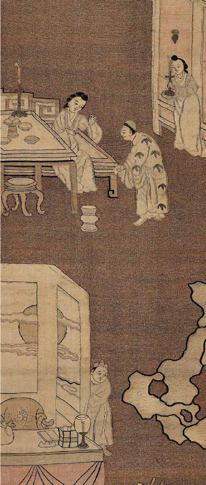  

Published for the exhibition Pictorial Silks: Chinese Textiles from the UMAG Collection at the University Museum and Art Gallery, The University of Hong Kong, 18 September to 6 December, 2020.  

本書是香港大學美術博物館為配合  
《如絲如畫：香港大學美術博物館藏中國織物》專題展覽而編製，該展覽展期為二零二零年九月十八日至十二月六日。  

Curator 策展人Kikki Lam 林嘉琪  

Designer 設計師Stephy Tsui 徐曉雯  

Cover illustration: cat. 15 封面圖片：圖版十五  

# Edition 版次  

September 2020 二零二零年九月© University Museum and Art Gallery,The University of Hong Kong, 2020© 香港大學美術博物館，二零二零年  

ISBN 國際標準書號978-988-74707-1-7  

All rights reserved. No part of this publication may be reproduced or transmitted in any form or by any means, electronic or mechanical, including photocopying, recording, or any information storage or retrieval system, without permission in writing from the publisher or from the artist of the exhibition.  

版權所有。未經香港大學美術博物館和參展藝術家的書面許可，任何人士不得以任何形式或方法，不論是電子或手寫方式，翻印、記錄、或利用任何資料儲存或檢索系統來發放本圖錄之任何內容或資料。  

  

Note to the Reader09 凡例Foreword11 前言Threading Colour: Chinese Silk Textiles from the UMAG Collection13 絲彩交織：香港大學美術博物館藏中國絲織物Kesi Silk Tapestry37 緙絲Cixiu Embroidery75 刺繡Glossary91 術語詞彙Bibliography95 參考書目  

Textiles illustrated in this volume are from the collection of the University Museum and Art Gallery (UMAG), The University of Hong Kong (HKU), unless otherwise noted. UMAG’s textile collection has developed over the past several decades through generous donations by individuals affiliated with the University of Hong Kong and private collectors. Several embroidery pieces were donated by Dr Hui Wai Haan, who taught in HKU’s Department of Chemistry for nearly four decades, and the entire silk tapestry collection was donated by Dr Lam Kwok Pun.  

The textiles have been dated according to their weaving or embroidery techniques, use of materials, or established information on individual weavers. The comparative discussion of silk tapestry and embroidery is based on the traditional juxtaposition of these two mediums in historical texts, including catalogues of the imperial collection such as Midian zhulin (The Pearl Forest in the Secret Hall) (1744), Shiqu baoji (Catalogue of  Painting and Calligraphy in the Qianlong Imperial Collection) (1745), and the monographs Qing neifu cang kesi xiuxian shuhua lu (Catalogue of  Kesi Silk Tapestry Woven and Silk Embroidered Calligraphy and Painting in the Collection of  the Imperial Household Department) (1930) and Sixiu biji (Notes on Silk and Embroidery) (1933).  

Throughout the text, dimensions exclude mounts or frames; height precedes width. Chinese names are given in the traditional order, surname first. The transliteration of Chinese names, places and techniques into English follows the Pinyin system of romanisation. Chinese terms are italicised unless commonly used in English.  

除另有說明者，本圖錄所示織物均屬香港大學美術博物館館藏。本館的織物收藏得以建立，實有賴過往數十載與香港大學緊密相關的熱心人士和私人收藏家的慷慨捐贈。其中，部分刺繡珍藏由曾在香港大學化學系執教近四十年的許慧嫻博士惠贈；緙絲精品則全由林國本醫生惠贈。  

本書據織物的緙織或刺繡工藝、所選用的物料或有關個別織匠的文獻史料，進行斷代研究。清代宮廷書畫收藏著錄如《秘殿珠林》(1744)、《石渠寶笈》(1745)，以及《清內府藏刻絲繡線書畫錄》(1930)、《絲繡筆記》(1933) 等相關專書，常將緙絲與刺繡並列討論。本書亦據此傳統，將緙絲與刺繡兩種媒介作一比較分析。  

書中織物的尺寸不包括裝池；先列高，後列寬。中文姓名按傳統以姓氏在前、名字在後列出。姓名、地名及工藝名稱的中文音譯以漢語拼音系統為準。除英語常用詞彙，中文詞彙的英文音譯會以斜體標示。  

Textiles are essential cultural objects that offer insight into an individual society’s history of design and manufacturing. The traditions of weaving and embroidering silk textiles in China have been passed on for centuries through discrete decorative motifs and techniques, and Chinese textiles have been treasured on the international market since they were first bartered on the Silk Road. For generations, these luxurious cloths were collected as highly prized artworks, or else imitated and reinterpreted to extend the reach of this exotic material into foreign palaces and princely wardrobes.  

Whereas the woven kesi and embroidered cixiu works represent the pinnacle of detail-oriented manufacturing techniques, the variety of motifs deployed as figurative depictions highlight the broad cultural connotations and symbolic language commonly found in Chinese art. Unlike the finest ink paintings, these textiles represent the pictorial compositions, vivid colours and minute details demonstrating the sophistication of a craft that achieved its highpoint during the Qing Dynasty (1644–1911) and continues to flourish today.  

This handsome publication accompanies a special exhibition of the same title at the University Museum and Art Gallery (UMAG). In it, researcher Kikki Lam describes and illustrates textiles from UMAG’s collection to document and explain the wide-ranging and long-lasting production of Chinese silk weaving and embroidering. The book also includes a detailed account of textile production techniques and their development over the past 1,000 years.  

We would like to thank the author and the editorial team for this comprehensive and extensively illustrated catalogue of a marvellous and highly sought-after artform that exemplifies the refined craftsmanship of China’s textile artists. An informative reference volume for years to come, we hope that this volume will give ample access to this celebrated artform and to the textile collections at the University of Hong Kong.  

# Dr Florian Knothe  

Director, University Museum and Art Gallery, The University of Hong Kong  

織物是不可或缺的文化物品。通過織物，人們可以認識到個別社會的設計和製造業歷史。中國絲織與絲繡傳統隨着各具特色的裝飾圖案和工藝技術代代相傳；而中國織物自從沿着絲綢之路遠銷外地後，即成為風靡全球的商品。這種奢華而別具異域風情的紡織品世世代代被視為藝術珍藏；各地人民亦會加以仿製和重新詮釋，以配合域外皇宮的格調和皇室貴族的衣飾品味。  

巧奪天工的緙絲和刺繡是織造工藝的巔峰之作，其上豐富多樣的花紋構成一幅幅精緻的圖像，展現出中國藝術中常見的文化內涵和象徵語言。有別於精妙的水墨畫，這些紡織品講求圖像佈局、絢麗的色彩和精巧的細節，突顯匠人技藝之精湛。緙絲與刺繡工藝在清代 (1644–1911) 達至頂峰，至今仍蓬勃發展。  

本書是專為配合本館舉辦的《如絲如畫：香港大學美術博物館藏中國織物》專題展覽而編製。研究員林嘉琪通過研究館藏織物，記錄和闡述了歷史悠久而豐富多彩的中國絲綢紡織和刺繡工藝。本書亦收錄一篇詳述千年以來紡織生產技術與發展的導論。  

我們衷心感謝作者和編輯團隊的努力，合力編製這本內容詳盡而插圖精美的圖錄，介紹絲綢這令人驚嘆且備受追捧的藝術形式，以及中國紡織藝術家精妙絕倫的手藝。本館盼望讀者通過閱讀這本內容豐富而具參考價值的圖錄，能更深入了解這種名聞遐邇的藝術形式和香港大學的紡織品收藏。  

香港大學美術博物館總監羅諾德博士  

# Threading Colour: Chinese Silk Textiles from the UMAG Collection  

Prized by Chinese and foreign merchants as an essential commodity along a vast trade network, silk served multiple roles throughout the ancient world: as fabric for garments, as a form of currency and method of tax payment, and as a medium and subject for professional artists and the literati class.  

The development of sericulture—the cultivation of silkworms for the production of silk—was first documented in China, with archaeological discoveries of sericulture practice dating to as early as five thousand years ago. Half of a silk cocoon was found at a Neolithic site (ca. 10,000–2100 BCE) in Xiyin village, Xia county, Shanxi province, and a plain tabby silk fabric fragment was excavated from a Neolithic site in Qianshanyang, Wuxing county, Zhejiang province. Inscriptions related to silkworms, silk and mulberry trees also have been found on oracle bones from the Shang (1600–1046 BCE) and Zhou dynasties (1046–256 BCE).  

Though the precise origins of Chinese sericulture remain unknown, legend traditionally attributes the discovery to Lady Xiling, wife of the Yellow Emperor, in ca. 2700 BCE. Over the centuries, sacrifices at the Altar of Silkworms were routinely performed by the empresses, and as the official head of all women in each successive dynasty, their involvement reinforced the role of women within the realm of sericulture and weaving.  

The ancient trade route connecting East and West, known popularly as the Silk Road, originated from the political and military expeditions by the Han dynasty’s (206 BCE–220 CE)  Emperor Wu (r. 141–87 BCE), who sent Zhang Qian (?–114 BCE) on two diplomatic missions to the Western Regions (Xiyu, present-day Xinjiang and the far western territories of China) to form an alliance against the Xiongnu, a confederation of nomadic tribes from the Steppe. Although these missions ultimately failed, trade routes between China and various states in Central and Western Asia were developed. Exquisite silks first came into vogue among the Roman elite in the first century, when China and the neighbouring countries where the silk was produced came to be known as Serica (Land of Seres), a term derived from the Latin word for silk, sericum.2  

Over the centuries, silk fabrics have remained synonymous with beauty and are entwined throughout Chinese art and literature. The Chinese idiom ling luo chou duan, which describes the lustrous and extraordinary clothing worn by the upper class, is an amalgamation of four types of silk fabric: ling (damask), luo (complex gauze), chou (coarse tabby silk) and duan (satin). Another idiom jin shang tian hua, literally ‘adding blossoms to brocade’, describes the act of perfecting what is already perfect. Silk also has served as a source of inspiration for poets and artists. Silk production, for example, was depicted in 絲綢在龐大的貿易網絡中，一直是備受中外商旅 追捧的商品。它在古代世界所扮演的角色極為豐 富──絲綢既是一種紡織原料，亦是一種貨幣和 用以賦稅之物，更是藝術家和文人的創作媒介和 題材。  

中國是世上最早發明養蠶業──即飼養家蠶，取蠶所吐之蠶絲為紡織原料的國家。相關的桑蠶絲織考古發現更可追溯至五千年前，如從山西省夏縣西陰村的新石器時代 ( 約公元前 10,000 年至公元前 2100 年 ) 遺址出土的半顆蠶繭，1 以及從浙江省吳興錢山漾的新石器時代遺址發掘所得的絹片。在商代 ( 公元前 1600 年至公元前 1046 年 ) 和周代 ( 公元前 1046 年至公元前 256 年 ) 的甲骨文上，亦刻有蠶、絲和桑等字。雖然中國養蠶業的起源仍有待考證，但傳統的傳說往往視約公元前二千七百年的黃帝元妃嫘祖為養蠶取絲的發明者。在往後數個世紀裏，歷代皇后都會在供奉嫘祖的先蠶壇上行親蠶禮。由作為女性典範的皇后親自主持祭禮，正正強化了女性在養蠶和紡織上的角色。  

貫通東西的古代貿易路線，即被稱為絲綢之路。絲綢之路源自漢 ( 公元前 206 年至公元 220 年 ) 武帝 ( 統治年份為公元前 141 年至公元前 87 年 ) 兩次派遣張騫 (? 至公元前 114 年 ) 出使西域，欲與西域諸國建立軍事聯盟，以夾擊匈奴。張騫雖未能達成外交使命，卻打通了中國與中亞、西亞等地國家的商貿路線。到了一世紀，當精緻華美的絲綢初次風靡羅馬帝國的貴族時，中國和鄰近地區等出產絲綢的國家被稱為「賽里斯國」(Serica，即絲國 )，Serica 一詞則源自拉丁文 sericum，即絲綢的意思。2  

多個世紀以來，絲綢是美的象徵，它與中國藝術和文學緊密交織。以成語為例，形容上流社會所穿奢華服飾的「綾羅綢緞」，正是由四種不同的絲織品綾、羅、綢、緞組成；另一則比喻事物美上加美的成語「錦上添花」，即指在彩色花紋絲織品上繡花。絲綢亦是詩人和畫家的創作泉源，如唐代 (618–907) 詩人白居易 (722–846) 的《繚綾》  

Liao Ling (Twill Weaved Silk) written by the famous Tang dynasty (618–907 CE) poet Bai Juyi (722–846 CE) and the handscroll Dao Lian Tu (Court Ladies Preparing Newly Woven Silk) painted by Zhang Xuan (713–55 CE). Silk fabrics such as juan (plain tabby silk) and ling were also used as a medium for paintings and calligraphy, wrappers and mounting materials.  

Beginning in the Song dynasty (960–1279) and flourishing into the Qing (1644–1911), craftsmen took up shuttles and needles as their brushes and silk threads as their pigments for creating woven and embroidered pictorial and calligraphic works. In the hands of weavers and embroiderers, the weft-woven silk tapestry (kesi) and embroidery (cixiu) evolved into an art form—a beautiful combination of painting, calligraphy and hand weaving or embroidering. These works were created for aesthetic appreciation, beyond their traditional role as clothing and decorative items. Unlike traditional Chinese painting and calligraphy which emphasize yijing (‘artistic conception’)—the expression of an artist’s ideals and values—pictorial and calligraphic silk tapestry and embroidery rely on the vivid and life-like depiction of images and text through a range of weaving and embroidery techniques. Together, their interdisciplinary nature offers these silk works a unique and unbroken place in Chinese visual culture.  

# Silk tapestry and embroidery: techniques and origins  

和畫家張萱 (713–55) 的〈搗練圖〉皆以絲綢生產過程為題。絹、綾等絲織物也是書畫的創作媒介、包首和裝裱物料等。  

自宋代 (960–1279) 起至清代 (1644–1911)，工匠以梭子和針為筆、以絲線為彩，創作織繡書畫。織工和繡工的巧手將緙絲和刺繡幻化成一種集繪畫、書法、手工梭織或刺繡之美於一身的藝術形式。這些緙繡書畫主要是欣賞性藝術品，超越了緙絲和刺繡作為服飾和裝飾工藝品的傳統功能。有別於傳統中國書畫追求意境──作者的思想情感，緙繡書畫是以豐富多變的緙織和刺繡技巧，逼真生動地表現圖像和文字。正是這種跨媒介特質，使緙繡書畫在中國視覺文化中持續享有獨特的地位。  

# 緙絲與刺繡：工藝與起源  

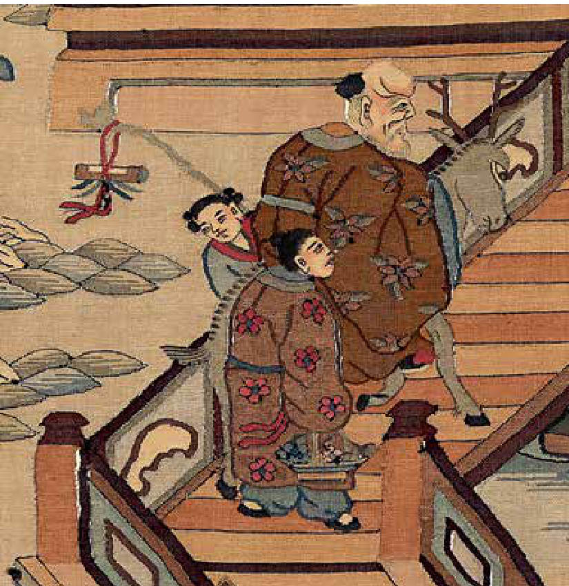  

Fig. 1   The saw-toothed split between adjacently coloured weft patterns can be seen in areas near the grey hair of Shoulao, and in the staircases and children’s robes. Detail from Gathering of  immortals, 18th century, Qing dynasty (1644–1911), China. Silk tapestry with metallic threads, 124.8 x 61.5 cm. HKU.T.2008.1671. Gift of Dr Lam Kwok Pun, UMAG.   
圖 1	 在壽老灰白色的頭髮、樓梯和童子的袍服等位置可見色緯之間呈鋸 齒狀的斷痕。 〈群仙會〉細部，中國，清代 (1644–1911)，十八世紀。緙絲、金屬 線，124.8 x 61.5 厘米。 HKU.T.2008.1671。香港大學美術博物館，林國本醫生惠贈。  

Silk refers to the long filament produced by silkworms that are fed exclusively on mulberry leaves. The material is lustrous, elastic, soft and thin, with a diameter of only 0.018 millimetres. Up to 1,000 metres of silk can be reeled from a single cocoon. The natural gaps in the filament mean that silk is well-ventilated and absorbent, making it a perfect material for clothing.3 Silk has been used historically in a diverse range of fabrics that can be classified according to structure (plain weave, twill-weave, satin-weave, gauze and rong [velvet]), surface pattern, colour and origin.  

Woven on small looms, Chinese silk tapestry is a type of handwoven textile that employs a technique known as tongjing duanwei (‘continuous warp and broken weft’).5 Small shuttles carrying polychrome wefts move back and forth across the warp threads within a defined pattern. Unlike other woven textiles created in a plain weave, weft threads in a silk tapestry do not run across the entirety of the fabric. The use of coloured weft threads and patterns woven in other silk fabrics, such as brocade, are relatively limited, or else are repeated through the continuous run of weft threads. Silk tapestry weavers could easily and freely employ an endless number of coloured weft threads to create individual patterned segments, resulting in a saw-toothed split between the adjacently coloured weft patterns. From a distance, such splits create a visual effect similar to carving; in fact, Chinese silk tapestry was first known as kesi (‘carved silk’), while another homophonic variant for the character ke (‘weft蠶絲是指蠶所吐的長纖維，而蠶是專以桑葉為食 的。蠶絲具有天然的光澤和良好的彈性，質地柔 軟而纖細，其直徑僅為零點零一八毫米。一隻蠶 繭可繅出約一千米長的蠶絲。蠶絲有天然的透孔， 透氣性高，亦易着色，是優質的紡織物料。3 以蠶 絲製成的絲織品種類繁多，可按其組織 ( 即平紋、 斜紋、緞紋、紗羅和起絨 )、圖案花紋、色彩和產 地等加以區分。  

緙絲是一種在較簡單的織機 4 上、以通經斷緯的方式手工梭織而成的織物。5 織匠先將彩色緯線繞在小梭子內，再依照圖案所需，局部挖織花紋。6 緙絲的組織不像其他平紋織物般通經通緯；換言之，它的緯線並不貫穿全幅織物。通緯的組織結構使錦等絲織物在使用色緯和梭織圖案上受到較多的限制、或呈重複式排列；相較之下，緙絲的斷緯結構讓織匠能更自由靈活地緙織圖案。由於不同色緯互不相聯，色塊與色塊之間存有形如刀刻的鋸齒狀斷痕，故緙絲起初被稱作「刻絲」。及至明代 (1368–1644)，學者始用同音字「緙」( 即織的意思），以突顯絲用緯線顯花的梭織特色。’(圖 1)  

雖然緙絲的織造原理相對簡單，但製作過程卻極 耗心力。緙絲以生絲為經，8 熟絲為緯。織匠先將 woven’) was adopted by scholars in the Ming dynasty (1368–1644) so as to highlight this characteristic weaving technique.7 (Fig. 1)  

Though the principle of the silk tapestry weave is relatively simple, the production process is extremely time-consuming. Warp threads in raw silk are first stretched onto a wooden loom.8 Weavers then place a fenben (‘cartoon’) beneath the warps and use a brush to outline the patterns on the warp threads. Dyed weft threads are inserted into individual small boat-like shuttles, which are then meticulously handwoven into the warp threads to create a polychrome composition. Developed by generations of weavers, the primary techniques include gou (‘outlining’) for defining the silhouette of patterns, along with guan (‘flinging’), jie (‘connecting’) and qiang (‘propping’). Each technique employs similar tones of polychrome wefts to achieve a gradation of colours. (Figs. 2 & 3) To prevent the slits between the adjacent weft patterns from becoming too large, weavers also employ the dasuo (‘shuttle joining’) technique to reduce the spacing. Weft threads of the adjacent patterns are interwoven once with the warp threads of the opposite coloured blocks, and within a set distance based on the size of the slits as a way to stabilise the weaving structure.  

Unlike kesi silk tapestry, in which warp and weft threads are used tocomplete a new piece of fabric, embroidery uses needle and threadto decorate a ground fabric, or another medium that can be pierced.The embroidered patterns are raised above the ground fabric, whilethe weft-woven areas of the silk tapestry lay horizontally in relation to經線整理在機架上，再將粉本襯墊在經線下面，用毛筆在經線上描繪圖案輪廓；然後將各色緯線繞在不同的舟形小梭子內，一絲不苟地引梭來回緙織圖案。歷代的緙絲匠運用不同技法來表現圖案，勾、結、摜、戧是四種基本緙法：勾緙用於勾勒圖案輪廓，結、摜、戧緙則運用色相相鄰的色緯來表現色階變化。( 圖 2 及圖 3) 為免花紋之間的斷痕過大，形成缺口，織匠又會用搭梭技法，即每隔一定距離，將雙方的色緯互相搭繞對方色緯區內的一根經線來鞏固結構。9  

有別於緙絲用經線緯線交織出一幅新的織物；刺繡乃是以針引線，在織物或其他可穿透的物料上穿繞成裝飾圖案。刺繡圖案在織物地上具微微隆起的效果，而緙絲以彩緯挖織的圖案則為平面。織造緙絲時，織匠一般會由下而上縱向緙織圖案；繡匠則可按照圖案所需，在織物上隨意施針繡製花紋。  

針、線、剪刀和繡繃是刺繡的四種主要工具。繡 工會先將繡地固定於木製或竹製的繡繃上，再用 the ground. While silk tapestry follows the principle of weaving the pictorial composition from bottom to top, embroiderers can freely apply stitches in any orientation, according to the defined pattern.  

Needles, thread, scissors and frames are the four major tools for creating an embroidery. The ground fabric is first stretched onto a frame, often made of wood or bamboo, known as a xiubeng (‘embroidery frame’) to stabilise the cloth. Artisans then use both hands, with one hand placed above the cloth and the other below to manage the meticulous process of handling the needles and myriad stitches. A variety of embroidery stitches were developed over the generations for outlining patterns (qizhen ‘straight stitch’ and dingxian xiu ‘couching stitch’); shading colours (qiangzhen ‘encroaching satin stitch’ and taozhen ‘long and short stitch’); adding three-dimensionality (tiehua ‘applique embroidery’ and gaoxiu ‘high embroidery’); and for representing surface textures (kelinzhen ‘carved scale embroidery’ and wangxiu ‘net embroidery’). (Figs. 4–7)  

The use of embroidered decorative items in China has a longer history than silk tapestry. The Shangshu (Book of  History) is the earliest known written record of Chinese embroidery, compiled during the Western Zhou period (1046–771 BCE). This canonical text describes the regulations concerning design and embroidery patterns as they relate to garments from nearly 4,000 years ago. Moreover, significant quantities of embroidered objects have been identified from the Spring and Autumn (771–476 BCE) and Warring States (475–221 BCE) periods, nearly a thousand years before the earliest surviving examples of silk tapestry in China. Embroidered costumes with birds, dragons and geometric patterns in suozhen (‘chain stitch’) from a Chu Kingdom (1030–223 BCE) tomb were discovered in Mashan Tomb No. 1, in Jiangling, Hubei province, and embroidered garments continued to flourish in later dynasties. Distinctive examples are a group of extraordinarily well-preserved embroidered silk fabrics and robes excavated from the Han tombs at Mawangdui in Changsha, Hunan province. Embroidered religious images emerged when Buddhism arrived in China during the Eastern Han (25–220 CE) dynasty. In the Sui (581–618 CE) and Tang, producing and commissioning embroidered Buddhist hangings and banners became a popular way to demonstrate a believer’s devotion. The embroidered silk Buddha image (dated 487 CE) from the Mogao Grottoes at Dunhuang is considered to be the earliest Buddhist pictorial embroidery known in China.  

Beginning with the woollen tapestries of the Mediterranean,1 the technique of tongjing duanwei was most likely transmitted to northwest China via Central Asia, where kemao (‘carved wool tapestry’) objects were produced along the Silk Road between the Han and Wei (386–556 CE) dynasties. The history of local Chinese artisans using silk threads rather than wool to create tapestries or articles of clothing can be traced back to as early as the Tang 雙手，即一隻手置在繡地上，另一隻放在繡地下 來回穿針引線、繡製圖案。歷代繡匠創造了一系 列豐富多變的針法，以勾勒輪廓 ( 如齊針和釘線 繡 )、表現色彩變化 ( 如搶針和套針 )、增加繡品 的立體效果 ( 如貼花和高繡 )、以及突顯質地紋理 ( 如刻麟針和網繡 )。(圖 4 至圖 7)  

在中國，刺繡的歷史比緙絲的更為悠久。有關刺繡的記載最早見於西周 ( 公元前 1046 年至公元前771 年 ) 的《尚書》，該書描述了近四千年前帝舜時代的人以刺繡裝飾服飾的制度。10 春秋 ( 公元前771 年至公元前 476 年 ) 戰國時代 ( 公元前 475 年至公元前 221 年 ) 的刺繡文物亦有大量出土，11 較傳世最早的緙絲早了接近一千年；12 如湖北江陵馬山一號楚 ( 公元前 1030 年至公元前 223 年 ) 墓出土、以鎖針繡製且非常精緻的鳥紋、龍紋和幾何紋服飾。13 而湖南長沙馬王堆一號漢墓內保存完好的刺繡袍服和絲織品，反映出刺繡服飾在隨後各朝依然風靡社會。14 刺繡佛像則隨着佛教在東漢(25–220) 傳入中國而逐漸興起。到了隋 (581–618)、唐年間，佛教信徒流行委託繡工繡製或親自刺繡佛像、佛幡，以修積功德。而從敦煌莫高窟發現的絲繡佛像 (487 年 )，則屬中國已知最早的佛教圖像刺繡品。15  

中國的緙絲源自地中海的緙毛織物。 此通經斷緯的織造工藝或在漢、魏 (386–556) 年間，沿着絲綢之路從出產緙毛織物的中亞傳入中國西北地區。早自唐代，本地織匠已採用絲線、而非毛線來緙織服飾。一九七三年，位於吐魯番阿斯塔那 ( 今新疆 ) 的高昌左衛大將軍張雄 (584–633) 和妻子麴氏 (607–88) 合葬的唐墓 (688 年 ) 中，發掘到一條繫於隨葬木製女俑身上的彩色緙絲腰帶，顯示唐代的緙絲主要作服飾用。緙絲工藝逐漸從中國西北傳播到東部和中原地區，但確實的傳播路線仍有待研究。基於北宋 (960–1127) 和中亞東部地區相類的緙絲裝飾風格 ( 兩者常以花卉地獸紋為裝飾 )，以及「刻絲」一詞源自波斯文 qazz 之回鶻語音譯的推論， 學者普遍認為約十世紀的回鶻人在緙絲工藝交流上扮演傳播者的角色。18 新疆喀什曾出土一件以緙絲織造邊飾的宋代長袍，這件長袍很可能由回鶻人織造，或能成為上述論點的  

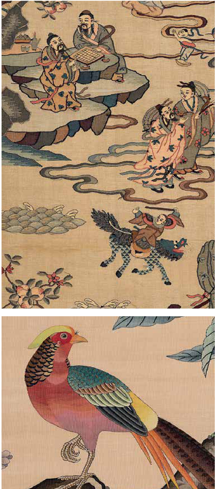  

Fig. 2   Cloud motifs are woven in the jie (‘knotting’) technique, robes of the immortals are outlined in the gou (‘outlining’) technique and the coloured gradation of the ocean waves and rocks are achieved with the qiang (‘propping’) technique. Detail from Gathering of  immortals, 18th century, Qing dynasty (1644– 1911), China. Silk tapestry with metallic threads, 124.8 x 61.5 cm. HKU.T.2008.1671. Gift of Dr Lam Kwok Pun, UMAG.   
圖 2	 雲紋以結技法織造，仙人的袍服以勾緙技法織造，波浪紋和石紋的 色彩變化則以戧技法織造。 〈群仙會〉細部，中國，清代 (1644–1911)，十八世紀。緙絲、金屬線， 124.8 x 61.5 厘米。 HKU.T.2008.1671。香港大學美術博物館，林國本醫生惠贈。   
Fig. 3   Brownish feathers of the golden pheasant are woven in the guan (‘flinging’) technique. Detail from Golden pheasant on a loquat tree, 18th century, Qing dynasty (1644–1911). China, silk tapestry, 96 x 50 cm. HKU.T.2008.1673. Gift of Dr Lam Kwok Pun, UMAG.   
圖 3	 錦雞的褐色羽毛以摜技法織造。 枇杷錦雞〉細部，中國，清代 (1644–1911)，十八世紀。緙絲， 96 x 50 厘米。 HKU.T.2008.1673。香港大學美術博物館，林國本醫生惠贈。  

dynasty. In 1973, a fragment of a fine polychrome silk tapestry belt wrapped around a wooden figurine was excavated from the Tang dynasty tomb (dated 688) of General Zhang Xiong (584–633 CE) and his wife Qu (607–688 CE) in Astana, Turfan (now Xinjiang province). This belt illustrates the utilitarian nature of silk tapestry from that era. The silk tapestry weaving technique was gradually transmitted from northwest China to eastern and central China, though the exact route remains unknown. Based on the similarity of the Northern Song (960–1127) and eastern Central Asian silk tapestries, which both represent animals against a floral ground pattern, and the hypothesis that the Chinese term for silk tapestry, kesi, is likely a Uyghur phonetic transliteration from the Persian qazz,17 scholars generally believe that silk tapestry weaving was brought to eastern and central China by the Uyghers in the tenth century. A Song dynasty robe with silk tapestry border is one piece of evidence supporting this view.19  Excavated from a tomb in the Kashgar region of Xinjiang, the robe was probably made by a local Uyghur weaver. This practical function continues into the early Song dynasty (960–1279), when silk tapestry began to be manufactured in Dingzhou, Hebei province as luxurious clothing and Buddhist statue wrappers. According to Jilei Bian (Chicken Ribs) (1133)—one of the earliest written records on Chinese silk tapestry by the Northern Song scholar Zhuang Chuo (ca. 1079–?)—a single woman’s garment could take weavers an entire year to complete due to the complex production process.20  

# Pictorial and calligraphic silk tapestry and embroidery from the Song to the Ming dynasty  

While functional items in silk tapestry and embroidery had been made in China for millennia, the practice of producing woven and embroidered paintings and calligraphy purely for aesthetic appreciation did not emerge until the Song dynasty. In the Northern Song, landscape and bird-and-flower paintings were popular, and artworks from the Six Dynasties (220–589) and Tang era were favoured by connoisseurs of the Song court. Paintings and calligraphy were mounted on precious silk fabrics, most notably on silk tapestries. The Song dynasty scholar Zhou Mi’s (1232–1308) Qidong Yeyu (Wild Talk in Qidong) and Ming dynasty scholar Tao Zongyi’s (ca. 1316–1402) Chuo Geng Lu (Nancun´s Records Taken While Halting Field Work) record the use of silk tapestry as colourful mountings for handscrolls with floral arrangements, birds and landscapes. These mountings may have served as prototypes for later pictorial and calligraphic silk tapestry works. (Fig. 8)  

In the Southern Song (1127–1279), the Gaozong Emperor’s (r. 1127–1162) fondness for paintings and calligraphy compelled artisans to use court paintings, particularly bird-and-flower scenes, as blueprints for textiles.23 Woven or embroidered as album leaves and handscrolls, the life-like quality of these reproductions were highly 佐證。19 直到宋代 (960–1279) 初年，緙絲仍主要 是實用性織物，如河北定州曾出產奢華的緙絲服 飾和包裹佛像用的緙絲織物。據北宋學者莊綽 (約 1079 年至 ?)《雞肋編》(1133) ──最早記載中國 緙絲的文獻之一所載，一件婦人的衣裳需時一年 才能完成，可見緙絲織造過程之複雜。20  

# 宋代至明代的緙繡書畫  

中國實用性緙絲和刺繡的歷史悠久，但欣賞性緙絲和刺繡書畫藝術到了宋代才逐漸興盛。北宋時期，山水畫與花鳥畫極為流行；宋室亦喜愛鑒賞和收藏六朝 (220–589) 和唐代的藝術品，更會採用珍貴的絲織品，尤其是緙絲來裝裱書畫珍藏。21宋代學者周密 (1232–1308)《齊東野語》和明代學者陶宗儀（約1316-1402)《耕錄》均記载了以色彩斑斕的花鳥紋或山水樓閣紋緙絲織物來裝裱書畫。22這些裝裱用緙絲或許是日後緙絲書畫的原型。(圖 8)  

南宋 (1127–1279) 高宗 ( 統治年份為 1127 年至 1162年 ) 對書畫的熱愛，鼓勵了工匠以宮廷書畫，尤其是花鳥畫為藍本，緙織和刺繡書畫作品。23 這些緙繡書畫冊頁和卷軸上的圖像栩栩如生，深受宋室和上流社會喜愛。24 著名的織者如朱克柔 ( 活躍於高宗年間 ) 和沈子蕃 ( 生卒年不詳 ) 等 25 擅長以巧奪天工的緙織技藝，逼真生動地再現寫實花鳥畫；他們甚至能夠如赫赫有名的畫家在畫作上落款署名般，將自己的名字織在緙絲書畫上。26 而從明代鑒賞家高濂 (1573–1620)《遵生八箋》的記載可見，宋代的刺繡書畫亦廣為流行。27  

到了元代 (1271–1368)，緙絲和刺繡主要作為袍服、扇子和靴套等實用性服飾，但圖像織物仍有生產。元宮廷喜愛用緙絲織造皇室人員的肖像，先帝先后的織御容則會安放在影堂或神御殿中作供奉。28 當時的緙絲匠受流行的納石失 ( 又稱織金錦 ) 啟發，29 採用金線織造緙絲。30 (圖 9) 元代的刺繡文字作品則以詔書和佛經為主。31  

緙繡書畫在明代的發展更為興盛。君主對藝術的支持──如宣德皇帝 ( 統治年份為 1426 年至 1435年 ) 曾重設內造司製作緙絲書畫，加上文人博古  

Fig. 4   The silhouette of Magu is outlined in gold threads using dingxian xiu (‘couching stitch’) and her face is embroidered in qizhen (‘straight stitch’). Detail from Longevity banner commemorating the 70th birthday of  Xu Yingkui, 1900, Qing dynasty (1644–1911), China. Silk with metallic threads, 293.5 x 145.5 cm. HKU.T.2004.1922. Gift of Dr Hui Wai Haan, UMAG.   
圖 4	 麻姑的輪廓以金線和釘線繡繡製，其臉龐以齊針繡製。 〈許應騤七十大壽賀壽幡〉細部，中國，清代 (1644–1911)，一九 零零年。絲、金屬線，293.5 x 145.5 厘米。 HKU.T.2004.1922 $^\circ$ 香港大學美術博物館，許慧嫻博士惠贈。   
Fig. 5   Shading of the green coloured bat wings is done in qiangzhen (‘encroaching satin stitch’). Detail from Longevity banner commemorating the 70th birthday of  Xu Yingkui, 1900, Qing dynasty (1644–1911), China. Silk with metallic threads, 293.5 x 145.5 cm. HKU.T.2004.1922. Gift of Dr Hui Wai Haan, UMAG.   
圖 5	 蝙蝠的綠色翅膀以搶針繡製。 〈許應騤七十大壽賀壽幡〉細部，中國，清代 (1644–1911)， 一九零零年。絲、金屬線，293.5 x 145.5 厘米。 HKU.T.2004.1922。香港大學美術博物館，許慧嫻博士惠贈。  

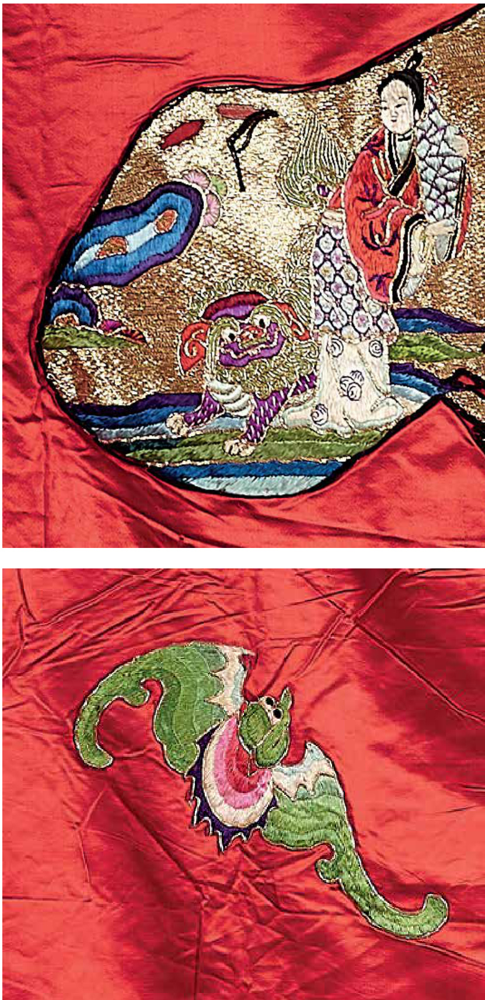  

valued by the Song court and upper-classes. The most celebrated artisans were able to master and reproduce realistic paintings in silk tapestries by employing a variety of painting and weaving techniques in polychrome silk threads. One such master was Zhu Kerou (active during the reign of Gaozong) and Shen Zifang (dates unknown).25 Their names were woven into their artworks in the same way that renowned painters would sign works with seals. Embroidered paintings were also popular in the Song dynasty, as remarked on by the Ming dynasty connoisseur Gao Lian (1573–1620) in his Zun Sheng Bajian (Eight Discourses on the Art of  Living).27  

In the Yuan dynasty (1271–1368), silk tapestry and embroidery were used principally for functional items such as robes, imperial fans and boot covers, but also for painting-like textiles. The Yuan court also favoured silk tapestry as a medium for producing imperial portraits of deceased imperial family members, known as zhi yurong (‘woven imperial portraits’). These were displayed in imperial ancestral halls and portrait halls for worship and rituals. Inspired by the highly prized nashishi or zhijin jin (gold brocade) silk fabrics, weavers also employed gold threads when producing silk tapestries. (Fig. 9) Yuan embroidered works containing written texts were predominately imperial edicts and reproductions of Buddhist scripts.31  

The tradition of pictorial and calligraphic silk tapestry and embroidery expanded further during the Ming dynasty. With the patronage of the Xuande Emperor (r. 1426–35), who established the imperial silk tapestry workshops and the popularity of connoisseurship among the literati, a significant number of silk tapestries were made that reproduced famous paintings and works of calligraphy, many depicting birds, flowers and natural landscapes. Weavers often employed gold threads and peacock feathers, and introduced the new practice of painting certain areas of the tapestry with a brush. Southern China, particularly the Jiangnan region, was famous for producing huaxiu (‘embroidery painting’). (Fig. 10) Works produced by Guxiu (Gu Embroidery), also known as Luxiangyuan xiu (‘Dew Fragrance Garden Embroidery’) in Shanghai, were the most well-known type of decorative embroidery. Characterised by sophisticated craftsmanship, Guxiu works were produced by the elite females of the Gu family who had mastered both painting and embroidery. Song Yuan mingji fangce (Gu Embroideries of  Song and Yuan Masterpieces) (1634), an embroidered painting volume published by Han Ximeng (dates unknown), the granddaughter-in-law of Gu Mingshi (dates unknown) was a particularly popular reference work among the elite. The famed artist Dong Qichang (1555–1636) also wrote poems in the volume complementing the artworks. Guxiu’s style and techniques were subsequently inherited by Suxiu (Suzhou School of Embroidery) artisans in the Qing dynasty.35  

賞玩之風興盛，造就大量摹刻著名書畫、展現花鳥與山水景色的緙絲作品出現。32 明代織匠常以金線和孔雀羽毛來織造緙絲，又開創用畫筆來描繪織物細部的技法。當時南方，尤其是江南地區更以織造「畫繡」聞名。( 圖 10) 上海的顧繡，又稱為露香園繡，是當時欣賞性刺繡的佼佼者。33 顧繡精湛的刺繡工藝享負盛名，其繡品主要由知書達禮且精於繪畫和刺繡的顧氏女性創作。顧名世( 生卒年不詳 ) 的孫媳韓希孟 ( 生卒年不詳 ) 的繡品集《宋元名跡方冊》(1634) 深受當時的文人精英歡迎，著名的書畫家董其昌 (1555–1636) 更於冊上題贊。34 及後清代的蘇繡亦繼承了顧繡的風格與工藝。35  

# 清代發展  

清代，尤其是乾隆年間 (1736–95)，緙繡書畫發展蓬勃。工匠持續從宋、元、明或當代書畫汲取靈感，創作緙繡書畫。36 清廷鍾愛這些作品，更將之收錄於《秘殿珠林》(1744) 和《石渠寶笈》(1745) 等乾隆皇帝的宮廷書畫收藏著錄中。37 乾隆皇帝亦曾下令工匠以緙絲和刺繡來摹刻自己的詩文書畫。  

清代絲綢業發達，為緙繡書畫的發展奠定基礎。穩定的政局、繁榮的經濟，以及康熙 (1662–1722)、雍正 (1722–35) 和乾隆年間宮廷對藝術的贊助，使興旺的絲綢業獲得進一步發展。38 清初的農桑業因清廷壓制明遺民叛亂和八旗圈地而備受摧殘。為了重整與鼓勵農桑，康熙皇帝在一六九六年下令宮廷畫家焦秉貞 (生卒年不詳 ) 繪製《御製耕織圖》，他本人更親自為四十六幅圖題詩。39 隨後各朝亦有重刊此書，反映清廷對農桑業這中國社會之本和清代重要的國庫收入來源的重視。( 圖 11a及 11b)  

清廷建立了規模龐大的絲綢和絲織品生產中心，在北京設有由內務府主理的內織染局，在江寧( 南京 )、蘇州和杭州三地則置織造局，經營官營織造作坊，合稱江南三織造。40 據《大清會典》(1732) 記載，各織造局分工明確，每年需生產一定數量的絲織品供宮廷和官員所用。41 而北京內  

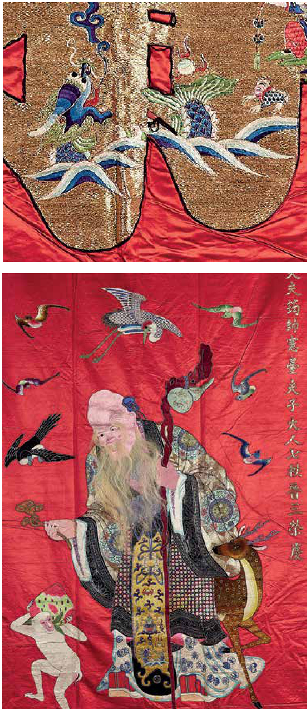  

Fig. 6   Dragon scales are embroidered in dielinzhen (‘stacked scale embroidery’), one type of kelinzhen (‘carved scale embroidery’). The bluish colouration of each scale is decorated in taozhen (‘long and short stitch’). Detail from Longevity banner commemorating the 70th birthday of  Xu Yingkui, 1900, Qing dynasty (1644–1911), China. Silk with metallic threads, 293.5 x 145.5 cm. HKU.T.2004.1922. Gift of Dr Hui Wai Haan, UMAG.   
圖 6	 龍鱗以疊鱗針繡製，疊鱗針是刻鱗針的一種。藍色鱗片的色階變 化以套針表現。 〈許應騤七十大壽賀壽幡〉細部，中國，清代 (1644–1911)，一九 零零年。絲、金屬線，293.5 x 145.5 厘米。 HKU.T.2004.1922。香港大學美術博物館，許慧嫻博士惠贈。   
Fig. 7   Facial features of Shoulao are embroidered in gaoxiu (‘high embroidery’), and the colourful octagonal pattern on his robe is embroidered in wangxiu (‘net embroidery’). All of the auspicious motifs, including the Shoulao, monkey, bats and cranes have been stitched onto the red satin ground with the tiehua (‘applique embroidery’) technique. Detail from Longevity banner to commemorate the 73rd birthday of  Xu Yingkui, 1903, Qing dynasty (1644–1911), China. Silk with metallic threads, 304 x 147 cm. HKU.T.2004.1923. Gift of Dr Hui Wai Haan, UMAG.   
圖 7	 壽老的五官以高繡繡製，其色彩斑斕的長袍上的八角圖案以網繡 繡製。所有吉祥圖案，包括壽老、猴子、蝙蝠和鶴皆用貼花技術 繡於紅緞上。 〈許應騤七十大壽賀壽幡〉細部，中國，清代 (1644–1911)， 一九零三年。絲、金屬線，304 x 147 厘米。 HKU.T.2004.1923。香港大學美術博物館，許慧嫻博士惠贈。  

# Qing dynasty developments  

Pictorial and calligraphic silk tapestry and embroidery thrived in the Qing dynasty, particularly during the Qianlong period (1736–95). Artisans continued to seek inspiration from paintings and calligraphy in the Song, Yuan and Ming dynasties, or from contemporary works as subjects for woven or embroidered textiles. Treasured by the imperial court, these textiles were included in catalogues of the Qianlong Emperor’s collections of paintings and calligraphy, such as Midian zhulin (The Pearl Forest in the Secret Hall, compiled in 1744) and Shiqu baoji (Catalogue of  Painting and Calligraphy in the Qianlong Imperial Collection, compiled in 1745). The Qianlong Emperor himself also commissioned artisans to reproduce his poems and paintings in silk tapestry and embroidery.  

The flourishing silk industry in the Qing dynasty laid a solid foundation for the development of pictorial and calligraphic silk textiles. Political and economic stability, as well as imperial patronage during the reign of the Kangxi (1662–1722), Yongzheng ( 1722–35) and Qianlong Emperors contributed to an already thriving silk industry. To revive the state’s agriculture and sericulture sectors, which were interrupted by the suppression of Ming supporters and the pasturing of the Eight Banners’ army horses on farmlands and mulberry fields, the Kangxi Emperor commissioned the court painter Jiao Bingzhen (dates unknown) to publish the Yuzhi gengzhi tu (Imperially Commissioned Illustrations of  Tilling and Weaving) in 1696; the Emperor himself wrote a poem for each of the forty-six illustrations.39 The volume was reproduced in successive dynasties and demonstrated imperial recognition for the importance of agriculture and sericulture, which were two of the most important revenue streams for the empire, as well as pillars of Chinese society. (Fig. 11a, 11b)  

Large-scale manufacturing centres for silk and silk products were founded by the Qing government. Imperial weaving workshops were established within the nei zhiran ju (Imperial Weaving and Dyeing Service) in Beijing under the oversight of the neiwu fu (Imperial Household Department), as well as in regional cities such as Jiangning (Nanjing), Suzhou and Hangzhou, which came to be known collectively as the Jiangnan san zhizao (Three Southern Textile Workshops). According to Da Qing huidian (Collected Statutes of  the Qing Dynasty, compiled in 1732), each workshop was responsible for manufacturing a specific type and certain amount of silk fabrics annually for imperial members and court officials. Among the more than 800 artisans and labourers employed by the Imperial Weaving and Dyeing Service in Beijing, more than 300 of them were zhixiu jiang (‘weavers and embroiders’). Throughout the Qing dynasty, nearly all silk tapestries created for court use—consisting of robes, decorative panels and hangings—were manufactured at the Suzhou Textile Workshop. Gongtingxiu (‘court embroideries’) such as dragon 織染局的逾八百名工匠中，超過三百名是織繡匠。42 清代幾乎所有的宮廷用緙絲品，包括龍袍、裝飾 用掛屏和幔帳等，皆由蘇州織造局生產。而王公 貴族用的龍袍和奢華服飾等宮廷繡品，則由江寧、 蘇州和杭州的官營繡坊生產。43 香港大學美術博物 館收藏的龍袍，是在喜慶節日或御宴時穿的納紗 吉服袍。龍袍有窄幅，袖口為馬蹄袖，別具滿洲 遊牧民族特色；紗地輕薄透風，顯示它們是夏季 服飾 (圖版 16)。  

與此同時，民營織造業，特別是江寧、蘇州和杭州三地的民營作坊也極為興盛。清廷廢除了明代匠籍制度， 改為計工受值，提高了織匠和繡匠在不同作坊之間的流動性，45 促進了民營作坊和紡織商品經濟的發展。康熙皇帝亦廢除了民間作坊不得擁有超過一百張織機的規定。到了清中葉，江寧、蘇州和杭州三地民營作坊的規模擴大，擁有逾一千張織機、聘用超過三千名織匠，46 以競逐本地和海外市場。絲綢與茶葉、瓷器一同成為最重要的外銷貨品，風靡歐亞。當時蠶絲和絲織品佔了中日之間外銷貿易貨品數量約七成，直到十八世紀初日本發展本地絲綢業後，日本對中國絲綢的需求才逐漸減少。47 十八世紀中葉，約超過兩萬件絲綢商品自廣州遠銷至歐美，迎合英國、法國、荷蘭和美國等地顧客的龐大需求。48  

# 題材與工藝發展  

緙繡書畫的題材豐富多元，如歷史人物、山水、花鳥、宗教人物和經文、吉慶祥瑞等，可迎合不同的品味愛好，是深受宮廷和上流社會喜愛的贈禮和奢華陳設品。49 民國時期 (1912–49) 的緙絲刺繡鑒賞家朱啟鈐 (1871–1964) 所著《清內府藏緙絲繡線書畫錄》(1930)，詳盡地記錄清代最流行的緙繡書畫題材，分別是法書、釋道圖像、花鳥、花卉、翎毛、人物和山水。50  

香港大學美術博物館所藏清代至二十世紀中葉的絲織品，包括立軸、掛屏、幡及袍服等，形式多樣，內容豐富，涵蓋了朱啟鈐著作所論的主題。取材自著名書畫的館藏包括摹刻宋畫的〈桃花鴛鴦〉(圖版 14) 和清官翁同龢 (1830–1904) 的刺繡書法  

Fig. 8   Scroll Cover with Animals, Birds, and Flowers. 11th–12th centuries,Song dynasty (960–1279). China. Kesi silk tapestry, 36.2 x 31.8 cm.Accession no. 1983. 1983.105. Gift of John M. Crawford Jr.,The Metropolitan Museum of Art, New York.  
圖 8 〈飛鳥走獸紋包首〉，中國，宋代 (960–1279)，十一世紀至十二世紀。緙絲，36.2 x 31.8 厘米，館藏編號 1983. 1983.105。紐約大都會藝術博物館，John M. Crawford Jr. 惠贈。  
Fig. 9  	Flowers and Garden Rock. 14th century, Yuan dynasty (1271–1368) orMing dynasty (1368–1644). China. Kesi silk tapestry and metallic-thread tapestry, 40.6 x 38.7 cm. Accession no. 13.100.24. JohnStewart Kennedy Fund, The Metropolitan Museum of Art, NewYork.  
圖 9	 〈花卉與假山〉，中國，元代 (1271–1368) 或明代 (1368–1644)。緙絲、金屬線，40.6 x 38.7 厘米，館藏編號 13.100.24。紐約大都會藝術博物館，John Stewart Kennedy Fund。  

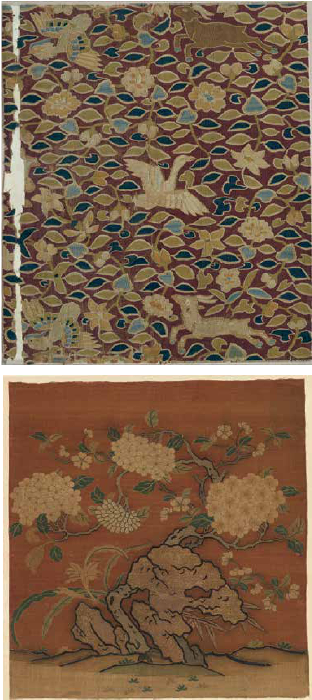  

robes and luxurious garments worn by the imperial family were produced in xiufang (‘embroidery workshops’) in Jiangning, Suzhou and Hangzhou. The dragon robes in the UMAG collection are jifu (‘semi-formal robes’ or ‘auspicious robes’), which were embroidered in nashaxiu (‘counted stitch’) on silk gauze. The narrow sleeves with horse-hoof cuff design reflects the Manchu’s nomadic style, and the use of well-ventilated transparent silk gauze suggests they were worn in summer. Jifu like these were worn on festive occasions such as imperial banquets. (Plate 16)  

Private weaving workshops also blossomed, particularly in Jiangning, Suzhou and Hangzhou. The abolition of the Ming dynasty jiangyi (‘artisan corvée’) system fostered the development of private workshops and the economy of textile commodities, as weavers and embroiderers could now enjoy the freedom of earning a fairer wage, along with the ability to move to different workshops. A regulation restricting private commercial weaving workshops from owning more than one hundred looms per workshop was also abandoned by the Kangxi Emperor. By the mid-Qing dynasty, private workshops in Jiangning, Suzhou and Hangzhou quickly expanded until they housed more than 1,000 looms and employed over 3,000 weavers, which subsequently allowed them to compete with the local and overseas markets. As one of the most important export goods (along with tea and ceramics), silk products were exported to markets across Asia and Europe. Raw silk and silk products amounted to approximately seventy percent of the total export trade between Japan and China; and the Japanese demand for Chinese silks only declined after Japan developed its own silk industry in the early eighteenth century. Approximately 20,000 silk products, including raw silk and silk textiles, were exported to Europe and America via Canton (Guangzhou) in the mid-eighteenth century, destined for consumers in England, France, the Netherlands, the Americas and elsewhere.48  

# Subjects and technical development  

Favoured by members of the court and the upper class as gifts of exchange and luxurious furnishings, pictorial and calligraphic textiles embraced a diverse range of subjects, including historical figures, landscapes, birds and flowers, religious figures and scriptures, as well as auspicious symbols to suit various tastes and audiences. Zhu Qiqian (1871–1964), a connoisseur of silk tapestry and embroidery works from the Republican period (1912–49),  compiled Qing neifu cang kesi xiuxian shuhua lu (Catalogue of  Kesi Silk Tapestry Woven and Silk Embroidered Calligraphy and Painting in the Collection of the Imperial Household Department (1930) in order to provide a detailed description of the most popular subjects of pictorial textiles in the Qing dynasty. These included fashu (calligraphy), shidao tuxiang (Buddhist and Daoist images), huaniao (birds and flowers), huahui (flowers and plants), lingmao (birds and animals), renwu (figures) and shanshui (landscapes).  

對聯 (圖版 18)；描繪和合二仙 (圖版 2) 和壽老(圖版 19) 等寓意吉祥的道教人物之緙繡作品也為數不少。約四之分一的藏品刻劃了花鳥美景 (圖版 8)，另有恬靜的山水人物圖像 (圖版 1 及圖版17)。  

清代緙絲的流行和對逼真生動地再現書畫的追求，促進了緙織工藝的創新與突破。緙絲匠鑽研出雙面透緙技法，緙織裝飾性極高的雙面緙絲品 (圖版3；圖版 4)，用來製作插屏、掛屏和扇子等深受歡迎的觀賞陳設品。織匠又會將兩種或以上顏色相類的線合捻成合花線，來緙織圖案的色階和質感變化 (圖版 11)。51 而三色金技法則運用赤圓金線、淡圓金線和銀線來加強圖案的立體感 (圖版 7)。52在西洋畫影響下，清中葉至清末的本地緙絲匠開始運用三藍緙絲和水墨緙絲等技法來緙織富立體感的作品。前者使用深藍、品藍和月白三種藍色線來緙織退暈效果，後者則用黑色、深灰色和淺灰色線緙織圖案，配合使用金線或銀線勾勒輪廓。53清織匠更別具創意地採用其他物料或媒介來緙織，提升作品的藝術效果。清中葉宮廷用的掛屏和插屏常以緙絲毛技法製造，即以絲線緙織地紋，再用毛線緙織花紋。54 當遇上較難緙織的微細部分，織匠又會運用畫筆作點綴，是為緙畫。(圖 12) 為了令緙絲品的畫面更加豐富亮麗，織匠又會在緙織地紋和特定圖案後，再加繡其他複雜花紋。55  

清代刺繡工藝發展更趨成熟，在針法技巧上亦有所創新。手藝嫻熟的繡工開創出雙面繡技法，能繡出正反兩面相同的繡品；就像雙面透緙一樣，雙面繡主要用於裝飾服飾、插屏和屏風。而三藍繡，也是運用深藍、品藍和月白三種深淺不同的藍色線來表現暈色效果。56(圖 13) 另外，蘇州的蘇繡亦發展出納紗繡技法，在紗地上刺繡圖案，屬龍袍等宮廷服飾常用的刺繡技巧 (圖版 16)。57清代熾熱的刺繡商業市場和多元化的生產中心，促成多個別樹一幟的地方刺繡系統出現，包括著名的四大名繡──蘇州的蘇繡、廣東的粵繡、四川的蜀繡和湖南的湘繡。58 官營繡坊的繡品需以如意館內宮廷畫家繪製的畫稿為藍本；相比之下，  

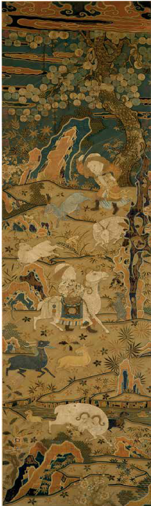  

Fig. 10   Welcoming Spring. 15th century, Ming dynasty (1368–1644).China. Silk embroidery, 213.4 x 63.5 cm. Accession no. 1981.410.Purchase, The Dillon Fund Gift, The Metropolitan Museum ofArt, New York.  
圖 10	 〈開泰圖〉，中國，明代 (1368–1644)，十五世紀。絲繡，213.4x 63.5 厘米，館藏編號 1981.410 $^\circ$ 紐約大都會藝術博物館，TheDillon Fund Gift 購藏。  

Ranging from the Qing dynasty to the mid-20th century, UMAG’s silk textile collection encompasses a variety of subjects that fit within Zhu’s account, including hanging scrolls, framed panels, banners and robes. Inspired by famous paintings and works of calligraphy, Mandarin Ducks and Peach Blossoms (Plate 14) is a reproduction of a Song dynasty painting in silk tapestry, while the embroidered calligraphy panel (Plate 18) vividly imitates a couplet written by Qing dynasty official Weng Tonghe (1830–1904). Daoist figures featuring auspicious symbols, such as the Hehe Immortals (Plate 2) and Shoulao, the God of Longevity (Plate 19), are also commonly found throughout the UMAG collection.  

Roughly one quarter of the objects illustrate languid scenes of birds and flowers (Plate 8), while several artworks represent serene landscapes (Plate 1) and figures at leisure. (Plate 17)  

The widespread popularity of silk tapestry and a demand for life-like images resulted in the development of new weaving techniques in the Qing dynasty. As silk tapestry table screens, panels and fans were commonly used as display objects, weavers developed shuangmian touke (‘double-sided translucent silk tapestry’) as a way to create a highly ornamental object with identical images on both sides. (Plate 3; Plate 4) Another notable technique known as hehuaxian (‘mixedcolour threads’) combines two or more strands of polychrome threads with similarly coloured tones to produce variations in texture and shades of colour. (Plate 11)51 For example, the sansejin (‘three colour gold’) technique uses three types of twisted gold and silver threads to achieve a highly expressive pattern. (Plate $7)^{52}$  

Influenced by the aesthetics of Western painting, Chinese silk tapestry weavers in the mid- and late Qing dynasty began to produce three-dimensional woven works through the use of techniques such as sanlan kesi (‘three shades of blue silk tapestry’) and shuimo kesi (‘water and ink silk tapestry’). The former technique employs three different blue threads, including dark blue, reddish blue and pale blue to achieve the various shades; the latter utilises black, dark grey and light grey with gold or white threads to outline the depicted image.  

Qing dynasty weavers also creatively combined silk tapestry works with other materials or mediums to enhance the quality of woven textiles. Wall hangings and table screens in the imperial palace in the mid-Qing period were often made using the kesi mao (‘silk tapestry with wool’) technique, in which the background pattern was woven in silk and the main pattern in wool. For smaller areas that were particularly difficult to weave, artisans used brushes to paint in the details; this technique is known as kehua (‘silk tapestry and painting’). (Fig. 12) Another distinctive technique, kexiu (‘silk tapestry with embroidery’), gives finished textiles a shimmering surface, as the fabric ground and specific patterns are first woven into the silk tapestry, and then the remaining motifs are embroidered.55  

地方刺繡更可靈活自由地設計與製作別具特色的繡品。以粵繡為例，其繡品色澤艷麗，常採用大量金線刺繡；構圖豐富，喜繡製華麗的邊飾和孔雀開屏等吉祥圖案。59 本館所藏〈呈盧督頌詞〉產自廣州，繡有精緻的邊飾和孔雀紋，別具粵繡特色。(圖 14) 而據鄧淳 (1776–1850)《嶺南叢述》(1835) 記載，粵繡的繡工大多是精於女紅的廣州和潮州男子，而非像其他地方刺繡以女性繡工為主。60  

事實上，整個清代的繡工皆以女性為主。對女性而言，刺繡除了是維持生計的方法，更是一門極重要的手藝。因為刺繡又稱為女紅，是女性傳統四德之一 ── 婦功。61 而成語「男耕女織」，正好突顯了帝制中國的性別分工。活躍於嘉慶(1796–1820) 與道光年間 (1821–50) 的丁佩和沈壽(1874–1921) 的刺繡手藝精妙絕倫，各著有刺繡專書，是清代最重要的女性繡者之一。  

丁佩所著《繡譜》(1821) 強調刺繡是閨閣中的翰墨──以絹素為紙、絲線為朱墨、針為筆，62 又詳論如何揀選合適的工作地點與工具、刺繡的紋樣、顏色和針法，以及品評繡品優劣的準則。63 她的著作為刺繡這門手藝提供理論基礎，將之昇華成一種藝術。另一位技藝超卓的繡者沈壽，在推廣刺繡文化與工藝交流上貢獻良多，或許是晚清最蜚聲國際的中國刺繡名家。64 她曾出任農工部繡工科總教習，65 更獲派赴日本考察教授刺繡工藝的學校。期間，沈壽受到日本刺繡和西洋畫啟發，返國後創立「仿真繡」風格，提升刺繡圖案的立體效果。其作品在國際間廣受好評，屢獲殊榮，如繡品〈耶穌像〉曾於一九一五年舉辦的美國舊金山巴拿馬太平洋國際博覽會上展出。66 一九一九年，在著名的工業家和農業家張譽 (1853–1926) 協助下，沈壽出版了《雪宦繡譜》。該書有系統地討論刺繡的工具、工序、針法、繡者的品德，以及刺繡與書畫的關係，成為清代最具影響力的刺繡專著之一，至今仍是繡者與研究者所珍視的參考文獻。  

清末政局動盪，外有列強虎視眈眈，內有叛亂，令本地絲綢生產急速衰落。一九一一年清朝亡國圖 11	 a.〈御製耕織圖〉( 第七圖─採桑 )，中國，清代 (1644–1911)，一六九六年。絹本設色。美國國會圖書館。b. 〈御製耕織圖〉( 第十七圖─織 )，中國，清代 (1644–1911)，一六九六年。絹本設色。美國國會圖書館。  

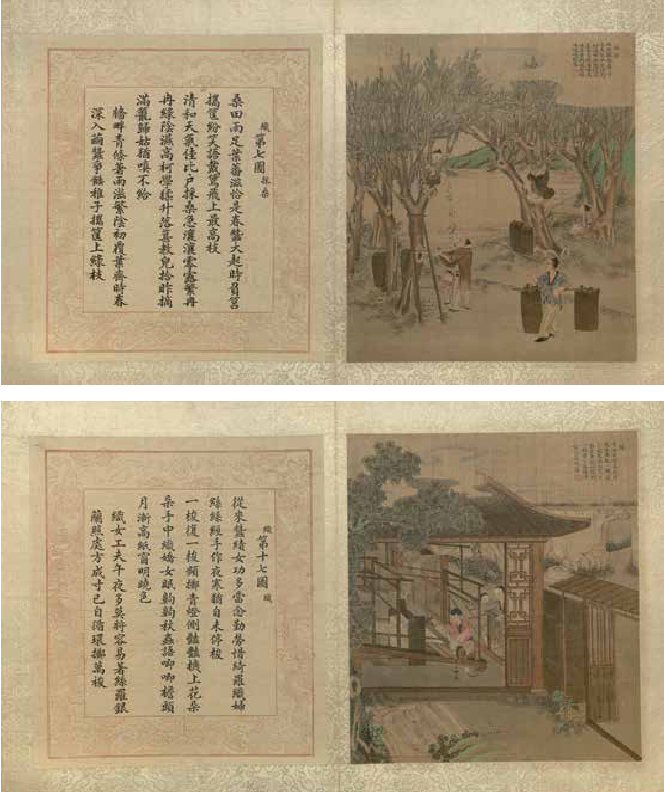  
Fig. 11   a. Yuzhi Gengzhi Tu (Imperially Commissioned Illustrations of  Tilling and Weaving) (No. 7 Picking Mulberry Leaves). 1696, Qing dynasty (1644–1911), China. Ink and colour on silk. The Library of Congress. b. Yuzhi Gengzhi Tu (Imperially Commissioned Illustrations of  Tilling and Weaving) (No. 17 Weaving). 1696, Qing dynasty (1644–1911), China. Ink and colour on silk. The Library of Congress.  

The industry surrounding the production of embroidery also developed significantly in the Qing period, exemplified by several new techniques developed during this period. Similar to the doublesided shuangmian touke, skilful embroiderers developed shuangmianxiu (‘double-sided embroidery’) to produce identical patterns on both sides of embroidered textiles. This technique was primarily used for clothing, table screens and room dividers. The sanlan technique, which employs light blue, blue and dark blue to achieve the colouration, was also used in embroidery works known as sanlanxiu (‘three shades of blue embroidery’). (Fig. 13) Yet another innovative technique known as nashaxiu (‘counted stitch’) was developed by artisans from the Suxiu School in Suzhou to create patterns of various shades on a silk gauze ground. This method is commonly used for stitching patterns onto imperial costumes, such as dragon robes. (Plate 16)  

Also during the Qing, the thriving commercial embroidery market and diversified production centres led to the emergence of new regional embroidery schools, each with its own distinctive style. These included the Sida mingxiu (Four Famous Embroidery Schools) —the Suxiu School in Suzhou, Yuexiu School in Guangdong, Shuxiu School in Sichuan and Xiangxiu School in Hunan.58 Unlike the imperial xiufang, which were obliged to create embroidery based on the cartoons provided by court painters from the Ruyiguan (‘Hall of Fulfilled Wishes’), these regional schools enjoyed the creative freedom to produce their own distinctive embroideries. The Yuexiu School in Guangdong distinguished itself through the extensive use of gold and brightly coloured threads; the school produced rich pictorial compositions with an ornamental border and auspicious patterns such as peacocks spreading their wings.59 The colourful floral border and peacock motif of Lugard Tribute from the UMAG collection, created in Guangzhou, illustrates the features of the Guandong Yuexiu School. (Fig. 14) According to the Lingnan Congshu (Book Series of  Lingnan) (1835), compiled by Deng Chun (1776–1850), unlike other embroidery schools that often employed female embroiderers, those from the Yuexiu School were predominately male workers from Guangzhou and Chaozhou who excelled at nugong (‘needlework’).  

Apart from the example of the Yuexiu School, the majority of artisans in the Qing dynasty were women who pursued the art not simply to make a living, but because the practice was recognised as being nugong or fugong (‘women’s work’)—one of the four traditional virtues of Chinese women and an essential handicraft skill. The Chinese phrase nangeng nuzhi (‘men plough and women weave’) illustrates the gendered division of labour in imperial China. Ding Pei (active between the reigns of the Jiaqing (1796–1820) and Daoguang (1821–50) Emperors) and Shen Shou (1874–1921), were two of the most important Qing dynasty women embroiderers, both in terms of their work and respective publications on the art form.  

後，絲織業雖然仍是中國重要的經濟活動，但隨着外國繅絲機和合成纖維引入中國，本地絲綢業發展受到進一步打擊，尤其是緙絲這種製作費時的手工織物。67 在二十世紀，仍有少數工匠從事和傳承緙絲和刺繡這兩項精湛的工藝；如緙絲藝人沈金水 (1883–1968)( 圖版 15) 和沈壽的徒弟、刺繡藝人金靜芬 (1885–1970)，在一九五零年代和六零年代獲邀加入蘇州工藝美術研究所 傳授工藝。到了一九七零年代，緙絲生產以外銷至日本市場的和服腰帶 69 為主。70 不過，面對着急速的工業化和社會經濟變遷，這兩項傳統工藝現已逐漸式微。  

古代中國文人曾以「一寸緙絲一寸金」來形容緙絲的珍貴，並「十指春風」來描述刺繡的巧藝。歷代工匠在製作栩栩如生的織繡圖像時，創造出一系列緙織和刺繡技法來再現書畫。雖然緙繡書畫間或只被收錄在書畫著錄的附錄中，但它們遠遠不只是古代書畫的複製品。在織物的絲線之間，蘊藏着一幅中國紡織圖像史──記錄了絲織品背後的社會經濟脈絡、工藝技術發展；呈現出織物圖案和色彩所蘊含的中國文化與美學價值，以及女性對傳統紡織和刺繡業的貢獻。這些織物交織着中國視覺文化和物質文化的種種色彩，糅合了中國藝術史與工藝史的不同藝術形式。  

要傳承上述工藝，不但需要個別匠人孜孜不倦地磨練手藝，更需要廣大社會對中國緙絲和刺繡有更深刻的認識、欣賞和了解。二零一一年，中國實施《中華人民共和國非物質文化遺產法》以保護和弘揚傳統中國文化，並加強保育和傳承非物質文化遺產，包括緙絲和刺繡工藝。 兩種工藝於二零零年代初獲列入國家級非物質文化遺產代表性項目名錄，既標誌着緙絲與刺繡擁有珍貴的歷史與藝術價值，同時反映出隨着手藝者的老齡化和缺乏年輕傳承者等問題，它們正面臨失傳的危機。72 本書和相關的專題展覽盼望通過探討絲織物的歷史發展、工藝與價值，喚起人們對這些傳統工藝的興趣和關注，激發更多有關絲綢之多元角色的討論。  

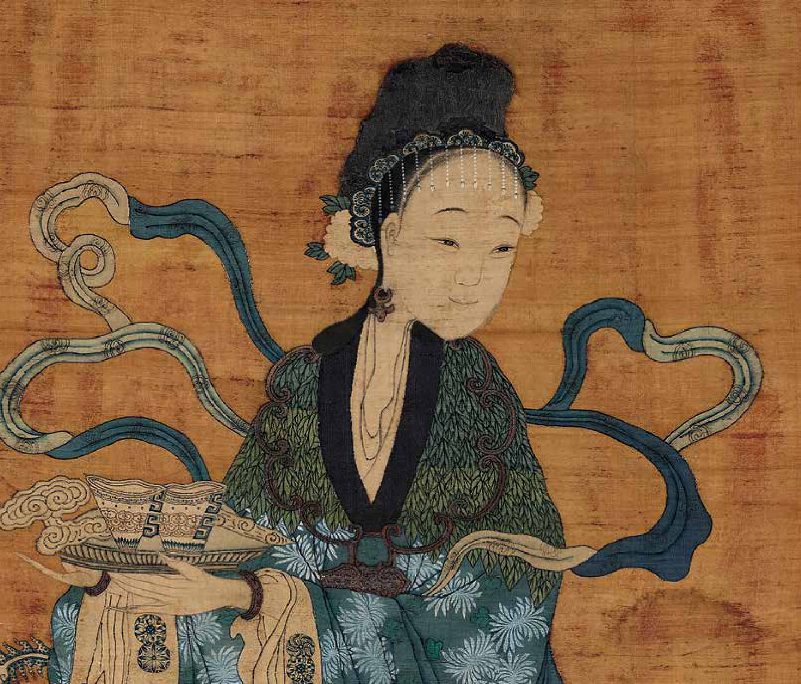  

In her book Xiupu (Treatise on Embroidery) published in 1821, Ding emphasises that embroidery was the art of writing for women—in which silk was the writing paper, silk floss the ink and the needle the brush.62 Ding further theorised embroidery practices by outlining how to choose a suitable work location and tools, embroidered patterns, colours and techniques, as well as offering a list of criteria for judging an admirable piece of embroidery.63 Her publication transformed the act of embroidery from the realm of craft to art. Likely the most internationally renowned Chinese embroiderer in the late Qing dynasty, Shen64 contributed significantly to promoting cultural and technical exchange in the field of embroidery craftsmanship. Appointed as the Zong jiaoxi (Chief Instructor) at the Nonggongbu xiugongke (Department of Embroidery Workers in the Ministry of Agriculture, Crafts and Commerce), Shen was sent by the court to research embroidery schools in Japan. During her visit, she was inspired by Japanese embroidery and Western paintings, and later innovated the technique of fangzhenxiu (‘realistic representational embroidery’) to enhance the three-dimensionality of embroidered patterns. Her works also received international recognition and promoted Chinese embroidery overseas; her Portrait of  Jesus was exhibited at the 1915 Panama-Pacific International Exposition in San Francisco.66 In 1919, with help from Zhang Jian (1853–1926), a famous industrialist and agriculturalist, Shen published Xuehuan Xiupu (Xuehuan’s Embroidery Treatise). This work systematically discusses the tools, working processes, stitches and embroiderers’ approach, as well as the relationship between embroidery, painting and calligraphy. Such a publication was one of the most influential monographs on embroidery in the Qing dynasty, and it has remained a vital reference for embroiderers and researchers.  

By the end of the Qing, the political upheavals brought about by foreign interference and local rebellions led to a marked decline in silk production. Although the silk industry remained an important economic sector in China after the fall of the Qing dynasty in 1911, the introduction of foreign reeling machines and synthetic fibres led to a further decline in local silk production, particularly that of silk tapestry, which relies on the time-consuming hand-woven production process. The sophisticated craftsmanship of silk tapestry and embroidery works continued to be passed down to a limited number of artisans throughout the twentieth century. For example, the famous silk tapestry weaver Shen Jinshui (1883–1968) (Plate 15) and embroiderer Jin Jingfen (1885–1970), a student of Shen Shou, were invited to teach in the Suzhou gong yi meishu yanjiushi (Suzhou Crafts Art Research Institute) in the 1950s and 1960s.68 During the 1970s, many silk tapestries were woven as obi (kimono belts)69  and exported to Japan. However, facing rapid industrialisation and socioeconomic change, these artistic traditions are now in steep decline.  

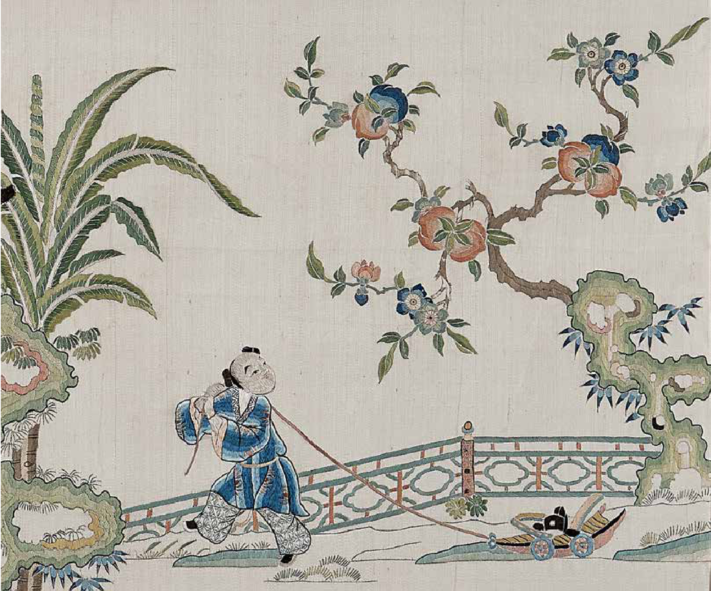  

Fig. 13   The blue colouration of the child’s robe is embroidered insanlanxiu—pale blue, blue and dark blue silk threads.Detail from Ladies and children, 19th century, Qing dynasty (1644–1911), China. Silk, 179 x 126.7 cm.HKU.T.2005.1595. Gift of Mr and Mrs Wellington Yee, UMAG.  
圖 13	 童子的袍服以三藍繡，即月白、品藍和深藍三色絲線繡製。〈婦孺圖〉細部，中國，清代 (1644–1911)，十九世紀。絲，179 x126.7 厘米。HKU.T.2005.1595。香港大學美術博物館，余豪、孫冠華伉儷惠贈。  

The sophisticated craftsmanship of silk tapestry and embroidery has been praised by the ancient Chinese literati throughout the ages with phrases such as yicun kesi yicun jin (‘an inch of silk tapestry equals an inch of gold’) and shizhi chunfeng (‘pleasant spring breeze on the fingertips’). While creating life-like pictorial textiles, artisans in successive dynasties innovated a variety of weaving and embroidery techniques to create exquisitely woven and embroidered paintings and works of calligraphy. Although these woven and embroidered objects were sometimes only included in the annex of paintings and calligraphy catalogues, they are much more than simply copies of earlier artworks. A pictorial history of Chinese textiles—the sociocultural contexts from where these silk works emerged, their technical development and craftsmanship, the Chinese cultural and aesthetic values embedded in the patterns and colours, and the contribution of women to traditional weaving and embroidery practices—are embodied in these woven and embroidered paintings and works of calligraphy. By interweaving the many ‘colours’ of Chinese visual and material cultures, they are a spectacular combination of various art forms developed throughout the history of Chinese arts and crafts.  

The survival and transmission of this form of craftsmanship requires not only the ongoing practice of individual practitioners, but also a broader public awareness, appreciation and deeper understanding of Chinese silk tapestry and embroidery. The Intangible Cultural Heritage Law of the People’s Republic of China was enacted in 2011 to protect and reinvigorate traditional Chinese culture and to strengthen the preservation and protection of intangible cultural heritage, including the craftsmanship of silk tapestry and embroidery. Both silk tapestry and embroidery were included in the earlier National List of Representative Intangible Cultural Heritage in the early 2000s, designating their historical and artistic value, and addressing fears over the art forms’ potential loss due to a generational shift and a lack of younger practitioners. By examining the historical development, craftsmanship and value of silk textiles, this publication, and the accompanying UMAG exhibition, seek to generate renewed interest in the value of these traditional crafts, and to spark further discussion about silk’s multiple roles.  

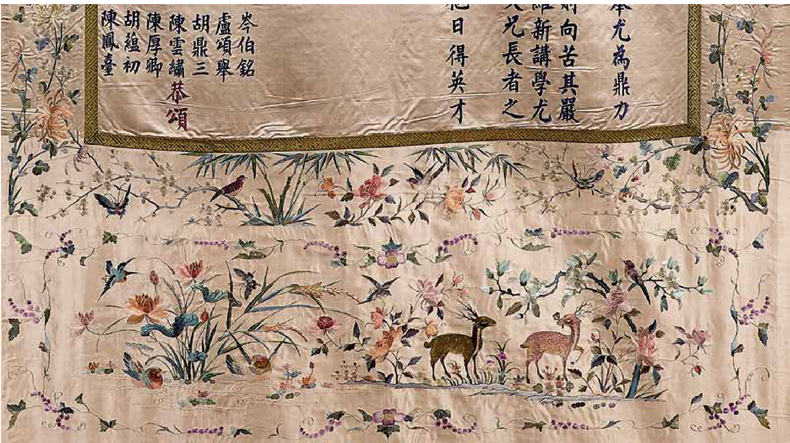  

Fig. 14   The silk scroll's border is embroidered with ornamental flora and fauna. Detail from The Lugard Tribute, 1910, Qing dynasty (1644–1911), Guangzhou, China. Silk, 347 x 116.5 cm. HKU.W.2001.1393. On permanent loan from Major Richard Pinker, UMAG.   
圖 14	 絲卷軸的邊飾繡上別致的動植物圖案。 〈呈盧督頌詞〉細部，中國廣州，清代 (1644–1911)，一九一零年。 絲，347 x 116.5 厘米。HKU.W.2001.1393。香港大學美術博物館， Major Richard Pinker 永久惠借。   
1	 The exact dating of the silk cocoon is subject to debate. For a detailed discussion, see Peng 2012: 71–2; Zhao et al. 2014: 29–30. 這半顆蠶繭的確實年代仍備受爭議，更詳盡的討論參見 Peng 2012: 71–2; Zhao et al. 2014: 29–30。   
2	 Vainker 2004: 6; Watt et al. 1997: 7.   
3	 Peng 2012: 68.   
4 	 According to Jilei Bian (Chicken Ribs, compiled in 1133), Song dynasty weavers in Dingzhou did not use daji (‘large looms’) to weave silk tapestries. Large looms most likely refer to looms for weaving silk fabrics with a more complicated weaving structure, such as brocade and damask. Producing a silk tapestry only requires a wooden tabby loom with double heddles. 據《雞肋編》(1133) 記載，宋代定州的織工在織造緙絲時「不用大機」， 此處「大機」很可能指用於織造錦和綾等組織結構較複雜的絲織物之織 機。織造緙絲時，用兩片綜的平紋木織機即可。   
5 	 Vainker 2004: 131.   
6	 Lin & Guoli lishi bowuguan bianji weiyuanhui 2001: 5.   
7	 Zhao 2012: 287.   
8	 Raw silk is used for warp threads because the boiling and dying process often weakens the fabric’s structure. 絲線經練染脫膠後，其纖維結構一般會變得較脆弱，故織造緙絲多用未 經練染的生絲為經。   
9	 Chen 2005: 145.   
10	 Bertin-Guest 2003: 15.   
11	 Peng 2012: 100.   
12	 Tunstall 2012: 42.   
13	 Chung 2005: 89.   
14	 Ibid: 98.   
15	 Ibid: 102; Bertin-Guest 2003: 16.   
16	 Zhao 2012: 237.   
17	 For further discussion on the origins of Chinese silk tapestry, see Cammann 1948: 70–1; Watt et al. 1997: 53–63; Sheng 1995: 166–7 and Zhao 2012: 286–94; and Zhao et al. 2014: 368–70.  For more details on the relationship between kemao and silk tapestry, see Pu 2009: 1–15. 有關中國緙絲起源的詳盡討論，參見 Cammann 1948: 70–1; Watt et al. 1997: 53–63; Sheng 1995: 166–7 and Zhao 2012: 286–94; and Zhao et al. 2014: 368–70。有關緙毛與緙絲的關係，參見 Pu 2009: 1–15。   
18	 In his Song Mo Ji Wen (Records of  Hearsay on the Pine Forests North of  the Plains), Hong Hao (1088–1155) describes his activities as an envoy sent by the Southern Song (1127–1279) court to the Jin (1115–1234) state. During fifteen years in captivity, he reported seeing the Uyghurs’ delicate polychrome silk tapestry robes. 據洪皓 (1088–1155) 《松漠紀聞》記載，他曾為南宋 (1127–1279) 出使金國 (1115–1234)，卻被扣留了十五年之久，期間曾目睹回鶻工匠以五色線織 成的精緻「剋絲」袍。   
19	 Zhao 2012: 290.   
20	 Watt et al. 1997: 59.   
21	 Pu 2009: 26.   
22	 Ibid: 26, 29.   
23	 Zhao 2012: 292; Tung 2015: 4.   
24	 Watt et al. 1997: 58.   
25	 Chen 2005: 153.   
26	 Zhao 2012: 292.   
27	 Tung 2015: 4.   
28	 Zhao 2012: 350.   
29	 Nashishi probably derives from the Persian term nasij (‘cloth of gold’), which refers to textiles with an overall pattern woven in gold. 「納石失」一詞或源自波斯語 nasij ，意思是黃金服飾，指一種織入金線 顯花的絲織品。   
30	 Lin 2001: 15.   
31	 Zhao 2012: 351.   
32	 Zhao et al. 2014: 498.   
33	 Guxiu was developed by née Miao (dates unknown), daughter-in-law of Gu Mingshi, who earned the jinshi degree during the reign of the Jiajing Emperor (1522–66) and built the Luxiangyuan (‘Dew Fragrance Garden’). The Gu family embroidered paintings produced by their female family members became more popular during the Wanli period (1573–1620). 顧繡始創於顧名世的媳婦繆氏 ( 生卒年不詳 ) 。顧名世在嘉靖年間 (1522–66) 中進士，晚年修建露香園。由顧氏家族女成員繡製的刺繡書畫 在萬曆年間 (1573–1620) 非常流行。   
34 	 Chen and Huang 2012: 410.   
35  	Chung 2005: 108.   
36  	Tung 2015: 362.   
37  	Pu 2009: 41.   
38  	Vainker 2004: 184–5.   
39  	Zhao, Long and Shang 2014: 522; Woolley 2016: 11–12.   
40  	Chen and Huang 2012: 433.   
41  	Ibid: 433.   
42  	Ibid: 434.   
43  	Ibid: 468.   
44  	In the Ming dynasty, craftsmen were registered as jiangji (‘artisans’), who were required to provide a certain amount of regular and unpaid labour to the court for a specific number of years. As most services were performed in the capital Nanjing, and later in Beijing, artisans who lived far away from the capital had to journey far to fulfil their obligations. This policy placed great pressure on craftsmen, as their freedom of mobility was highly restricted for the duration, which in turn hindered the development of the local handicraft industry (Zhao et al. 2014: 525; Moll-Murata 2018: 58). 明代的匠籍制度規定工匠需定期服徭役，而居在首都以外的工匠更需自 費前往南京 ( 其後為北京 ) 服役。此制既加重了人民的經濟負擔，亦限 制了他們的流動，窒礙了本地手工業的發展。   
45  	Zhao et al. 2014: 525.   
46  	Zong 2005: 21–22; Chen and Huang 2012: 438.   
47  	Zhao et al. 2014: 627.   
48  	Vainker 2004: 193.   
49  	Lin 2001: 13.   
50  	Zhu 1930.   
51  	Shan 2005: 24.   
52  	Wang 2001: 20.   
53  	Ibid: 20.   
54  	Chen and Huang 2012: 464.   
55  	Chen 2001: 28.   
56  	Ibid: 473.   
57  	Shan 2005: 20.   
58  	With the widespread use of embroidery in clothing and the flourishing export markets, many other significant regional styles appeared, such as the Jingxiu School in Beijing, Bianxiu School in Kaifeng, Ouxiu School in Wenzhou and Hanxiu School in Wuhan. 隨着刺繡服飾的普及和活躍的外銷市場，其他地區亦建立起個別的刺繡 系統，如北京的京繡、開封的汴繡、溫州的甌繡和武漢的漢繡。   
59  	Chen and Huang 2012: 474.   
60  	Zhao et al. 2014: 602.   
61  	A woman who masters needlework is recognised as fulfilling her duty in fugong. The other virtues include fude (a woman’s morality), fuyan (a woman’s language) and furong (a woman’s manner); together with fugong (a woman’s work), they constitute si de (‘The Four Virtues’) of women in ancient China (Nien 1998: 45). 女性擅長織繡，是為其婦功。古代中國傳統女性的四德包括婦德、婦功、 婦言和婦容。   
62  	Chen and Huang 2012: 467.   
63  	Ibid: 467.   
64  	Shen, originally known as yunzhi and xuehuan, was famous for presenting her embroidered screens titled Baxian shangshou (‘The Eight Immortals Celebrating a Birthday’) and Wuliang shoufo (‘The Buddha of Endless Life’) as birthday gifts to the Empress Dowager Cixi (1835–1908) in 1904. Cixi appreciated the works and gifted a piece of writing with the shou (‘longevity’) character written by herself to Shen. Shen thereafter renamed herself Shen Shou (Chen and Huang 2012: 477). 沈壽，原名沈雲芝，號雪宦，曾於一九零四年為慈禧太后 (1835–1908) 繡 製賀壽禮〈八仙上壽圖〉和〈無量壽佛圖〉。慈禧太后因而大悅，更親 筆書賜「壽」字，沈雲芝因而改名沈壽。   
65  	Ibid: 477.   
66  	Shen, Zhang and Geng 2010: 2.   
67  	Vainker 2004: 199.   
68  	Suzhou gong yi meishu yanjiushi was later renamed the Suzhou cixiu yanjiushi (Suzhou Embroidery Research Institute) in 1960. 蘇州工藝美術研究所在一九六零年更名為蘇州刺繡研究所。   
69  	Tapestry weaving was known as tsuzure-ori in Japanese. 緙絲的日文為綴織。   
70  	Qian 2015: 99.   
71  	Lixinski 2013: 128.   
72  	The traditional craftsmanship of the Suxiu School in Suzhou, Yuexiu School in Guangdong, Xiangxiu School in Hunan and Suzhou silk tapestry were included in the first batch of the National List of Intangible Cultural Heritage of China in 2006; Sichuan’s Shuxiu School was included in the second batch of the National List of Intangible Cultural Heritage of China in 2008. 蘇州的蘇繡、廣東的粵繡、湖南的湘繡皆於二零零六年獲列入首批國家 級非物質文化遺產代表性項目名錄；四川的蜀繡則於二零零八年被列入 第二批國家級非物質文化遺產代表性項目名錄。  

  

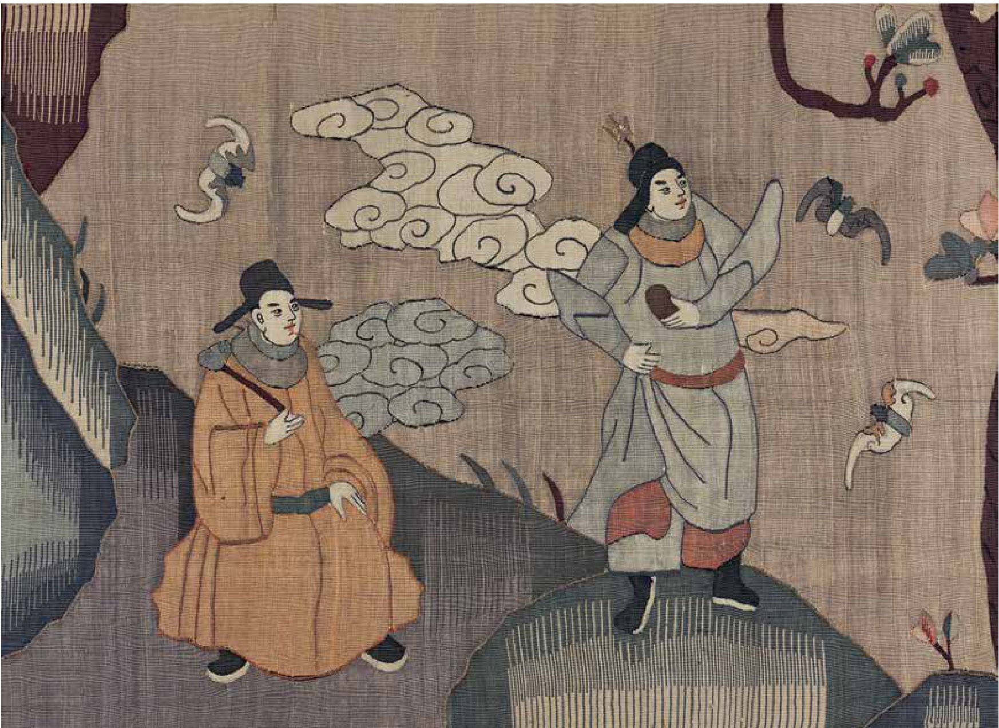  

# Two figures  

China, Qing dynasty (1644–1911), 18th or early 19th century Kesi (silk tapestry), panel, 60.1 x 39.5 cm Gift of Dr Lam Kwok Pun HKU.T.2008.1664  

The two figures wear the distinctive clothing of scholarofficials. While sightseeing on a mountain, they are surrounded by bats and clouds, which symbolise wealth and good fortune. Distinctive sawtooth patterns appear between the areas of colour due to the unique processes involved in making kesi. Weavers use a shuttle to carry polychrome weft threads across the warp—not the entire textile—leaving a subtle space between the colours. Known as tongjing duanwei (‘continuous warp and broken weft’), this technique gives kesi its unique appearance, as it is thought to resemble cut or carved silk. The shading of the green and blue slopes was achieved by using the changduanqiang (‘long and short propping’) technique. The offsetting rows of threads often create the striking zigzag patterns that are seen here on the edge of the colour blocks.  

# 人物兩個  

中國，清代 (1644–1911)，  
十八世紀或十九世紀初  
緙絲，掛屏，60.1 $\textbf{x}39.5$ 厘米  
林國本醫生惠贈  
HKU.T.2008.1664  

兩位身穿士大夫服飾的人物站在山上賞景，那環繞二人的蝙蝠和祥雲圖案，象徵富貴吉祥。織物上各個色塊之間的斷痕是緙絲的特色。織工製作緙絲時，會先將各色絲線繞在小梭子內，按照圖案輪廓，以通經斷緯的方式局部挖織花紋。換言之，緯線並未貫穿全幅織物，不同顏色的緯線也不相聯綴，形成如刀鏤的斷痕，故緙絲又稱為「刻絲」。山坡的藍綠暈色以長短戧技法織造，長短不一的深淺緯線互相穿插，色塊之間的邊線肖似鋸齒紋。  

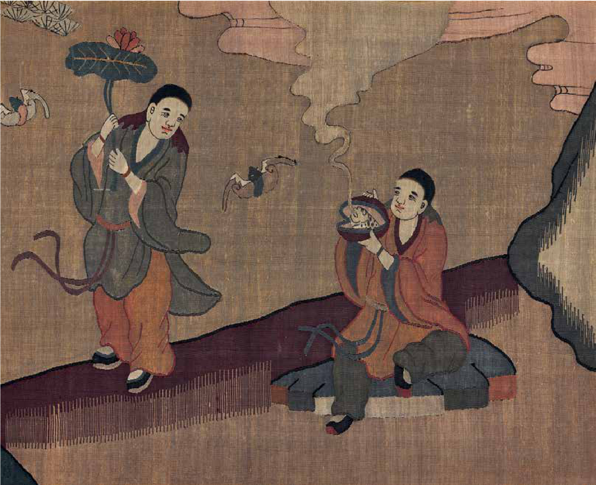  

# Hehe Immortals  

China, Qing dynasty (1644–1911), 18th or early 19th century Kesi (silk tapestry), panel, 47.3 x 38.4 cm Gift of Dr Lam Kwok Pun HKU.T.2008.1665  

Surrounded by auspicious bats, the two boys represent the Hehe Immortals, also known as the Immortals of Harmony and Happiness (He-He Erxian). The gou (‘connecting’) technique employs wefts that differ from the colour of the subject motif in order to mark the pattern’s edge. Here the technique is used to outline the silhouettes of the Hehe Immortals. The light blue robe of the Immortal of Harmony, for instance, is outlined with greyish blue threads, while the orange robe of the Immortal of Happiness is highlighted with red threads.  

In Daoist belief, the Immortals of Harmony and Happiness were two monks, Hanshan and Shide, who resided in the Guoqing Monastery on Tiantai Mountain, Zhejiang province during the Tang dynasty (618–907 CE). In 1733, the Yongzheng Emperor (1678–1735) designated them the saints of unity and harmony, and they became immortalised in folklore as symbols of these qualities. The small box and lotus that they typically carry are pronounced ‘he’ in Chinese, as are the words for harmony and friendship, which forms a visual pun. Such symbolism made these common wedding gifts.  

# 和合二仙  

中國，清代 (1644–1911)，  
十八世紀或十九世紀初  
緙絲，掛屏，47.3 x 38.4 厘米  
林國本醫生惠贈  
HKU.T.2008.1665  

兩個童子是和合二仙，寓意吉祥的蝙蝠圍繞二人飛行。他們的輪廓以勾緙技法織造，即運用主體紋樣以外的另一種色緯來勾勒邊線。和仙的淺藍色袍以灰藍色緯線勾勒，合仙的橘色袍則以紅色緯線點綴。  

據道教信仰，和合二仙是唐代 (618–907)居於浙江省天台山國清寺的寒山和拾得兩位僧侶。一七三三年，雍正皇帝 (1678–1735) 將寒山和拾得封為和聖、合聖，二人遂成為民間故事的神祇。和合二仙經常手持荷花和盒子，荷和盒為諧音，寓意和諧融洽、友誼永固，故配有此圖案的掛屏常為新婚賀禮。  

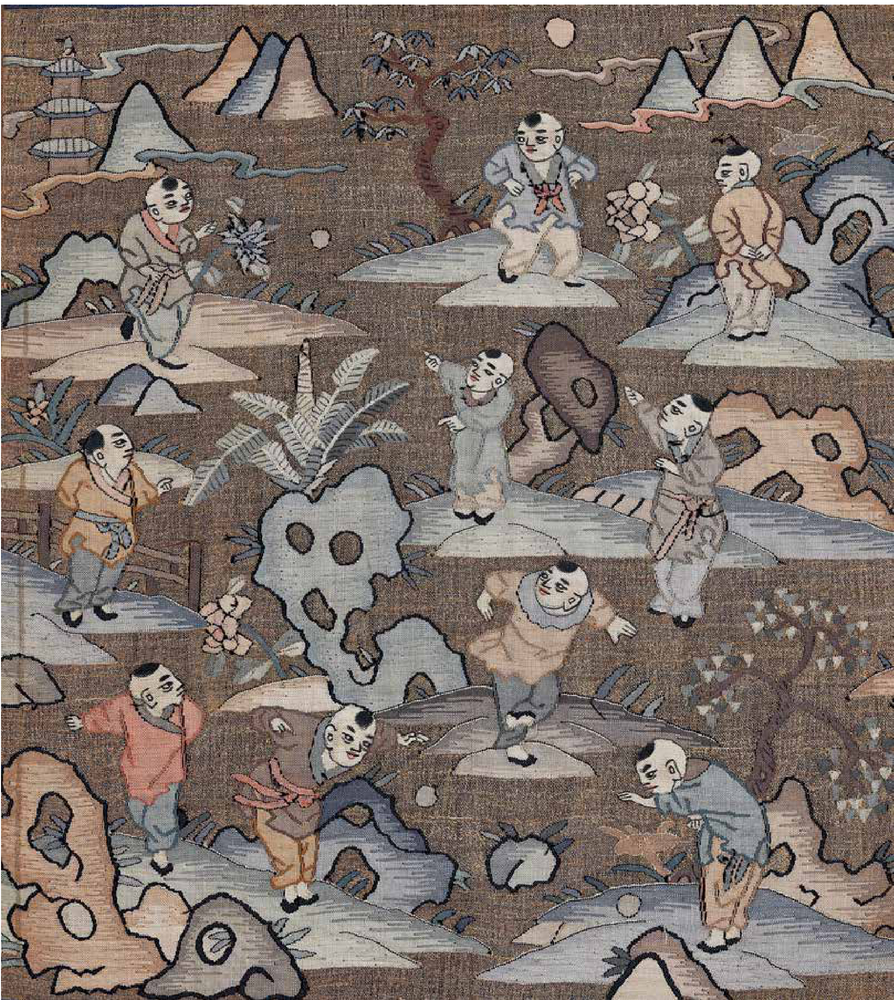  

# Boys at play  

China, Qing dynasty (1644–1911), 18th century   
Kesi (silk tapestry) with metallic threads,   
panel, $35.8\mathrm{~x~}34.4\mathrm{~cm}$   
Gift of Dr Lam Kwok Pun   
HKU.T.2008.1666  

Woven on a richly embellished golden ground with polychrome threads, the children represent a popular design known as Yingxi tu (‘Boys at play’). Surrounded by a pleasing scene of trees, mountains, flowers and a pagoda, each child strikes a unique expression and pose. During the Ming (1368–1644) and Qing dynasties, the Yingxi tu design appeared on textiles, furniture, ceramics and other decorative objects to represent the desire for a large family.  

In the mid-Qing dynasty, kesi weaving techniques and technologies were sufficiently advanced to allow for the widespread production of textiles with identical doublesided imagery that did not expose the threads on either side—shuangmian touke (‘double-sided translucent silk tapestry’). Panels like this, with attractive identical images on the front and back, were often used as two-sided screens for desks or room dividers, the latter typically placed in the wedding chamber of a newly married couple.  

# 嬰戲圖  

中國，清代 (1644–1911)，  
十八世紀  
緙絲、金屬線，掛屏， $35.8\mathrm{~X~}34.4$ 厘米  
林國本醫生惠贈  
HKU.T.2008.1666  

這件緙絲以金色為地，用彩緯緙織在山水、花間和亭台樓閣嬉戲的童子，他們神態各異，怡然自得 $^\circ$ 這種稱為「嬰戲圖的圖案是明 (1368–1644)、清時期的流行花紋，常見於織物、家具、陶瓷和其他裝飾品上，寓意多子多福。  

清中葉的緙絲技術發展成熟，能夠大量生產以雙面透緙技法織造的緙絲品，成品正反兩面圖案相同，雙面皆不露線頭。這類緙絲品尤其適合製成雙面插屏或屏風，飾有嬰戲圖圖案的屏風更是新婚夫婦新房內常見的家具。  

  

# (Detail) (細部)  

Children’s silhouettes outlined in gou (‘connecting’) and the colouration of rocks woven in baoxinqiang (‘embracing propping’). 童子的輪廓以勾緙技法勾勒，假山則以包心戧技法緙織。  

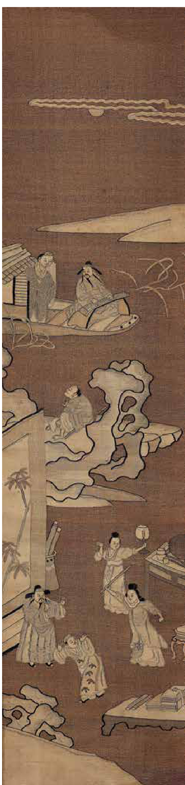  

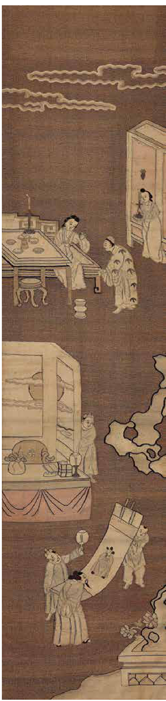  

# Figures in the moonlight (left) 月下人物 ( 左 )  

China, Qing dynasty (1644–1911), 18th century   
Kesi (silk tapestry) with metallic threads,   
hanging scroll, $102.5\times24.7~\mathrm{c}$ m   
Gift of Dr Lam Kwok Pun   
HKU.T.2008.1667   
中國，清代 (1644–1911)，   
十八世紀   
緙絲、金屬線，立軸， $102.5\times24.7$ 厘米   
林國本醫生惠贈   
HKU.T.2008.1667  

# Figures in a garden (right)  

# 庭園人物 ( 右 )  

China, Qing dynasty (1644–1911), 18th century   
Kesi (silk tapestry) with metallic threads,   
hanging scroll, $102.3\times24.6$ cm   
Gift of Dr Lam Kwok Pun   
HKU.T.2008.1668   
中國，清代 (1644–1911)，   
十八世紀   
緙絲、金屬線，立軸， $102.3\times24.6$ 厘米   
林國本醫生惠贈   
HKU.T.2008.1668  

These two kesi depict the elegant lifestyle of China’s educated elite. On the first hanging scroll, scholars and their attendants are shown riding a boat and enjoying music in the evening. Below them, figures dance and make merry. On the second scroll, an aristocratic lady sits calmly and enjoys her dessert, while a scholar in the lower register appreciates a painting, most likely a portrait of himself.  

Upon closer inspection, it can be seen that the subtle shading effect in the scrolling clouds was achieved using the jie (‘knotting’) technique. Artisans often employed two or three similarly coloured wefts with different degrees of brightness to create adjacent lines of colours ranging from light to dark. On Figures in the moonlight, four layers of coloured wefts, ranging from dark grey to silver, were woven together to give the clouds a sense of three-dimensionality. In the Qing dynasty, both official and private workshops were involved in kesi production. Private workshops primarily served local landowners, scholar-officials and wealthy merchants; therefore, their kesi were often decorated with themes related to the dail lives of these groups.  

兩件緙絲品呈現古代中國飽讀詩書的社會精英之雅致生活。在第一幅立軸上，文人與侍從在月色下泛舟，彈琴奏樂；下方位置的人物則互相追逐，嬉鬧不停。第二幅立軸上的貴族婦人正享用茶點，閒適自在；畫面下方的文人或正在觀賞自己的肖像畫。  

織物上捲雲紋的微妙色調變化是運用結技法織造，即以兩種或三種顏色相鄰、明度相異的色緯來緙織，線條彼此相鄰，呈現退暈效果。〈月下人物〉的雲紋是以四道色緯緙織，色彩從深灰色過渡到銀色，具立體效果。清代的官營和民營作坊皆有生產緙絲，由於地主、士大夫和富裕的商人是民營作坊的主要顧客，故這類緙絲品多以他們的日常生活為主題。  

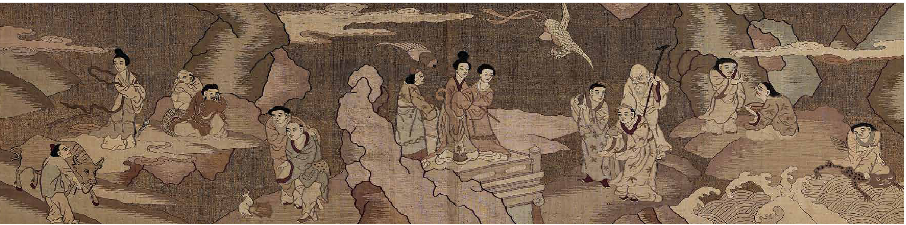  

# Daoist immortals  

China, Qing dynasty (1644–1911), 18th century   
Kesi (silk tapestry) with metallic threads,   
horizontal scroll, 175.4 x 46.5 cm   
Gift of Dr Lam Kwok Pun   
HKU.T.2008.1669  

# 道教人物  

中國，清代 (1644–1911)，  
十八世紀  
緙絲、金屬線，橫幅， 175.4 x 46.5 厘米  
林國本醫生惠贈  
HKU.T.2008.1669  

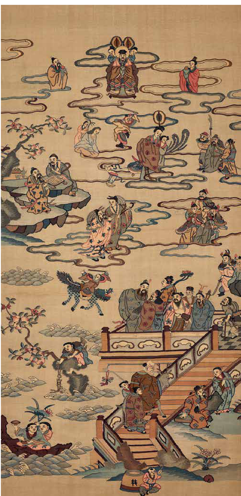  

# Gathering of immortals  

China, Qing dynasty (1644–1911), 18th century   
Kesi (silk tapestry) with metallic threads,   
hanging scroll, 124.8 x 61.5 cm   
Gift of Dr Lam Kwok Pun   
HKU.T.2008.1671  

Over thirty Daoist immortals, such as Shoulao (the God of Longevity), the Eight Immortals, Hehe Immortals and Magu, the Goddess of Longevity, adorn these scrolls, along with auspicious mythical creatures such as qilins and phoenixes. On the first horizontal scroll, the Queen Mother of the West, shown on a staircase surrounded by attendants, is offering a large Peach of Immortality (xiantao). On the second tapestry, a group of immortals is shown surrounded by two trees bearing abundant xiantao, accompanied by waves and clouds. Various weaving techniques create the vivid imagery of the second hanging scroll. In order to highlight the figures’ silhouettes, the gou (‘connecting’) technique was used to outline the robes, while the rocks and ocean waves were woven with the changduanqiang (‘long-and-short propping’) technique. This process employs various long and short, light- and dark-coloured wefts that offset each other to create a fluid and natural colouration. Another similar method known as mushuqiang (‘wood comb propping’), in which wefts of similar tones are woven into a comb-like edge pattern, creates the reddish pink xiantao.  

Scenes on both scrolls may depict an episode recorded in Daoist literary texts, such as Du Guangting’s (850–933) Yongcheng Jixian Lu (Records of  the Assembled Immortals of the Walled City), in which the Queen Mother of the West holds a birthday banquet at her home on Mount Kunlun, after the Peaches of Immortality from her garden have ripened.  

Kesi showing gatherings of immortals were popular among the upper-class in the Qing dynasty because of their auspicious connotations of longevity and prosperity. They were typically displayed indoors or exchanged between scholars as gifts.  

# 群仙會  

中國，清代 (1644–1911)，  
十八世紀  
緙絲、金屬線，立軸， $124.8\mathrm{~x~}61.5$ 厘米  
林國本醫生惠贈  
HKU.T.2008.1671  

超過三十位道教人物如壽老、八仙、和合二仙、麻姑，並各式瑞獸如麒麟、鳳凰出現在這兩件緙絲品上。橫幅上的西王母正賞賜蟠桃予眾仙，侍從在她身旁侍候着。另一幅立軸刻劃了在雲紋、海波紋及兩棵果實累累的蟠桃樹映襯下，眾仙相聚的情景。如此豐富的畫面是以不同的緙織技法來表現；舉例說，眾仙的衣飾輪廓是以勾緙技法織造、石紋和海波紋則運用了長短戧技法，即將長短不一的深淺緯線互相穿插，以調和色彩、仙桃紋則以木梳戧技法織成。木梳戧的原理與長短戧相似，但戧頭邊緣整齊劃一，如木梳齒緣。  

織物刻劃的情景或許是杜光庭 (850–933)《墉城集仙錄》等道教文學所載的「瑤池集慶」，即西王母在昆侖山舉辦壽宴，宴請眾仙品嚐蟠桃的故事。  

這類寓意長壽和繁榮興盛的緙絲品備受清代上流社會歡迎，是常見的室內陳設或文人互相餽贈的禮物。  

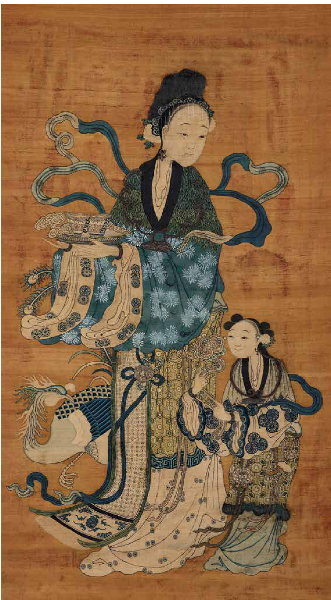  

# Magu offering wine  

China, Qing dynasty (1644–1911),   
18th or early 19th century   
Kesi (silk tapestry) hanging scroll, 135.2 x 75.7 cm   
Gift of Dr Lam Kwok Pun   
HKU.T.2008.1670  

Accompanied by a phoenix and a child attendant holding a ruyi (a wish-granting wand or scepter), the figure on this scroll is Magu, the Goddess of Longevity. According to Daoist myth, Magu became an immortal and witnessed the Eastern ocean dry up and turn into mulberry fields three times, indicating her transcendence of time. Here, she carries two wine cups and a lingzhi mushroom on a platter, from which she brews longevity wine for the birthday banquet of the Queen Mother of the West. The white pearls of her headdress were painted with brushes using a technique known as kehua (‘silk tapestry and painting’), which is characteristic of kesi produced during the reign of the Qianlong Emperor (1736–95). The choice of this figure—together with auspicious chrysanthemums and five bats surrounding a shou (longevity) character on her dress—suggests that the tapestry was intended as a birthday present, most likely for a woman.  

# 麻姑晉酒  

中國，清代 (1644–1911)，  
十八世紀或十九世紀初  
緙絲，立軸， $135.2\mathrm{~x~}75.7$ 厘米  
林國本醫生惠贈  
HKU.T.2008.1670  

立軸上的人物是道教女壽仙麻姑，她身旁站着一隻鳳凰和一名手持如意的童子。道教傳說記載麻姑曾三次目睹東海變為桑田，她超越時空限制，成為長壽的象徵。這件緙絲品上的麻姑雙手捧着一個盛載了兩隻酒杯和靈芝的盤──為西王母祝壽而釀造的長生不老酒。麻姑頭上的白珍珠頭飾是用畫筆添上的，此技法稱為緙畫，屬乾隆年間 (1736–95) 緙絲品的標誌。從麻姑及其裙子上寓意長壽的菊花紋和五福捧壽紋可見，這件緙絲品或是餽贈女性的賀壽禮。  

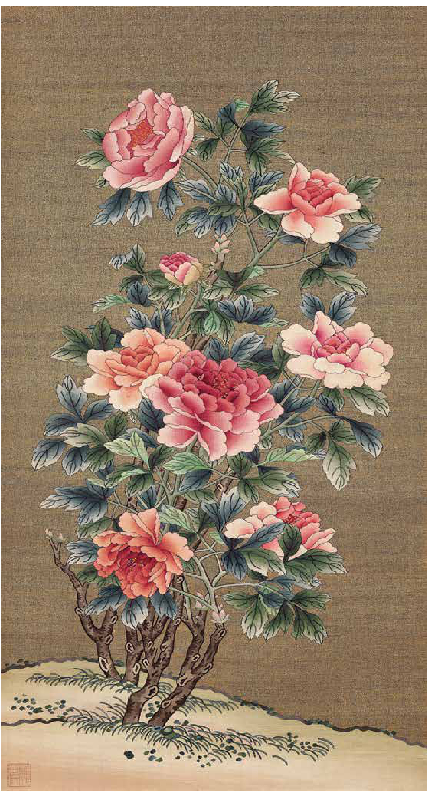  

# Peonies  

China, Qing dynasty (1644–1911), 18th century   
Kesi (silk tapestry) with metallic threads,   
hanging scroll, 98.8 x 54 cm   
Collector’s seal: Lantang shuwu\*   
Gift of Dr Lam Kwok Pun   
HKU.T.2008.1672  

Recognised as the ‘King of Flowers’ and a symbol of wealth and honour, blossoming peonies express the wish huakai fugui (‘may you be prosperous’), and have traditionally been favoured on objects owned by scholars and nobles. The brightly coloured peonies and leaves were woven in various shades of red, pink, orange and green weft threads using the changduanqiang (‘long-andshort propping’) technique. Its dazzling golden ground was created with the kejin (‘silk tapestry woven with gold’) technique, in which twisted gold threads are made by wrapping a yellow silk thread with thin sheets of gold leaf in a spiral twist. This technique provides the tapestry a particularly luxurious and elegant appearance.  

# 牡丹  

中國，清代 (1644–1911)，  
十八世紀  
緙絲、金屬線，立軸 $,$ 98.8 x 54 厘米  
藏印：藍塘書屋\*  
林國本醫生惠贈  
HKU.T.2008.1672  

牡丹被譽為百花之王，象徵富貴繁榮。盛放中的牡丹寓意花開富貴，是深受傳統文人和貴族青睞的器物裝飾圖案。色澤艷麗的牡丹花和綠葉是運用各色調的紅色、粉紅色、橘色和綠色緯線，配合長短戧技法緙織。其耀眼的金地則以緙金技法緙織金線而成──織匠會以黃色蠶絲為芯，將切成片狀的金箔以螺旋形的方式纏繞在蠶絲的外圍來製作金線；金線的運用使這件緙絲品別具奢華高貴之感。  

\*「藍塘書屋」是香港鑒藏家和藝術教育家李維洛 (1929 年生 ) 的書屋名稱。李維洛自一九五零年代畢業於羅富國師範學院，即加入葛量洪師範學院教授設計、繪畫和藝術史，直至一九八四年退休。  

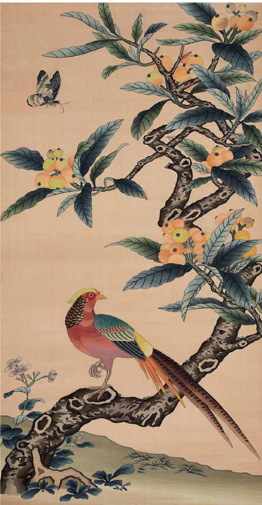  

# Golden pheasant on a loquat tree  

China, Qing dynasty (1644–1911), 18th century Kesi (silk tapestry), hanging scroll, 96 x 50 cm Gift of Dr Lam Kwok Pun   
HKU.T.2008.1673  

The golden pheasant on this kesi was woven with nearly twenty variously coloured wefts to illustrate its colourful plumage, including a golden crest and rump, purplered body and a long tail in orange and dark brown. The coloured variation for its body was achieved with the chanheqiang (‘blend propping’) technique. As one of the weaving techniques used to express the gradation of colours from dark to light, it is distinguished by the smooth and flexible overlapping of variations in colour. The blending of colour blocks often moves vertically from top to bottom, or bottom to top. In another technique known as guan (‘flinging’), two or more similarly coloured wefts are woven continuously according to the silhouette of patterns so as to achieve the gradation. The wefts of each block do not overlap and often appear to pile up layer upon layer. These were applied to imitate the colourful layers and texture of the wings’ feathers, from dark brown to brown and light brown.  

As with much of the imagery selected for kesi, both the loquat and pheasant are auspicious motifs in Chinese art. A symbol of literary refinement, golden pheasants were embroidered on the robes of second-rank civil officials of the Qing court. The loquat tree was perhaps chosen as an accompanying motif because the yellow colouration of its fruit resembles gold, and the two together may have connoted wishes for the accumulation of wealth and the achievement of high rank.  

# 枇杷錦雞  

中國，清代 (1644–1911)，  
十八世紀  
緙絲，立軸，96 x 50 厘米  
林國本醫生惠贈  
HKU.T.2008.1673  

這件緙絲品上色彩斑斕的錦雞，包括它的金黃色冠羽和尾部、紫紅色腹部和橘褐色長尾羽，是運用了接近二十種不同的色緯來緙織。其腹部的色彩變化以摻和戧技法織造，此法將緯線靈活交織，色彩一般從上而下、或從下而上縱向過渡。錦雞那層次豐富而顏色鮮艷的翅膀羽翼，如深褐色到淺褐色的過渡，則運用了摜技法，即用兩種或以上色彩相鄰的緯線，沿輪廓順序緙織，各色緯互不交錯，造成色塊層層相疊的效果。  

枇杷和錦雞與其他常見的緙絲圖案一樣，是中國藝術的吉祥圖案 $^\circ$ 錦雞是文采昭著的象徵，清代二品文官補服的補子即繡上錦雞圖案。金黃色的枇杷肖似黃金，或因此被選為錦雞的配襯圖案，二者或表達出對富貴和步步高陞的嚮往。  

  

# Growing peony  

China, Qing dynasty (1644–1911), 18th century   
Kesi (silk tapestry), hanging scroll, $89.3\mathrm{~x~}$ 44 cm   
Collector’s seal: Lantang shuwu   
Gift of Dr Lam Kwok Pun   
HKU.T.2008.1674  

This kesi illustrates the different stages of the growth of a green peony. On the lower branches, three tiny flower buds are woven in red-coloured wefts. In the middle register the peony is blossoming, and at the top it has fully bloomed. The gradation of tones on the peony and its leaves are finely woven with different shades of greencoloured wefts using the changduanqiang (‘long-and-short propping’) technique.  

Early kesi were used as wrappers for Buddhist statues or for dressing tomb figures. The Song dynasty’s (960–1279) Huizong Emperor (r. 1100–26) was thought to have encouraged the use of precious kesi as wrappers for the imperial collection of painting and calligraphy. He favoured realistic bird-and-flower paintings, and kesi weavers were encouraged to create tapestries depicting the beauty of the natural world.  

# 牡丹盛開  

中國，清代 (1644–1911)，  
十八世紀  
緙絲，立軸， $,~89.3\mathrm{~x~}\$ 44 厘米  
藏印：藍塘書屋  
林國本醫生惠贈  
HKU.T.2008.1674  

這件緙絲品刻劃了一朵碧綠牡丹的生長過程。在下方的樹枝上長有三朵細小的紅色花蕾，正中位置的是綻放中的牡丹，上方則是盛開的牡丹。牡丹的花葉紋理細膩，綠色色澤變化運用了長短戧技法來表現。  

早期的緙絲曾用作包裹佛像的織物或墓葬塑像的衣飾。宋 (960–1279) 徽宗 ( 統治年份 1100 年至 1126 年 ) 或曾鼓勵使用緙絲作為宮廷書畫藏品的包首，而他本人對寫實花鳥畫的熱愛，亦推動了織匠緙織描繪自然美景的緙絲品。  

# Kingfishers and hibiscuses  

China, Qing dynasty (1644–1911), 18th century Kesi (silk tapestry), hanging scroll, $114.9\mathrm{~x~}41.5\mathrm{~cm}$ Gift of Dr Lam Kwok Pun   
HKU.T.2008.1676  

# 芙蓉翠鳥  

中國，清代 (1644–1911)，  
十八世紀  
緙絲，立軸， $114.9\times41.5$ 厘米  
林國本醫生惠贈  
HKU.T.2008.1676  

Hibiscus blossoms surrounded by kingfishers are a popular theme in Chinese paintings, lacquerwares, ceramics and kesi tapestries. Woven on a light-yellow ground, the pinkish-white hibiscus blossoms and the iconic bluish feathers of the kingfishers are meticulously rendered using a technique known as sanyunse (‘threecolour shading’), in which three tones of the same or a similar colour create a gradation from dark to light.  

Blue kingfisher feathers were used to produce clothing and hair accessories for upper-class women in imperial China, and their depiction in art was symbolic of feminine beauty. The Chinese term for hibiscus, mufurong, creates an auspicious pun as it includes sounds that resemble the words for wealth (fu) and glory (rong).  

翠鳥在芙蓉間飛舞的情景，是中國繪畫、漆器、陶瓷和緙絲上常見的圖案。在淡黃地上，芙蓉花那呈粉紅色和白色的花瓣、以及翠鳥的標誌性藍色羽毛，均以三暈色技法一絲不苟地織造，即運用三種同類顏色，暈染出從深至淺的色階變化。  

在帝制時代的中國，翠鳥羽毛是製作上流社會婦女的衣飾和頭飾的材料之一，故它也是女性美的象徵。芙蓉的漢語拼音與富榮相似，取其諧音之趣，亦象徵富貴榮華。  

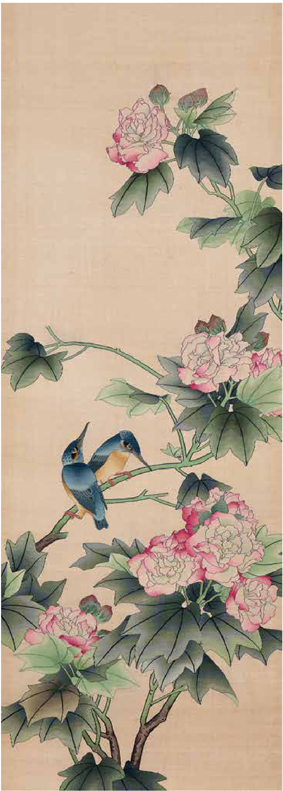  

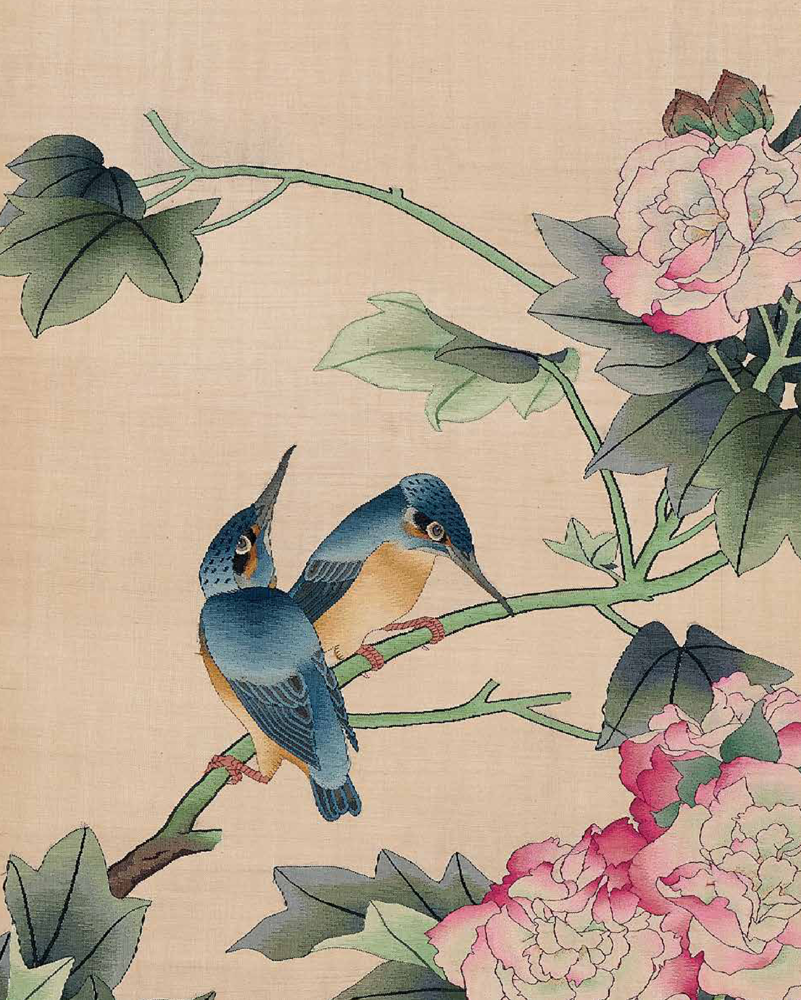  

# (Detail) (細部)  

Bluish and golden kingfisher feathers woven in baoxinqiang (‘embracing propping’) and guan (‘flinging’). 翠鳥的藍色和金色羽毛以包心戧和摜技法緙織。  

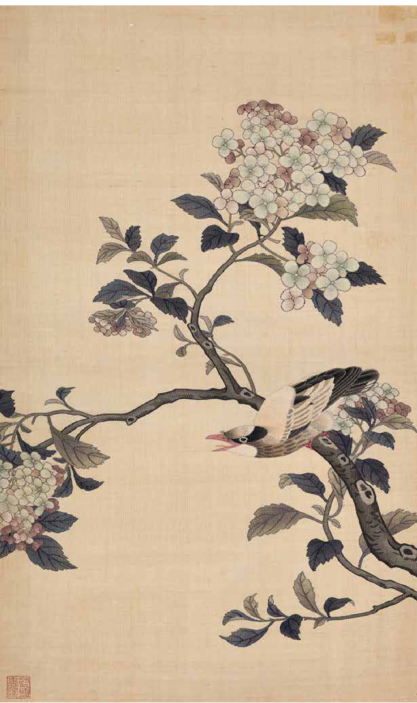  

# Oriole and cloves  

China, Qing dynasty (1644–1911), 18th century   
Kesi (silk tapestry), hanging scroll, $72.3\mathrm{~x~}43.6\mathrm{~cm}$   
Collector’s seal: Lantang shuwu   
Gift of Dr Lam Kwok Pun   
HKU.T.2008.1677  

With a pinkish beak and smooth colourful feathers, the oriole on this silk tapestry is shown leaning forward and singing. Clove blossoms woven in red and blue wefts with subtle gradations evoke the warmth and vitality of spring. Because cloves bloom in spring, they are thought to be auspicious symbols of growth and prosperity. This work employs the hehuaxian (‘twisted coloured thread’) technique, in which two or three coloured threads are entwined to form a single polychrome strand. Hehuaxian was widely adopted by kesi weavers during the Qing dynasty, particularly in the production of kesi depicting bird feathers in white and grey, such as the jaw of the oriole on this tapestry.  

# 丁香黃鶯  

中國，清代 (1644–1911)，  
十八世紀  
緙絲，立軸，72.3 x 43.6 厘米  
藏印：藍塘書屋  
林國本醫生惠贈  
HKU.T.2008.1677  

擁有粉紅色鳥喙及柔滑彩色羽毛的黃鶯正向前傾和高聲歌唱。丁香以紅色和藍色色緯緙織，色調微妙變化，散發出春天的溫暖氣息和活力。丁香在春季開花，寓意吉祥繁盛。清代的緙絲匠常用合花線──即將兩種或三種不同色絲捻成一條有雙色或三色的花線，如合捻白色線和灰色線來緙織飛鳥羽毛，就像這件緙絲品上黃鶯的下顎。  

# Sparrows and hibiscuses  

# 芙蓉麻雀  

China, Qing dynasty (1644–1911), 18th century Kesi (silk tapestry), hanging scroll, 105 x 41.5 cm Gift of Dr Lam Kwok Pun   
HKU.T.2008.1678   
中國，清代 (1644–1911)，   
十八世紀   
緙絲，立軸，105 x 41.5 厘米   
林國本醫生惠贈   
HKU.T.2008.1678  

Most of the sparrows on this kesi are grouped in pairs, except for one, which spreads its wings as if about to leap from a branch in the lower register. The feathers of the sparrows were woven with polychrome wefts and each sparrow is presented in a different, dynamic pose. The changduanqiang (‘long-and-short propping’) and guan (‘flinging’) techniques express the feathers’ colour variations, while the gou (‘connecting’) technique outlines the sparrows’ silhouettes in black wefts.  

Often depicted with pink-and-white blossoms, hibiscuses are also called jushuang (meaning ‘resistant to frost’) because they bloom in autumn. Green- and browncoloured wefts woven in the changduanqiang technique illustrate decaying leaves, probably to suggest autumn or the passing of seasons. Hibiscuses became a popular theme after several paintings depicting them were included in the Xuanhe huapu, a twelfth-century catalogue of the imperial collection written during the reign of the Huizong Emperor (r. 1100–26) of the Song dynasty (960– 1279).  

這件緙絲品上的麻雀成雙成對，畫面下方佇立在樹枝上的麻雀卻獨自張開翅膀，看似準備翱翔天際。每隻麻雀的姿勢各異，並用各式色緯緙織。麻雀的羽毛運用長短戧和摜技法來表現色階變化，其輪廓則用勾緙技法以黑色緯線作勾勒。  

呈粉紅色和白色的芙蓉在深秋盛放，故又稱為「拒霜」。織匠以褐色和綠色緯線、配合長短戧技法來緙織漸漸枯萎的葉子，或在暗示秋天或季節的交替。在十二世紀，隨着宋 (960–1279) 徽宗年間(1100–26) 成書的宮廷藏畫著錄《宣和畫譜》收藏了多幅描繪芙蓉的畫作，芙蓉成為了流行的繪畫主題。  

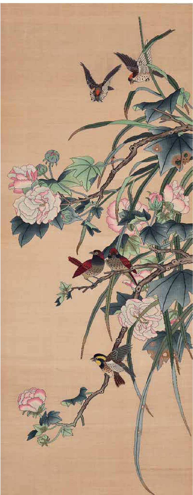  

# Kingfisher and roses  

# 月季翠鳥  

China, Qing dynasty (1644–1911), 18th century   
Kesi (silk tapestry), hanging scroll, 84 x 39.5 cm   
Seal mark: Meiyi yannian   
Gift of Dr Lam Kwok Pun   
HKU.T.2008.1679   
中國，清代 (1644–1911)，   
十八世紀   
緙絲，立軸， 84 x 39.5 厘米   
印款：美意延年   
林國本醫生惠贈   
HKU.T.2008.1679  

Woven on a beige background, this bird, likely a kingfisher with its iconic blue feathers, holds fruit in its mouth and rests on the branch of a rose bush. The greyish-blue feathers are woven with the changduanqiang (‘long-and-short propping’) technique, and the gradation of dark grey feathers on its wing are achieved using the guan (‘flinging’) technique. As the weft threads were woven horizontally on looms, the gradation of colours moves from left to right, or right to left, as seen on the kingfisher’s feathers.  

As roses bloom once a month, they are known as yuejihua or changchunhua (‘flowers of eternal youth’), and are traditional symbols of longevity. A seal mark that reads meiyi yannian (‘a carefree life brings longevity’) in the lower right corner of the tapestry echoes this symbolic meaning.  

此緙絲以米色為地，鳥兒佇立在枝頭上、銜着果實，其別具特色的翠羽顯示它應是一隻翠鳥。鳥兒灰藍色的羽毛是以長短戧技法緙織，翅膀上的深灰色羽毛則用摜技法表現。從翠鳥羽毛的色彩變化可見，緙絲的緯向呈水平方向，故緯暈亦從左至右、或右至左變化。  

由於月季花每月都會開花，故又稱為長春花，是傳統的長壽象徵 $^\circ$ 此作右下方位置的印款為「美意延年」，正好與主題花卉互相呼應。  

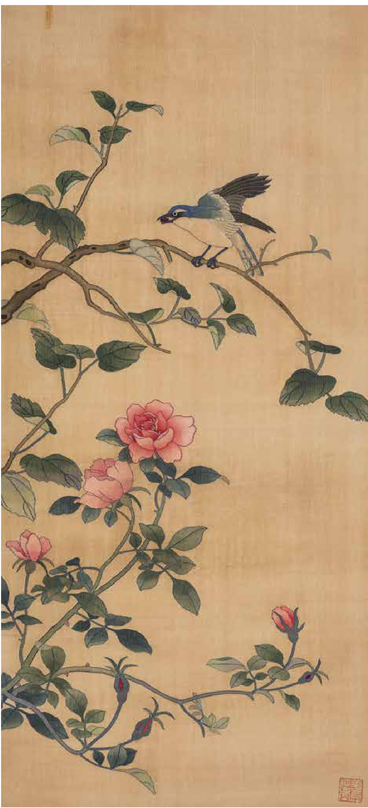  

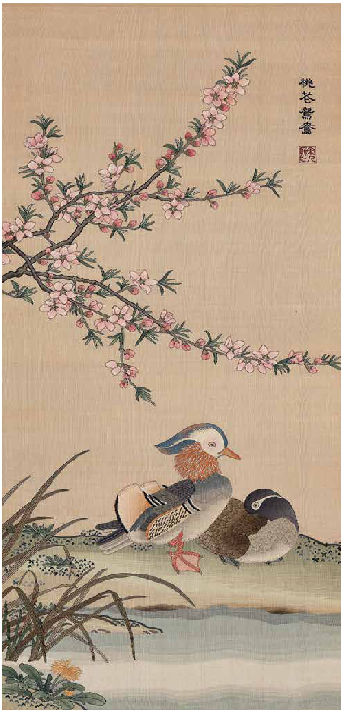  

# Mandarin ducks and peach blossoms  

China, Qing dynasty (1644–1911), 18th century   
Kesi (silk tapestry), hanging scroll, 78.1 x 37.8 cm   
Woven seal: Song ren suo zuo   
Gift of Dr Lam Kwok Pun   
HKU.T.2008.1680  

A pair of mandarin ducks rests on a riverbank under peach blossoms. Each is coloured and posed differently: the duck with golden neck feathers gazes forward, while the duck with black feathers leans its head back to groom its body. Their colourful feathers were woven using the changduanqiang (‘long-and-short propping’) and mushuqiang (‘wood comb propping’) techniques. The subtle gradation of greyish-green grass beneath the ducks was woven with the fengweiqiang (‘phoenix tale propping’) technique, wherein two weft threads, one thicker and one thinner, are interwoven to create a graceful flow of colours.  

In traditional Chinese culture, mandarin ducks symbolise a harmonious marriage as they are thought to mate for life. The peach blossoms continue this theme because they bloom in spring, a time of fertility. The design of the kesi was probably inspired by the Song dynasty (960–1279) hanging scroll Taohua yuanyang tu zhou (Peach Blossom and Mandarin Ducks), held in the collection of the Nanjing Museum. This is also indicated by the four characters in black-coloured wefts, taohua yuanyang, and a seal in bronze script woven in the top right corner of the tapestry that reads: song ren suo zuo (‘an artwork made by the people of the Song dynasty’).  

# 桃花鴛鴦  

中國，清代 (1644–1911)，  
十八世紀  
緙絲，立軸， 78.1 x 37.8 厘米  
織印：宋人所作  
林國本醫生惠贈  
HKU.T.2008.1680  

一對色彩繽紛的鴛鴦正在桃花樹下、河岸上休憩：其中一隻擁有金色脖子的鴛鴦正凝視前方，另一隻長有黑色羽毛的鴛鴦則回首洗刷羽毛。鴛鴦艷麗的羽毛是以長短戧和木梳戧技法緙織，灰綠色的草地則用了鳳尾戧技法織成，即將兩道色緯交錯緙織，調和色彩，戧頭一粗一幼，粗者短，幼者長，肖似鳳凰的尾巴。  

鴛鴦習慣結伴同行，故在傳統中國文化中象徵夫妻和睦、婚姻美滿。而在生機勃勃的春天盛開的桃花，亦與此主題互相呼應 $^\circ$ 此作的構圖設計取自宋代 (960–1279)的〈桃花鴛鴦圖軸〉，該立軸現藏於南京博物院；織物右上角亦用黑色色緯織出「桃花鴛鴦」四字，並以金文書寫的「宋人所作」織印。  

# Orioles and magnolias  

# 玉蘭黃鶯  

China, late 19th or mid-20th century   
Kesi (silk tapestry), hanging scroll, 120 x 47.5 cm   
Signed: Shen Jinshui   
Collector’s seal: Lantang shuwu   
Gift of Dr Lam Kwok Pun   
HKU.T.2008.1675   
中國，十九世紀末或二十世紀中葉   
緙絲，立軸，120 x 47.5 厘米   
織款：沈金水   
藏印：藍塘書屋   
林國本醫生惠贈   
HKU.T.2008.1675  

Woven in polychrome wefts against a blue ground, the birds on this kesi are black-naped golden orioles. Woven in the changduanqiang (‘long-and-short propping’) technique, the magnolias in beige and light green colours grant the flowers a sense of simple beauty. The yellow bodies of the orioles were woven in a technique known as baoxinqiang (‘embracing propping’), in which the shading of colours moves smoothly from the edge towards the centre, resulting in a darker outer area and lighter centre.  

The finely woven feathers, claws and beaks of the orioles, as well as the magnolias, offer a vivid illustration of spring. A seal inscription on the lower left reads shen jinshui, indicating that the tapestry was woven by Shen Jinshui (1883–1968) who was born in Likou, Wu county, Jiangsu province. Shen Jinshui began learning kesi weaving at the age of fifteen. One of the three most prominent kesi weavers in Suzhou, he reportedly served in the imperial workshops of the Forbidden City and was invited to teach kesi weaving at the Suzhou Cixiu Yanjiusuo (‘Suzhou Embroidery Research Institute’) in the 1950s. Shen taught many influential weavers, including Wang Jinshan (b. 1939), who was designated by the government as a Representative Inheritor (chuanchen ren) of Suzhou kesi weaving. This weaving tradition was included in the first group of items designated for the National List of Intangible Cultural Heritage of China in 2006.  

這件緙絲品以藍色為地，用彩緯緙織呈金黃色、後頸位置有黑紋的黃鶯。色澤淡雅的白玉蘭略帶碧綠色，是以長短戧技法緙織。織匠運用包心戧技法來織造黃鶯的金黃色羽毛，此技法乃從圖案的邊緣同時向中心戧色，形成邊緣深而中間淺的調色效果。  

黃鶯的羽毛、鳥喙和鳥爪緙工精細，與玉蘭一同生動地呈現春天萬象更新的氣息。作品的左下方織有沈金水款，顯示它是由江蘇省吳縣蠡口人沈金水 (1883–1968) 織造的。沈金水自十五歲起學習緙絲工藝，是蘇州三位享負盛名、曾參與宮廷織造的緙絲藝人之一。一九五零年代，他更獲邀到蘇州刺繡研究所教授緙絲工藝。二零零六年，蘇州緙絲工藝被列入首批國家級非物質文化遺產代表性項目名錄，而當今該項目的代表性傳承人，正是沈金水的高徒王金山 (1939 年生 )。  

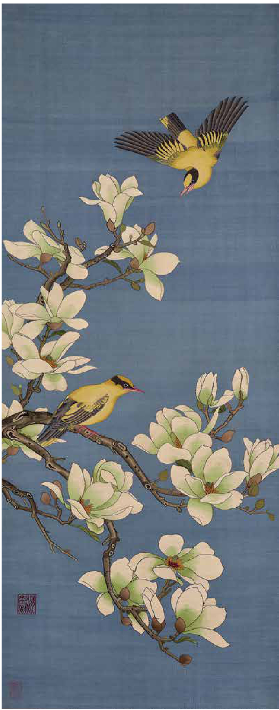  

刺铺  

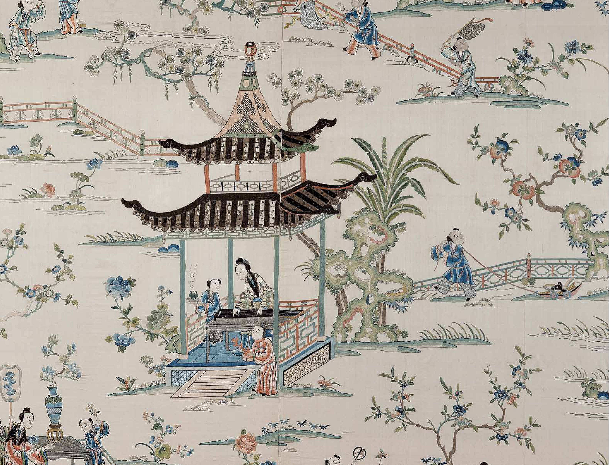  

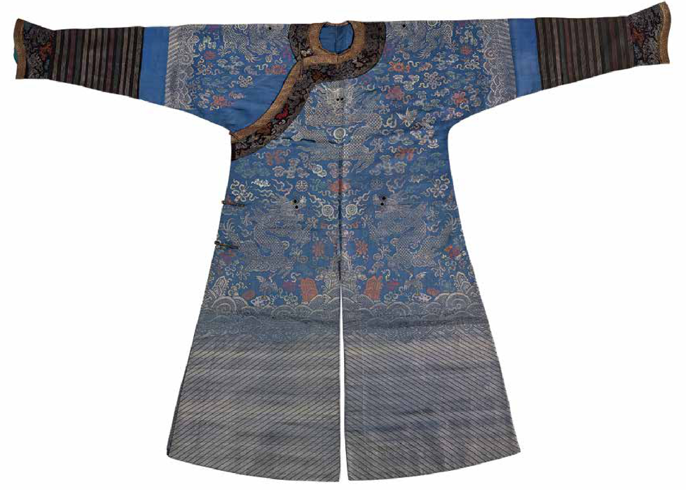  

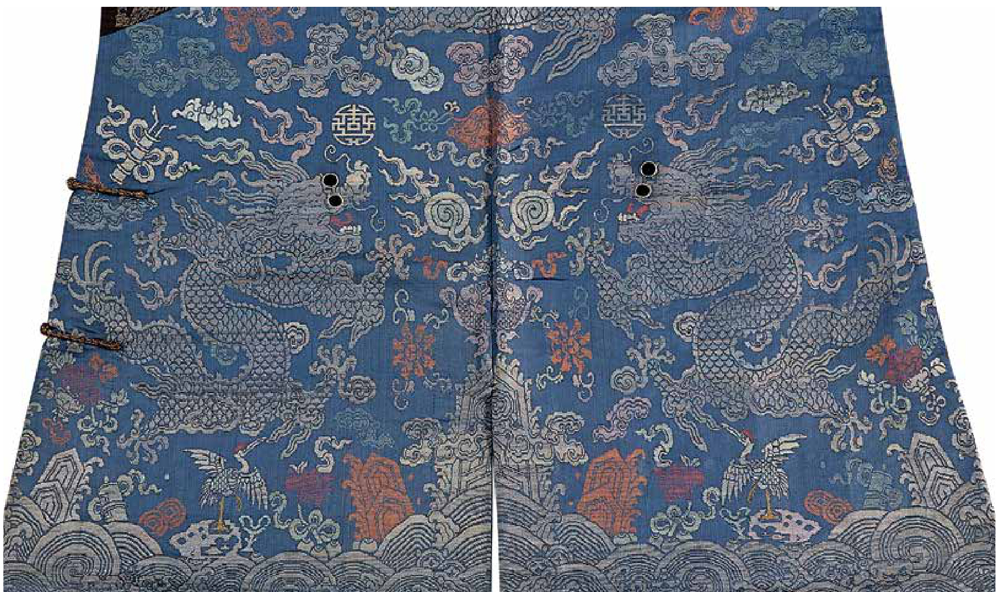  

# (Detail) (細部)  

Dragon motifs and auspicious patterns embroidered in nashaxiu(‘counted stitch’).  
龍紋和其他吉祥圖案以納紗繡繡製。  

# Dragon robe  

China, Qing dynasty (1644–1911), 19th century Silk with metallic threads, 142 x 217 cm Gift of Dr T T Tsui, Tsui Art Foundation Ltd HKU.T.1996.1095  

# 龍袍  

中國，清代 (1644–1911)，  
十九世紀  
絲、金屬線， 142 x 217 厘米  
徐氏藝術基金公司徐展堂博士惠贈  
HKU.T.1996.1095  

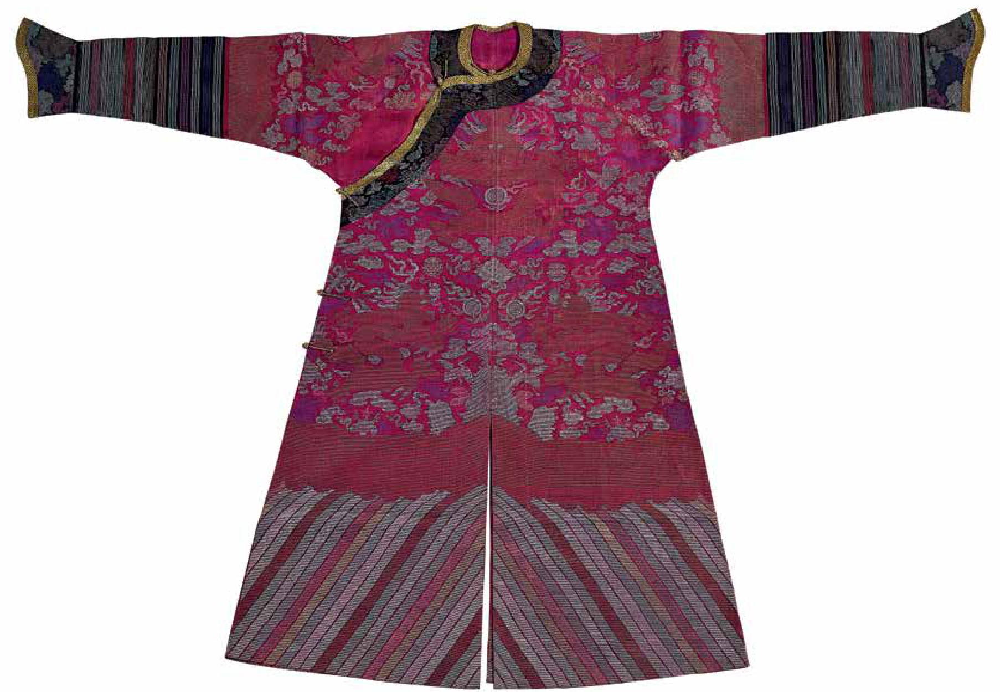  

# Dragon robe  

China, Qing dynasty (1644–1911), 19th century Silk with metallic threads, 130.5 x 198 cm Gift of Dr T T Tsui, Tsui Art Foundation Ltd HKU.T.1996.1096  

These dragon robes are embroidered with five-clawed dragons and other auspicious motifs, such as cranes, clouds and the character for longevity in the nashaxiu or chuoshaxiu (‘counted stitch’) technique. Artisans would use silk gauze as the ground fabric and then penetrate coloured silk threads in the holes of the gauze to create patterns. There are two types of silk gauze embroidery: when the silk gauze ground is completely covered by the embroidered patterns it is called najinxiu (‘full count’); when part of the underlying gauze is revealed, as with the two dragon robes here, it is known as nashaxiu. Embroidered items for the imperial court were manufactured by imperial embroidery workshops (xiufang) established during the Qing dynasty in Jiangning, Suzhou and Hangzhou. Dragon robes often took over one hundred and ninety days to complete.  

According to Daqing huidian (Collected Statutes of  the Great Qing), an official text describing the clothing system, golden yellow was reserved for the emperor; the bluecoloured dragon robes were worn by princes of the first and second rank, and purple red-coloured robes were often worn by noblemen. In the imperial dress hierarchy, robes with the five-clawed dragon motif worn by princes or noblemen were called a mangpao (‘mang robe’\*), while the emperor wore a longpao (‘dragon robe’). The slits on the centre front of both robes mark them as men’s garments. Although there were prohibitions on wearing dragon motifs and the golden yellow colour, exquisitely refined silk was available for purchase, and the imperial silk was also presented as diplomatic gifts.  

# 龍袍  

中國，清代 (1644–1911)，  
十九世紀  
絲、金屬線，130.5 x 198 厘米  
徐氏藝術基金公司徐展堂博士惠贈  
HKU.T.1996.1096  

這兩件龍袍上的五爪龍紋，並鶴紋、雲紋和壽字紋等吉祥圖案均以納紗繡製成。納紗繡又稱為戳紗繡，繡工以紗為地，用直針引色線，按照紗眼來繡製花紋。滿繡不留紗地的稱為納錦，留有紗地的稱為納紗。清代宮廷用的繡品皆由江寧、蘇州和杭州三地的官營繡坊製造，而製作一件龍袍往往需時約一百九十天。  

根據《大清會典》記載，明黃色是皇帝專用的顏色，親王和郡王的龍袍地色用藍色，其他宗室貴族可用絳色龍袍。清代冠服制度規定，皇帝所穿的五爪龍紋袍服才能稱作龍袍，皇子和親王等皇族所穿的則為蟒袍\*。這兩件龍袍前後開裾，顯示它為男吉服袍。雖然清廷嚴格禁止臣民穿着飾有龍紋的明黃色龍袍，但百姓仍可購買到精緻華美的絲綢，而御用絲織品更會作賞賜用，如作為贈予外交使節的禮物。  

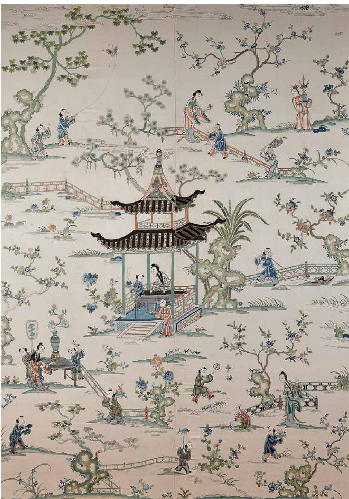  

# Ladies and children  

China, Qing dynasty (1644–1911), 19th century   
Silk, panel, $179\mathrm{~x~}126.7\mathrm{~cm}$   
Gift of Mr and Mrs Wellington Yee   
HKU.T.2005.1595  

# 婦孺圖  

中國，清代 (1644–1911)，  
十九世紀  
絲，掛屏，179 x 126.7 厘米  
余豪、孫冠華伉儷惠贈  
HKU.T.2005.1595  

The designs on this panel illustrate a peaceful landscape of noble ladies and children playing, each with a different character and facial expression depicted using a range of coloured threads. A pavilion, fences, ornamental rocks and trees create a typical Chinese garden scene often found in paintings and illustrations that reveals the leisurely life of wealthy women in ancient China.  

這扇掛屏以色絲繡製一幅貴族婦人與孩子嬉戲的風景畫，各人表情動作豐富多變，畫面洋溢着寧謐恬靜的氣氛。亭台樓閣、雕欄、假山和樹木等構成一道在繪畫和插圖中常見的庭園美景，刻劃出古代中國富裕家庭婦人的閒適生活。  

The choice of decoration is complemented by the work’s medium; embroidery, also known as nugong (‘women’s work’) was an important pastime for wealthy young women in dynastic China. In her Xiupu (Treatise on Embroidery, 1821), the noted artisan Ding Pei, active during the reigns of the Jiaqing (1796–1820) and Daoguang (1821–50) Emperors, recognised embroidery as the feminine art of writing, with the needle serving as one’s brush, the silk as paper and the floss as ink. The production of such works was thought to cultivate the moral character and technical skill of young women, and embroidered handkerchiefs, sashes and shoes were also popular items for a women’s trousseau.  

掛屏的裝飾主題與其製作工藝互相呼應──刺繡，又稱女紅，亦是古代中國富有人家的年輕女性怡情養性的閒暇活動。活躍於嘉慶 (1796–1820) 與道光年間(1821–50) 的丁佩精於繡工，著有《繡譜》(1821) 一書，她認為刺繡是閨閣中的翰墨，女子要以針為筆，以絹素為紙，以絲線為朱墨。製作繡品被視為有助女性陶冶性情和磨練手藝的活動，而刺繡手帕、腰帶和鞋子等也是當時流行的妝奩物品。  

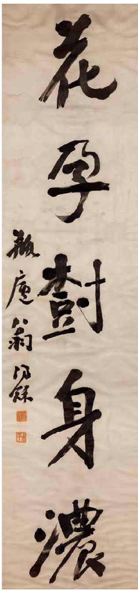  

#  

# Embroidered calligraphic panel 刺繡書法掛屏  

China, Qing dynasty (1644–1911), late 19th or early 20th century Silk, upper scroll: $^{169}\mathrm{~X~}$ 41 cm; lower scroll: 169.5 x 40.8 cm Gift of James W. C. Hong HKU.T.2008.1787  

中國，清代 (1644–1911)，十九世紀末或二十世紀初絲，上聯：169 x 41 厘米；下聯 $:~169.5\mathrm{~x~}40.8\$ 厘米James W. C. Hong 惠贈HKU.T.2008.1787  

The couplet on this panel was written by the Qing dynasty official and calligrapher Weng Tonghe (1830–1904). Embroidered in silk threads against a beige background, the text reads:  

yun zheng shan gu xiu   
(‘steaming clouds that rise from the hills illustrate the   
spirit and resonance of graceful mountains’)   
hua yun shu shen nong   
(‘flowers nourish luxuriant trees’)   
pingan   
[the art name of Weng Tonghe]   
Weng Tonghe  

Born in Changsu, Jiangsu province into a family of means, Weng became a jinshi (a recipient of the highest and final degree in the imperial examinations of Imperial China) civil service candidate in 1856, and served as the Grand Secretary and instructor of the Tongzhi (r. 1861–74) and Guangxu (r. 1875–1908) Emperors.  

To better capture the delicate shading of Weng’s brushwork, the weaver has used the taozhen (‘long-andshort stitch’) technique, in which a fluid and natural colouration is achieved by offsetting adjacent rows of stitches with fine silk threads split into four or five strands each. This technique was often used on embroidered paintings or calligraphy to vividly depict flora and fauna, as well as Chinese characters. Two of Weng’s seals in red-coloured threads, including ‘Weng Tonghe’ and his courtesy name ‘shuping’, are reminiscent of Chinese calligraphy.  

這副米色地刺繡對聯取自清官和書法家翁同龢 (1830–1904) 的翰墨，文曰：  

「雲蒸山骨秀花孕尌身濃  

瓶庵 翁同龢  

翁同龢，字叔平，江蘇常熟人。他生於官宦世家，在一八五六年中進士，曾任軍機大臣，亦是同治帝 ( 統治年份為 1861 年至 1874 年 ) 和光緒帝 ( 統治年份為 1875年至 1908 年 ) 兩代帝師。  

此繡品運用了套針來重現翁同龢的書法筆觸，逼真生動。套針是繡製花卉鳥獸或文字等刺繡書畫的常用技法，繡工往往會將一根絲掰成四根至五根更為纖細的絲線，再將此等深淺不同的色線，一長一短地交替穿插，使顏色相套，調和色彩。這副對聯上的印款「翁同龢」、「叔平」是以紅色色絲繡製，別具中國書法韻味。  

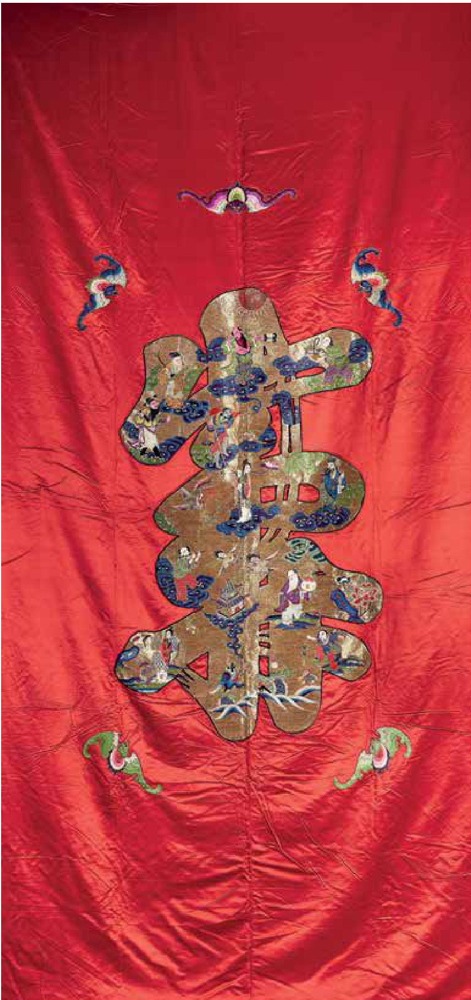  

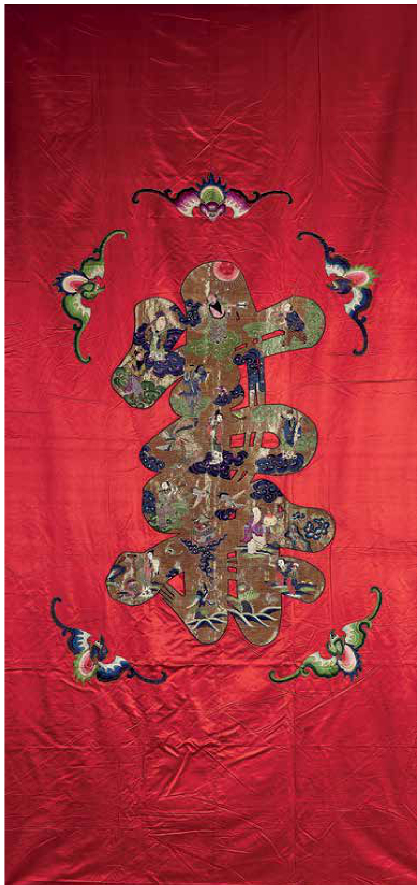  

# Pair of longevity banners commemorating the 70th birthday of Xu Yingkui  

China, Qing dynasty (1644–1911), 1900   
Silk with metallic threads, 293.5 x 145.5 cm; 302 x 147.3 cm   
Gift of Dr Hui Wai Haan   
HKU.T.2004.1922, HKU.T.2004.1924  

# 許應騤七十大壽賀壽幡一對  

中國，清代 (1644–1911)，  
一九零零年  
絲、金屬線，293.5 x 145.5 厘米；  
302 x 147.3 厘米  
許慧嫻博士惠贈  
HKU.T.2004.1922 $\setminus$ HKU.T.2004.1924  

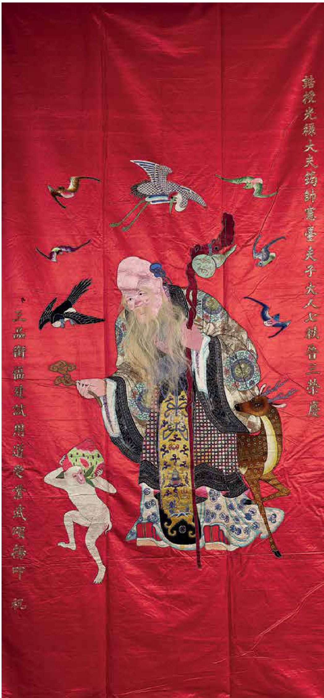  

# Longevity banner commemorating the 73rd birthday of Xu Yingkui  

China, Qing dynasty (1644–1911), 1903 Silk with metallic threads, 304 x 147 cm Gift of Dr Hui Wai Haan HKU.T.2004.1923  

These three longevity banners were presented to Xu Yingkui (1830–1903), the Qing Governor-General of Fujian and Zhejiang, to commemorate his seventieth and seventy-third birthdays. In 1900, when Xu celebrated his seventieth birthday, he was well-known in China for concluding the ‘Mutual Protection of Southeast China’ (dongnan hubao) agreement with other provincial governors and high-ranking officials, such as Zhang Zhidong (1837–1909) and Liu Kunyi (1830–1902). This agreement declared the neutrality of Southeast China in the war between the court of Empress Dowager Cixi (1835–1908) and the Eight-Nation Alliance of foreign powers during the Boxer Rebellion (1899–1901).  

One of the banners depicts Shoulao, the Daoist God of Longevity, and features an inscription stating that it was presented by Wu Songyang (1846–1916) to Xu on the occasion of his seventy-third birthday. The text reads:  

gaoshou guanglu dafu yunshuai xiantai fuzi daren qi zhi jin san rongqing (‘for the seventy-third birthday of Yunshuai, the Grand Master of Splendid Happiness and the Governor-General’)  

sanpin xian fujian shiyong dao shouye wusongyang kou zhu (‘sincere wishes from student Wu Songyang, the thirdranking shiyongdao of Fujian’)  

Surrounding Shoulao are various embroidered symbols of longevity, including a peach, several cranes and five bats. The number of bats is significant—as the Chinese characters for bat and fortune are both prounced fu, they symbolise the ‘Five Blessings’ of longevity, health, wealth, and a virtuous life and natural death. The other two banners feature large golden shou (longevity) characters that were first embroidered with images of various Daoist immortals stitched onto a red satin ground. The colourfully shaded bats around the shou characters were embroidered using a technique called qiangzhen (‘encroaching satin stitch’), in which short straight stitches were embroidered layer upon layer, resulting in a shading of colours moving from light to dark. Embroidered silk banners like these were often used to decorate interiors during birthday or wedding banquets, or as wall hangings in temple lecture halls.  

# 許應騤七十三歲大壽賀壽幡  

中國，清代 (1644–1911)，  
一九零三年  
絲、金屬線，304 x 147 厘米；許慧嫻博士惠贈  
HKU.T.2004.1923  

這三幅賀壽幡是清代閩浙總督許應騤(1830–1903) 於 七 十 歲 及 七 十 三 歲 生 辰時獲贈的賀壽禮。一九零零年，即許應騤 七 十 歲 時， 他 曾 聯 同 張 之 洞 (1837–1909)、劉坤一 (1830–1902) 等地方總督和高官重臣與列強訂立條約，實行「東南互保」，在慈禧太后 (1835–1908) 於義和團運動 (1899–1901) 期間向八國聯軍宣戰時保持中立。  

其中一幅繡有壽老圖案的賀壽幡，是武頌揚 (1846–1916) 獻予許應騤的禮物，祝賀對方七十三歲大壽。款識為：  

「誥授光祿大夫筠帥憲臺夫子大人七秩晉三榮慶三品銜福建試用道受業武頌揚叩祝」  

壽老旁邊繡上壽桃、鶴和蝙蝠等寓意長壽的圖案。由於蝠與福同音，故五隻蝙蝠寓意五福臨門──即長壽、富貴、康寧、好德及善終五種福氣。另外兩幅賀壽幡各以一個大壽字為裝飾，繡工先在壽字紋上繡製八仙圖案，再將整個壽字繡在紅色緞地上。五彩繽紛、環繞壽字紋飛舞的蝙蝠圖案以搶針繡製，即用短直針依照圖案分層刺繡，各層顏色從淺至深過渡。相類的絲織幡常作為壽宴或婚宴的室內陳設，或廟堂的掛飾。  

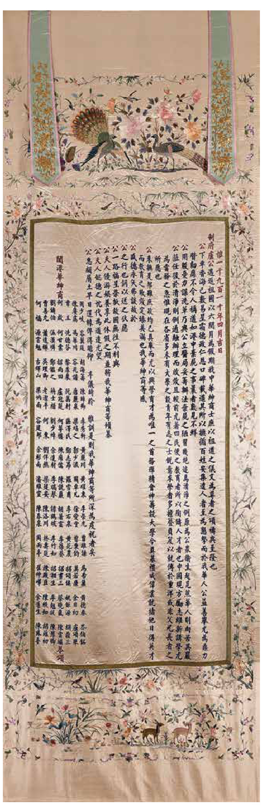  

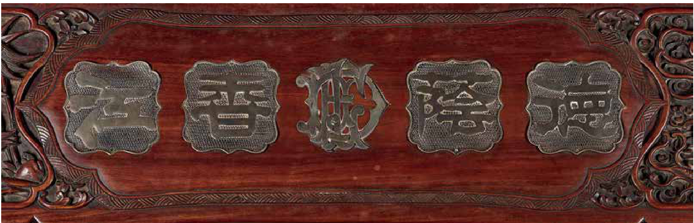  

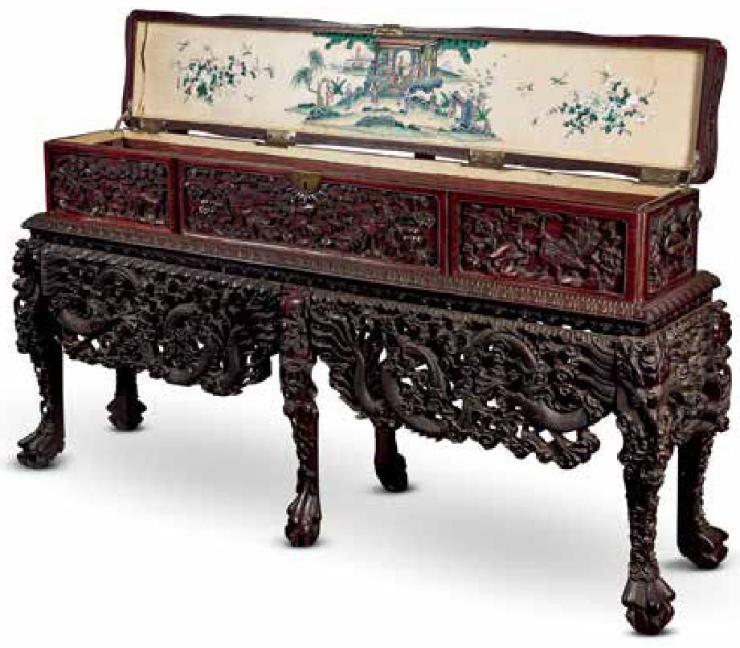  

# The Lugard Tribute  

# 呈盧督頌詞  

Guangzhou, China, Qing dynasty (1644–1911), 1910 Silk scroll with a red sandalwood casket and silver mounts, scroll: $347\mathrm{~X~}$ 116.5 cm, casket: height 84 cm On permanent loan from Major Richard Pinker HKU.W.2001.1393  

Embroidered against a pale-yellow background, this silk satin scroll was a gift presented to Sir Frederick Lugard (1858–1945), the fourteenth British Governor of Hong Kong (1907–12), by eighty-four local Chinese shenshang (prominent ‘gentry-merchants’ who exchanged wealth for social status or official titles, and who were often actively involved in charitable affairs) in 1910. It was presented to Lugard in recognition of his contributions while governor, which included founding the University of Hong Kong and prohibiting the practice of abandoning corpses on the streets, which remained widespread in the nineteenth century.  

Stored in an ornately carved red sandalwood casket adorned with bat-shaped silver brackets, the scroll is delicately embroidered with auspicious motifs, such as mandarin ducks and butterflies symbolising harmonious relationships and joyfulness. A striking pair of peacocks on the scroll, emblematic of culture and virtue according to the I-Ching (Book of  Changes), likely echoes an inscription deyin xiang jiang (‘virtue shelters Hong Kong’) on the lid of the casket, which glorifies the success and prosperity of Hong Kong during Lugard’s tenure.  

中國廣州，清代 (1644–1911)，一九一零年  
絲卷軸、鑲銀紫檀木匣子  
卷軸：347 x 116.5 厘米，  
匣子：高 84 厘米  
Major Richard Pinker 永久惠借  
HKU.W.2001.1393  

這幅淡黃色緞地刺繡卷軸，是由八十四位本地華人紳商於一九一零年獻予香港第十四任總督 (1907–12) 盧吉爵士 (1858–1945) 的禮物，以表揚他推動香港大學的成立、以及有效解決了人們在街頭棄置屍體這一項十九世紀香港面臨的公共衛生問題。  

此卷軸儲藏在一個裝飾精緻、鑲有蝙蝠造型銀扣的紫檀木匣子內。絲卷軸上繡有象徵和諧融洽、幸福的鴛鴦紋和蝴蝶紋等精美的吉祥圖案，上方位置則繡上一對耀目的孔雀圖案。據《易經》記載，孔雀是品德高尚的瑞鳥；這對孔雀紋或許與匣蓋上的銘文「德蔭香江」互相呼應，歌頌港督盧吉任內香港社會的安定繁榮。  

# baoxinqiang (‘Embracing propping’)  

Silk tapestry weaving. Based on the principle of changduanqiang (‘long-andshort propping’), in which colours move smoothly from the edge to the centre, resulting in a darker outer and lighter centre area.  

# 包心戧  

# changduanqiang (‘Long-and-short propping’) 長短戧  

Silk tapestry weaving. Various long and short, light- and dark-coloured wefts offset from each other to create a fluid and natural colouration.  

緙織方法之一。運用長短戧的原理，從圖案的邊緣同時向中心戧色，形成邊緣色彩深而中間色彩較淺的調色效果。  

緙織方法之一。在顏色由深至淺變化的圖案中，將長短不一的深淺緯線互相穿插，達致自然的色彩調和效果。  

# chanheqiang (‘Blend propping’)  

Silk tapestry weaving. Used to express a gradation of colours from dark to light. Distinguished from baoxinqiang and changduanqiang by the smooth and flexible overlapping of coloured variations; the blending of colour blocks often moves vertically from top to bottom, or bottom to top.  

# 摻和戧  

緙織方法之一。將色緯交織以表現色彩的深淺過渡，緯線交替靈活，色彩一般從上而下，或從下而上縱向過渡。  

# dasuo (‘Shuttle joining’)  

A slit occurs between the adjacent patterns of the silk tapestry as the weft threads only run across the designed areas. This stabilises the structure of the fabric and reduces the spacing; wefts of opposing coloured blocks are interwoven once within a specific area of the tapestry.  

# 搭梭  

緙織方法之一。由於緙絲的緯線並不貫穿整幅織品，故兩種不同顏色的花紋邊緣的垂直處會留有裂痕。為免裂縫過長，形成缺口，每隔一定距離，會將雙方的色緯互相搭繞對方色緯區內的一根經線。  

# dingxian xiu (‘Couching stitch’)  

Embroidery stitch. Convoluted coloured or gold threads are arranged onto a ground fabric to outline the silhouettes. Threads are then stitched down (approximately 3 to $5~\mathrm{mm}$ each) using the same coloured thread.  

# 釘線繡  

刺繡針法之一。將色線或金線對折盤成圖案的輪廓，再用同色線將它釘固，釘針的距離約為三至五亳米。  

# embroidery  

Decorative textile technique in which a needle stitches polychrome threads onto a ground fabric in order to create the patterns.  

# fangzhenxiu (‘Realistic representational embroidery’) 仿真繡  

一種以針引線在織物上穿繞成圖案的織物裝飾手法。  

Embroidery style developed by the famed Qing dynasty embroiderer Shen Shou (1874–1921), which expands the tradition of Chinese embroidery by integrating an emphasis on light and perspective found in Western paintings and Japanese embroidery. The result is three-dimensional and highly realistic.  

# 刺繡  

清代刺繡名家沈壽 (1874–1921) 自創的刺繡風格。即將西方繪畫和日本刺繡的明暗原理融入刺繡之中，用針線繡出逼真立體的明暗效果。  

# fengweiqiang (‘Phoenix tail propping’)  

Silk tapestry weaving. Two weft threads—one thicker and shorter and another thinner and longer—are interwoven to create a graceful flow of colours that resembles a phoenix tail.  

# 鳳尾戧  

緙織方法之一。將兩道色緯交錯緙織，戧頭一粗一幼，粗者短，幼者長，肖似鳳凰的尾巴。  

# gaoxiu (‘High embroidery’)  

An embroidery stitch in which the cotton or threads are first placed according to the designed pattern, and then are stitched down to the ground fabric. The stitches are built upon the lining materials, which creates a three-dimensional raised pattern.  

# 高繡  

刺繡針法之一。先將棉花或線等物料堆放在圖案上，以線釘固，再在其上繡製花紋，使圖案具突起的立體效果。  

# gou (‘Connecting’)  

Silk tapestry weaving. Wefts that differ from the colour of the subject motif are used to outline the motif ’s silhouette.  

# 勾緙  

緙織方法之一。在圖案的邊緣，用主體紋樣以外的另一種色緯勾勒邊線，使花紋輪廓清晰。  

guan (‘Flinging’)  

Silk tapestry weaving. Two or more different but similar tones of coloured wefts are woven following the silhouette of the patterns. Wefts of each coloured block do not overlap and often appear to pile up in layers.  

# 摜  

緙織方法之一。配用兩種或以上色彩相鄰的不同色緯，沿花紋輪廓方向順序緙織，色緯彼此不相交織，色緯如疊上去的效果。  

# nashaxiu (‘Counted stitch’)  

Embroidery stitch. Silk gauze is used as the ground fabric and coloured threads penetrate through the gauze holes with a straight stitch for creating the patterns. There are two types of nashaxiu: najin (‘full count’) where the silk gauze ground is completely covered by embroidered patterns, and nasha (‘counted thread on silk gauze’) where a section of the underlying gauze is revealed.  

# 納紗繡  

刺繡針法之一，又稱戳紗繡。以紗為底料，用直針引色線，以數格子的方式按照紗眼繡製花紋。滿繡不留紗地的稱為納錦，留有紗地的稱為納紗。  

# hehuaxian (‘Twisted coloured thread’)  

Two or three coloured silk threads are twisted together to form a single polychrome strand.  

# 合花線  

亦稱合色線，將兩種或三種不同色絲捻成一條有雙色或三色的花線。  

nashishi (‘Gold brocade’)  

# 納石失  

jie (‘Knotting’)  

Silk tapestry weaving. Two or three similarly coloured wefts with varying degrees of brightness create adjacent lines of colour ranging from light to dark.  

# 結  

緙織方法之一。以顏色相鄰、明度相異的兩種或三種色緯，依照顏色由深至淺地順序退暈緙織。  

One of the most celebrated types of silk fabric developed during the Yuan dynasty.  

# qiang (‘Propping’)  

又稱織金錦，即織入金線顯花的絲織物，是元代最著名的絲綢品種之一。  

# 戧  

# kelinzhen (‘Carved scale embroidery’)  

Embroidery stitch. Primarily used to create animal scales. Common types include dielinzhen (‘stacked scales stitch’), which uses taozhen (‘long and short stitch’) to create scales that are lighter outside and darker inside; qianglinzhen (‘encroaching satin scales stitch’), which uses qiangzhen (‘encroaching satin stitch’) to build up scales with a shallower edge and darker centre; and zalinzhen (‘bound scales stitch’), in which the back of birds, fishes or beasts are first created with a long straight stitch, while the scales are outlined in a short straight stitch.  

# 刻鱗針  

刺繡針法之一，專用來繡鱗片，常見種類包括疊鱗針、搶鱗針和扎鱗針。疊鱗針採用套針方法，繡出邊緣淺內面深的鱗片；搶鱗針採用搶針方法，繡出邊框淺而裏面深的鱗片；扎鱗針用鋪針繡滿鳥、魚或獸的背部，再用短紮針紮出鱗片。  

Silk tapestry weaving. Two or more coloured wefts woven together to create shading; in this technique, one coloured block abuts or ‘props’ up the other.  

qiangzhen (‘Encroaching satin stitch’)  

Embroidery stich. Short straight stitches are embroidered in layers, resulting in the shading of colours from light to dark, or pale to dark. In zhengqiang (‘inward encroaching satin stitch’) the embroidery work starts from the outer layer and moves towards the centre, and fanqiang (‘reverse encroaching satin stitch’) begins at the centre and moves towards the edge.  

緙織方法之一。使用兩種或以上的色緯緙織色彩變化，色緯相鄰相靠，是為戧色。  

# 搶針  

刺繡針法之一。用短直針依照圖案分層刺繡，各層顏色從淺至深或由深至淺過渡。搶針可分為正搶，即從花紋外層繡至內層，或反搶，即從內而外繡製。  

kesi (‘Carved silk tapestry’)  

Raw silk is used for the warp and dyed silk for the weft.Made using tongjing duanwei (‘continuous warp and broken weft’), in which only the warp threads extend across the entire loom.  

# 緙絲  

以生絲為經，熟絲為緯，用通經斷緯的方法織造而成的絲織品。  

qizhen (‘Straight stitch’)  

Embroidery stitch. Parallel straight stitches form the patterns. These can run vertically, horizontally or obliquely. A designed pattern fully completed with qizhen is also known as puzhen (‘satin stitch’).  

# 齊針  

刺繡針法之一。即用直線繡製圖案，針跡平行排列，分為直向、橫向和斜向。當圖案滿繡時，又可稱為鋪針。  

kesi mao (‘Silk tapestry with wool’)   
Textiles with a background pattern woven in silk and the main pattern woven in wool.  

# 緙絲毛  

一種用絲線緙織地紋，用毛線緙織花紋的織物。  

sanlan kesi  (‘Three shades of blue silk tapestry’) Silk tapestry weaving. Three different shades of blue thread—including dark blue, reddish blue and pale blue—achieve the patterns’ colouration.  

# 三藍緙絲  

緙織方法之一。用深藍、品藍和月白三種色線緙織圖案，達致退暈效果。  

kejin (‘Silk tapestry woven with gold’)  

Gold threads in the weaving patterns are used for the tapestry ground and the silhouette of motifs.  

# 緙金  

用金線緙織圖案，多用於緙地和勾勒輪廓線。  

sanlanxiu (‘Three shades of blue embroidery’)  

An embroidery technique using three different shades of blue thread— including dark blue, reddish blue and pale blue—to achieve the patterns colouration.  

# 三藍繡  

刺繡針法之一。用深藍、品藍和月白三種色線繡製圖案，達致退暈效果。  

kehua (‘Silk tapestry and painting’) Brushes are used to paint in small areas of the silk tapestry.  

# 緙畫  

亦稱緙繪，緙絲與繪畫的結合。運用毛筆在緙絲上作細部的描繪或點染。  

shuimo kesi  (‘Water and ink silk tapestry’)  

Silk tapestry weaving technique. Black, dark grey and light grey threads are used to weave the patterns; gold or white threads are also sometimes incorporated to outline the woven motifs.  

# 水墨緙絲  

緙織方法之一。用黑色、深灰色和淺灰色線緙織花紋，偶爾配合使用金線或白色線勾勒圖案邊緣。  

kemao (‘Carved wool tapestry’) Plain weave textiles woven in wool with discontinuous wefts.  

緙毛  

以獸毛毛線，並通經斷緯的方式緙織而成的平紋織物。  

# 雙面透緙  

kexiu (‘Silk tapestry and embroidery’)  

The fabric ground and specific patterns are first woven in silk tapestry, the complex design is then embroidered.  

# 緙繡  

緙絲與刺繡的結合。在緙織地子和部分圖案後，再加繡其他複雜的花紋。  

shuangmian touke  (‘Double-sided translucent silk tapestry’) Silk tapestry weaving. A tapestry with identical patterns on both sides; threads are not exposed on either side.  

緙織方法之一。可緙織出正反兩面圖案相同，雙面皆不露線頭的緙絲織物。  

# 雙面繡  

mushuqiang (‘Wood comb propping’)  

shuangmianxiu (‘Double-sided embroidery’) Embroidered works with identical patterns on both sides.  

Silk tapestry weaving. Wefts of similar tones are woven together to achieve the shading of colours; the edge of offsetting wefts produces a comb-like edge pattern.  

# 木梳戧  

緙織方法之一。將色相相鄰的色緯交織，呈現色彩的深淺過渡，戧頭邊緣整齊劃一，如木梳齒緣。  

suozhen (‘Chain stitch’)  

Embroidery stitch. Threads stitched into rows of interlocking loops that resemble a chain.  

刺繡針法之一。可繡出正反兩面圖案相同的繡品。  

# 鎖針  

刺繡針法之一。繡線環環相扣，穿套成狀如鎖鏈的花紋。  

# silk  

Refers to both the long filaments produced by silkworms and textiles woven from silk.  

taozhen (‘Long and short stitch’)  

Embroidery stich. Dark- and light-coloured long and short stitches offset to create a fluid and natural colouration.  

tiehua (‘Applique embroidery’)  

Embroidery stitch. Fabric with embroidered patterns that is either stitched or glued onto another ground fabric.  

wangxiu (‘Net embroidery’)  

Embroidery stitch. Straight, oblique and parallel threads crisscrossed to create a net-like pattern.  

# warp  

Textile threads stretched onto a loom that run lengthwise.  

# weft  

Textile threads interwoven with warp threads on a loom that run transversely.  

絲蠶所吐之長纖維，亦指用蠶絲織造而成的紡織品。  

套針  

刺繡針法之一。用深淺不同的色線，一長一短地交替穿插，使顏色相套，自然調和。  

貼花  

刺繡針法之一。將預先繡好的布料，用短針固定或塗上漿糊貼於繡布上。  

# 網繡  

刺繡針法之一。用直線、斜線或平行線相互交叉穿插，繡成網紋。  

# 經線  

在織機上縱方向垂直的線。  

# 緯線  

在織機上與經線交織的橫向線。  

Bertin-Guest, Josiane. 2003. Chinese Embroidery: Traditional Techniques. London: Batsford.  

Cammann, Schuyler van R.. 1948. ‘Notes on the Origin of Chinese K’ossu Tapestry’. Chinese and Central Asian Textiles: Selected Articles from Orientations, 1983–1997, edited by Orientations Magazine. Hong Kong: Orientations Magazine. pp. 68–75.  

Chen, Jinglin ( 陳景林 ). 2001. ‘Weaving Techniques of Silk Tapestry and Inspirations from Modern Textiles 緙絲的織作技藝與現代織物創作的啟示 (Kesi de zhizuo jiyi yu xiandai zhiwu chuangzuo de qishi)’. 19th and 20th Century Tapestries 清至近代緙絲特展 (Qing zhi jindai kesi te zhan), edited by Lin Poyou ( 林泊佑 )and Guoli lishi  bowuguan bianji weiyuanhui ( 國立歷史博物館編輯 委員會 ).  Taipei: National Museum of History. pp. 21–31.  

Chen, Juanjuan( 陳娟娟 ). 2005. Essays on Chinese Woven and Embroidered Costumes 中國織繡服飾論集 (Zhongguo zhi xiu fushi lunji). Beijing: Zijincheng Chubanshe.  

and Huang Nengfu. 2012. ‘Silk Fabrics of the Ming Dynasty’. Chinese Silks, edited by Dieter Kuhn. New Haven, CT: Yale University Press. pp. 369–429.  

and Huang Nengfu. 2012. ‘Textile Art of the Qing Dynasty’. Chinese Silks, edited by Dieter Kuhn. New Haven, CT: Yale University Press. pp. 431–89.  

Chung, Youngyang. 2005. Silken Threads: A History of  Embroidery in China, Korea, Japan and Vietnam. New York: Harry N. Abrams.  

Harris, Jennifer. 1995. 5000 Years of  Textiles. London: The British Museum Press.  

Leslie, Catherine A.. 2007. Needlework Through History: An Encyclopedia. Westport, CT: Greenwood Press.  

Lin, Poyou ( 林泊佑 ) and Guoli lishi bowuguan bianji weiyuanhui ( 國立歷史博物館編輯委員會 ) (eds.) 2001. 19th and 20th Century Tapestries 清至近代緙絲特展(Qing zhi jindai kesi te zhan). Taipei: National Museum of History.  

Lin, Shu-hsin ( 林淑心 ). 1998. ‘General Introduction to Ch’ing Embroidery’. The Cosmos of  Silk: A Special Exhibition of  Ch’ing Embroidery, edited by the National Museum of History. Taipei: National Museum of History. pp. 9–16.  

_. 2001. ‘The Woven Art: Silk Tapestry 綜梭幻化的藝術 ── 緙絲 (Zong suo huanhua de yishu kesi). 19th and 20th Century Tapestries 清至近代緙絲 特展 (Qing zhi jindai kesi te zhan), edited by Lin Poyou ( 林泊佑 ) and Guoli lishi bowuguan bianji weiyuanhui ( 國立歷史博物館編輯委員會 ). Taipei: National Museum of History. pp. 9–15.  

Lixinski, Lucas. 2013. Intangible Cultural Heritage in International Law. Oxford: Oxford University Press.  

Moll-Murata, Christine. 2018. State and Crafts in the Qing Dynasty. Amsterdam: Amsterdam University Press.  

Nien, Pivoine. 1998. ‘Hundreds of Stitches: A Brief History of Stitches Used on Chinese Embroidery’. The Cosmos of  Silk: A Special Exhibition of  Ch’ing Embroidery, edited by the National Museum of History. Taipei: National Museum of History. pp. 43–78.  

Peng, Hao. 2012. ‘Sericulture and Silk Weaving from Antiquity to the Zhou Dynasty’. Chinese Silks, edited by Dieter Kuhn. New Haven, CT: Yale University Press. pp. 65–113.  

Pu, Wengying ( 朴文英 ). 2009. Silk Tapestry 緙絲 (kesi). Suzhou: Soochow University Press.  

Qian, Cao ( 淺草 ). 2015. Crafts and Zen: The Journey of  Searching the Traditional Crafts Artisans 手藝與禪心──尋找傳統手工藝人之旅 (Shou yi yu chan xin : xun zhao chuan tong shou gong yi ren zhi lü). Hong Kong: Chung Hwa Book Co.  

Shan, Guoqiang ( 單國強 ). 2005. Embroidered Pictures: The Complete Collection of Treasures of  the Palace Museum 織繡書畫：故宮博物院藏文物珍品全集 (Zhi xiu shuhua: Gugong bowuyuan zang wenwu zhenpin quanji). Hong Kong: The Commercial Press.  

Sheng, Angela. 1995. ‘Chinese Silk Tapestry: A Brief Social Historical Perspective of Its Early Development’. Chinese and Central Asian Textiles: Selected Articles from Orientations, 1983–1997, edited by Orientations Magazine. Hong Kong: Orientations Magazine. pp. 166–71.  

Shen, Shou, ( 沈壽 ) Zhang, Jian ( 張謇 ) and Geng, Jipeng ( 耿紀朋 ) (eds.) 2010. Embroidery Book by Xue Yi 雪宦繡譜 (Xueyi xiupu). Chongqing: Chongqing chubanshe.  

Tung, Wene. (ed.) 2009. Weaving a Tapestry of  Splendors: Bird-and-Flower Tapestries of  the Sung Dynasty. Taipei: National Palace Museum.  

(ed.) 2015. Flights of  Fragrance at a Fingertip: The World of  Birds and Flowers in Painting, Tapestry and Embroidery. Taipei: National Palace Museum.  

Tunstall, Alexandra. 2012. ‘Beyond Categorization: Zhu Kerou's Tapestry Painting “Butterfly and Camellia. East Asian Science, Technology, and Medicine. 36 (2012). PP 39–76.  

Vainker, Shelagh. 2004. Chinese Silk: A Cultural History. London: The British Museum Press.  

Wang, Yimei ( 王怡美 ). 2001. ‘A Study on the Craftsmanship of Silk Tapestry 緙 絲工藝探源 (Kesi gongyi tanyuan).’ 19th and 20th Century Tapestries 清至近代緙絲 特展 (Qing zhi jindai kesi te zhan), edited by Lin Poyou ( 林泊佑 and Guoli lishi bowuguan bianji weiyuanhui ( 國立歷史博物館編輯委員會 ). Taipei: National Museum of History. pp. 16–20.  

Watt, James C.Y., Wardwell, Anne E. and Rossabi, Morris. 1997. When Silk Was Gold: Central Asian and Chinese Textiles. New York: The Metropolitan Museum of Ar  

Wooley, Nathan. 2016. Celestial Empire: Life in China 1644–1911. Canberra: National Library of Australia.  

Zhao, Feng. 2012. ‘Silks in the Sui, Tang, and Five Dynasties’. Chinese Silks, edited by Dieter Kuhn. New Haven, CT: Yale University Press. pp. 203–58.  

. 2012. ‘Silks in the Song, Liao, Western Xia, and Jin Dynasties’. Chinese Silks edited by Dieter Kuhn. New Haven, CT: Yale University Press. pp. 259–326.  

. 2012. ‘Silk Artistry of the Yuan Dynasty’. Chinese Silks, edited by Dieter Kuhn. New Haven, CT: Yale University Press. pp. 327–67.  

, Long, Bo and Shang, Gang. 2014. Ancient Chinese Material Culture: Textiles 中國古代物質文化史．紡織 (Zhongguo gudai wuzhi wenhuashi. Fangzhi). Beijing: Kaiming chubanshe.  

Zhu, Qiqian ( 朱啟鈐 ). 1930. ‘Catalogue of  Woven Kesi Silk Tapestry and Silk Embroidered Calligraphy and Painting in the Collection of  the Imperial Household Department 清內府藏刻絲繡綫書畫錄 (Qing neifu cang kesi xiuxian shuhua lu)’. A Collection of  Classic Paintings and Calligraphy. Volume 15 歷代書畫錄輯刊．卷 十五 (Lidai shuhualu jikan). Beijing: Beijing tushuguan chubanshe. pp. 255–384.  

Zong, Fengying ( 宗鳳英 ). 2005. Textiles and Embroideries in the Ming and Qing Dynasties 明清織繡 (Mingqing zhixiu). Hong Kong: The Commercial Press.  